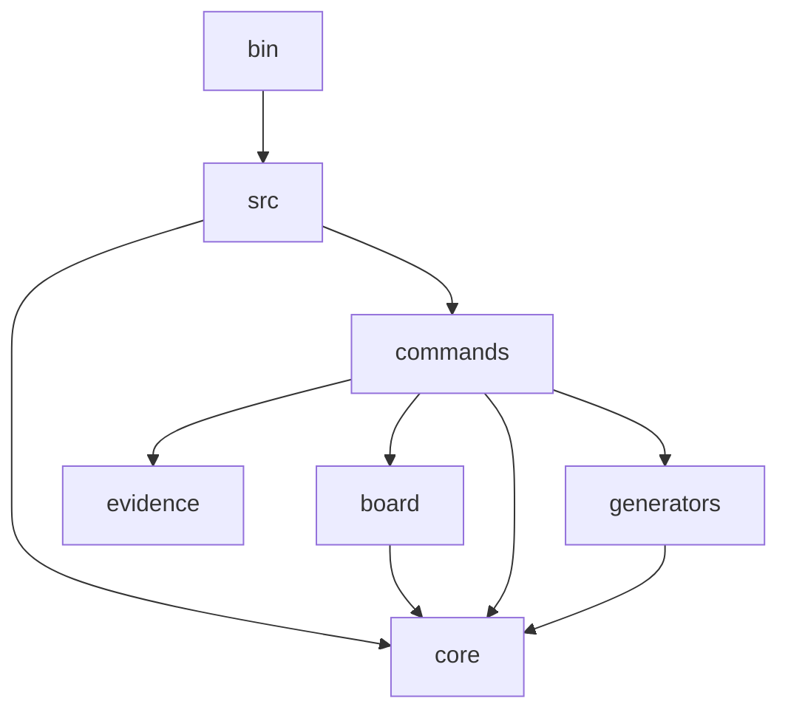

# Dependency graph

## Module dependencies

bin → src (runtime: requires compiled dist/index.js)
src → core
src → commands
board → core
commands → core
commands → board
commands → evidence
commands → generators
generators → core
evidence (no intra-project imports — standalone module)

## Circular dependencies
(none detected)

## Orphan modules
- vitest.config.ts (standalone config — consumed by Vitest at runtime)

## Mermaid export

