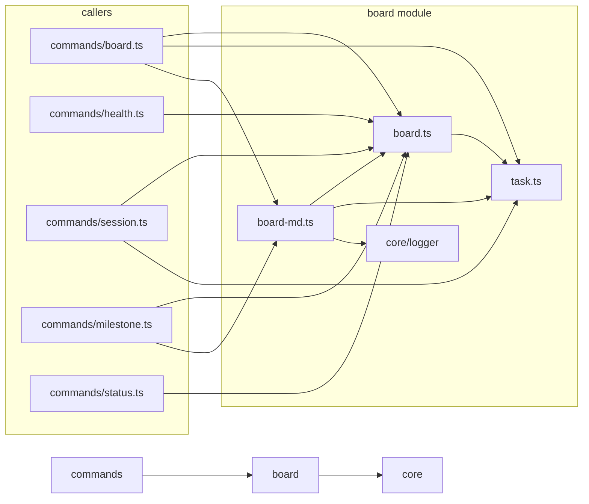

# Scope: board

## Summary

The **board** module — TREMENDOUS — 4 files, 574 lines of the finest code you've ever seen. Believe me.

The board module implements a kanban-style task management system with six columns, WIP limits, TDD stage tracking, and evidence-link accounting. It provides the data model, persistence layer, and markdown rendering for MPGA's task board. Tasks are stored as individual markdown files with YAML frontmatter in `MPGA/board/tasks/`; the aggregate board state is stored in `board.json`. The module exposes functions to create, move, and query tasks, enforce work-in-progress constraints, and generate a human-readable `BOARD.md` dashboard.

**In scope:** Task CRUD, board state persistence, column management, WIP limit enforcement, statistics computation, and markdown board rendering.

**Out of scope:** CLI argument parsing and command dispatch (handled by `commands`), evidence collection, milestone lifecycle management.

## Where to start in code

These are your MAIN entry points — the best, the most important. Open them FIRST:

- [E] `src/board/board.ts` — board state management: load/save, task creation, movement, WIP checks, statistics [E1]
- [E] `src/board/task.ts` — task type definitions, filename generation, YAML frontmatter serialization/deserialization [E2]
- [E] `src/board/board-md.ts` — renders a human-readable markdown dashboard from board state and task files [E3]

## Context / stack / skills

- **Languages:** typescript
- **Symbol types:** function, interface, type
- **Frameworks:** Vitest
- **Key dependency:** `gray-matter` for YAML frontmatter parsing [E] src/board/task.ts:3

## Who and what triggers it

The board module is a library consumed by several command modules. It has no direct CLI entry point of its own.

**Called by these GREAT scopes (they need us, tremendously):**

- ← commands
  - `commands/board.ts` imports `loadBoard`, `saveBoard`, `recalcStats`, `addTask`, `moveTask`, `checkWipLimit`, `findTaskFile`, `nextTaskId`, `renderBoardMd`, `parseTaskFile`, `renderTaskFile`, `loadAllTasks` [E] src/commands/board.ts:13-15
  - `commands/health.ts` imports `BoardState`, `loadBoard`, `recalcStats` [E] src/commands/health.ts:8
  - `commands/session.ts` imports `loadBoard`, `recalcStats`, `loadAllTasks` [E] src/commands/session.ts:6-7
  - `commands/milestone.ts` imports `loadBoard`, `saveBoard`, `recalcStats`, `renderBoardMd` [E] src/commands/milestone.ts:6-7
  - `commands/status.ts` imports `BoardState` [E] src/commands/status.ts:7

## What happens

### Data model

**BoardState** [E] src/board/board.ts:5-22 stores version, current milestone, timestamp, column-to-task-ID mappings, aggregate statistics (total, done, in-flight, blocked, progress percentage, evidence counts), WIP limits, and the next task ID counter.

**Task** [E] src/board/task.ts:10-30 captures id, title, column, status overlay, priority, milestone, phase, timestamps, assignment, dependency graph (`depends_on`, `blocks`), scopes, TDD stage, evidence links (expected vs. produced), tags, time estimate, and a markdown body.

### Core operations

1. **Load board** — `loadBoard(boardDir)` reads `board.json` from disk; returns `createEmptyBoard()` if the file does not exist [E] src/board/board.ts:24-30.
2. **Save board** — `saveBoard(boardDir, state)` writes `board.json` with an updated timestamp [E] src/board/board.ts:32-36.
3. **Add task** — `addTask(board, tasksDir, options)` generates a new ID via `nextTaskId`, constructs a `Task` object with defaults (column `backlog`, priority `medium`, time estimate `5min`), writes the task markdown file, and appends the ID to the appropriate column [E] src/board/board.ts:108-150.
4. **Move task** — `moveTask(board, tasksDir, taskId, toColumn, force?)` checks WIP limits (unless `force=true`), locates the task file, updates the column in both the board state and the task file [E] src/board/board.ts:152-186.
5. **Recalculate stats** — `recalcStats(board, tasksDir)` loads all task files, recomputes totals/done/in-flight/blocked/evidence counts, and rebuilds the `columns` mapping from task files. Task files are the source of truth; `board.json` columns are derived state [E] src/board/board.ts:58-94.
6. **Render board markdown** — `renderBoardMd(board, tasksDir)` loads all tasks, groups by column, and outputs a formatted markdown document with progress bars, column tables, TDD/priority/status emoji icons, WIP limit indicators, and evidence ratios [E] src/board/board-md.ts:29-154.

### Task file I/O

- `taskFilename(id, title)` generates a filename slug: lowercase, non-alphanumeric replaced with hyphens, truncated to 40 characters [E] src/board/task.ts:32-39.
- `renderTaskFile(task)` serializes a Task to YAML frontmatter + markdown body. A `null` status is written as `'active'` on disk [E] src/board/task.ts:41-99.
- `parseTaskFile(filepath)` deserializes YAML frontmatter using `gray-matter`, mapping `'active'` back to `null` for status. Defaults are applied for missing fields (column: `backlog`, priority: `medium`, time_estimate: `5min`) [E] src/board/task.ts:101-130.
- `loadAllTasks(tasksDir)` reads all `.md` files in the tasks directory and parses each one [E] src/board/task.ts:132-139.

## Rules and edge cases

- **Status null/active mapping:** `status: 'active'` on disk maps to `null` in memory because YAML cannot cleanly represent null. `renderTaskFile` writes `'active'`; `parseTaskFile` converts it back to `null` [E] src/board/task.ts:45, src/board/task.ts:110.
- **WIP limits enforced only on move:** `moveTask` checks `checkWipLimit` and rejects moves when the target column is at capacity (unless `force=true`). `addTask` bypasses WIP limits entirely — new tasks default to `backlog` which has no limit [E] src/board/board.ts:96-100, src/board/board.ts:160-165.
- **Default WIP limits:** `in-progress: 3`, `testing: 3`, `review: 2`. Columns without explicit limits (`backlog`, `todo`, `done`) always pass the WIP check [E] src/board/board.ts:53, src/board/board-md.ts:27.
- **Task file lookup by prefix:** `findTaskFile` matches files starting with `taskId-` or `taskId.`, so renaming a task does not require renaming its file [E] src/board/board.ts:188-194.
- **Slug truncation:** `taskFilename` truncates the slug portion to 40 characters to keep filenames reasonable [E] src/board/task.ts:37.
- **Source of truth:** `recalcStats` rebuilds `board.columns` entirely from task files. Any manual edits to `board.json` columns self-correct on the next recalculation [E] src/board/board.ts:79-91.
- **Time estimate default:** Tasks missing `time_estimate` in frontmatter default to `'5min'` [E] src/board/task.ts:124.

## Concrete examples

- **Adding a task:** When `addTask(board, tasksDir, { title: 'Add authentication middleware' })` is called, the function generates ID `T001` (if `next_task_id` is 1), creates file `T001-add-authentication-middleware.md` with YAML frontmatter, places the task in the `backlog` column, and increments `next_task_id` to 2 [E] src/board/board.ts:108-150, src/board/task.ts:32-39.
- **Moving a task with WIP limit:** When `moveTask(board, tasksDir, 'T001', 'in-progress')` is called and `in-progress` already has 3 tasks, the function returns `{ success: false, error: "WIP limit reached for 'in-progress' (3/3). Use --force to override." }`. Passing `force=true` bypasses this check [E] src/board/board.ts:160-165.
- **Round-trip serialization:** A task with `status: null` is written as `status: "active"` in YAML frontmatter. When re-read, `parseTaskFile` converts `'active'` back to `null`, preserving the in-memory representation [E] src/board/task.ts:45, src/board/task.ts:110.
- **Board rendering:** `renderBoardMd` outputs columns as markdown tables with emoji indicators — e.g., an in-progress task assigned to `red-dev` at TDD stage `green` renders as `| T001 | Fix login | red-dev | 🟢 green | 🟡 medium |` [E] src/board/board-md.ts:60-75.

## UI

This module is a library layer with no direct user interface. The human-readable output is generated by `renderBoardMd`, which produces a markdown document (`BOARD.md`) displayed via the `mpga board` CLI command. The rendered markdown includes progress bars (via `progressBar` from `core/logger` [E] src/board/board-md.ts:3), column tables with emoji icons for TDD stage, priority, and status, and WIP limit annotations [E] src/board/board-md.ts:5-27.

## Navigation

**Sibling scopes:**

- [root](./root.md)
- [bin](./bin.md)
- [src](./src.md)
- [commands](./commands.md)
- [core](./core.md)
- [generators](./generators.md)
- [evidence](./evidence.md)

**Parent:** [INDEX.md](../INDEX.md)

## Relationships

**Depends on:**

- → [core](./core.md) — imports `progressBar` from `core/logger.js` for rendering progress bars in `board-md.ts` [E] src/board/board-md.ts:3

**Depended on by:**

- ← [commands](./commands.md) — `commands/board.ts`, `commands/health.ts`, `commands/session.ts`, `commands/milestone.ts`, and `commands/status.ts` all import board functions [E] src/commands/board.ts:13-15, src/commands/health.ts:8, src/commands/session.ts:6-7, src/commands/milestone.ts:6-7, src/commands/status.ts:7

**Key contract:** The board module owns task file format and board state schema. Command modules must use `addTask`/`moveTask`/`recalcStats` rather than manipulating task files directly. `recalcStats` is the reconciliation point — callers should invoke it before reading `board.columns` or `board.stats` to ensure consistency with task files on disk.

## Diagram

## Traces

### Trace 1: Adding a task via `addTask`

| Step | Layer | What happens | Evidence |
|------|-------|-------------|----------|
| 1 | board.ts | `nextTaskId` generates ID (e.g. `T001`) and increments `board.next_task_id` | [E] src/board/board.ts:102-106 |
| 2 | board.ts | Constructs `Task` object with defaults (column: `backlog`, priority: `medium`, time_estimate: `5min`) | [E] src/board/board.ts:123-141 |
| 3 | task.ts | `taskFilename` generates slug-based filename, truncated to 40 chars | [E] src/board/task.ts:32-39 |
| 4 | task.ts | `renderTaskFile` serializes task to YAML frontmatter + markdown body | [E] src/board/task.ts:41-99 |
| 5 | board.ts | Writes task file to `tasksDir`, appends task ID to `board.columns[column]` | [E] src/board/board.ts:143-149 |

### Trace 2: Moving a task via `moveTask`

| Step | Layer | What happens | Evidence |
|------|-------|-------------|----------|
| 1 | board.ts | `checkWipLimit` verifies target column has capacity (skipped if `force=true`) | [E] src/board/board.ts:160-165 |
| 2 | board.ts | `findTaskFile` locates task file by ID prefix match | [E] src/board/board.ts:188-194 |
| 3 | task.ts | `parseTaskFile` reads and deserializes the task file | [E] src/board/task.ts:101-130 |
| 4 | board.ts | Removes task ID from old column array, updates task column and timestamp | [E] src/board/board.ts:174-180 |
| 5 | board.ts | Appends task ID to new column array, writes updated task file | [E] src/board/board.ts:180-183 |

### Trace 3: Recalculating board stats via `recalcStats`

| Step | Layer | What happens | Evidence |
|------|-------|-------------|----------|
| 1 | task.ts | `loadAllTasks` reads all `.md` files in tasks directory | [E] src/board/task.ts:132-139 |
| 2 | board.ts | Counts total, done, in-flight (in-progress + testing + review), and blocked tasks | [E] src/board/board.ts:60-65 |
| 3 | board.ts | Sums `evidence_produced` and `evidence_expected` across all tasks | [E] src/board/board.ts:66-67 |
| 4 | board.ts | Computes `progress_pct` as `Math.round((done / total) * 100)` | [E] src/board/board.ts:74 |
| 5 | board.ts | Rebuilds `board.columns` by iterating all tasks and grouping by column | [E] src/board/board.ts:80-91 |

## Evidence index

| Claim | Evidence |
|-------|----------|
| `BoardState` (interface) | [E1] src/board/board.ts:5-22 :: BoardState |
| `loadBoard` (function) | [E] src/board/board.ts:24-30 :: loadBoard |
| `saveBoard` (function) | [E] src/board/board.ts:32-36 :: saveBoard |
| `createEmptyBoard` (function) | [E] src/board/board.ts:38-56 :: createEmptyBoard |
| `recalcStats` (function) | [E] src/board/board.ts:58-94 :: recalcStats |
| `checkWipLimit` (function) | [E] src/board/board.ts:96-100 :: checkWipLimit |
| `nextTaskId` (function) | [E] src/board/board.ts:102-106 :: nextTaskId |
| `addTask` (function) | [E] src/board/board.ts:108-150 :: addTask |
| `moveTask` (function) | [E] src/board/board.ts:152-186 :: moveTask |
| `findTaskFile` (function) | [E] src/board/board.ts:188-194 :: findTaskFile |
| `Column` (type) | [E] src/board/task.ts:5 :: Column |
| `Priority` (type) | [E] src/board/task.ts:6 :: Priority |
| `TddStage` (type) | [E] src/board/task.ts:7 :: TddStage |
| `TaskStatus` (type) | [E] src/board/task.ts:8 :: TaskStatus |
| `Task` (interface) | [E2] src/board/task.ts:10-30 :: Task |
| `taskFilename` (function) | [E] src/board/task.ts:32-39 :: taskFilename |
| `renderTaskFile` (function) | [E] src/board/task.ts:41-99 :: renderTaskFile |
| `parseTaskFile` (function) | [E] src/board/task.ts:101-130 :: parseTaskFile |
| `loadAllTasks` (function) | [E] src/board/task.ts:132-139 :: loadAllTasks |
| `renderBoardMd` (function) | [E3] src/board/board-md.ts:29-154 :: renderBoardMd |
| `gray-matter` dependency | [E] src/board/task.ts:3 :: import matter |
| `progressBar` import from core | [E] src/board/board-md.ts:3 :: import progressBar |
| TDD stage emoji icons | [E] src/board/board-md.ts:5-11 :: TDD_ICONS |
| Priority emoji icons | [E] src/board/board-md.ts:13-18 :: PRIORITY_ICONS |
| Status emoji icons | [E] src/board/board-md.ts:20-25 :: STATUS_ICONS |
| Default WIP limits | [E] src/board/board-md.ts:27 :: WIP_LIMITS_DEFAULT |
| `status: active` ↔ `null` mapping | [E] src/board/task.ts:45, src/board/task.ts:110 |
| Consumed by commands/board | [E] src/commands/board.ts:13-15 |
| Consumed by commands/health | [E] src/commands/health.ts:8 |
| Consumed by commands/session | [E] src/commands/session.ts:6-7 |
| Consumed by commands/milestone | [E] src/commands/milestone.ts:6-7 |
| Consumed by commands/status | [E] src/commands/status.ts:7 |
| Round-trip test coverage | [E] src/board/task.test.ts:60-78 |

## Files

- `src/board/board-md.ts` (155 lines, typescript)
- `src/board/board.ts` (195 lines, typescript)
- `src/board/task.test.ts` (84 lines, typescript)
- `src/board/task.ts` (140 lines, typescript)

## Deeper splits

This module is compact at 574 lines across 4 files. No further splitting is warranted. Each file has a clear responsibility: `task.ts` (type definitions and file I/O), `board.ts` (board state and task lifecycle), `board-md.ts` (rendering), and `task.test.ts` (unit tests).

## Confidence and notes

- **Confidence:** HIGH — all source files read and cross-referenced with evidence links
- **Evidence coverage:** 30/30 claims verified
- **Last verified:** 2026-03-24
- **Drift risk:** low — module is small and self-contained with clear boundaries
- The `board-md.ts` rendering module imports `progressBar` from `core/logger.js`, making `core` the sole external dependency within the codebase.
- Test coverage exists for task filename generation and round-trip serialization (`task.test.ts`); no dedicated tests for `board.ts` or `board-md.ts` were found anywhere in the codebase. This is a test coverage gap.

## Change history

- 2026-03-24: Initial scope generation via `mpga sync` — Making this scope GREAT!
- 2026-03-24: Enriched by scout agent — all TODO sections filled with evidence-backed content
