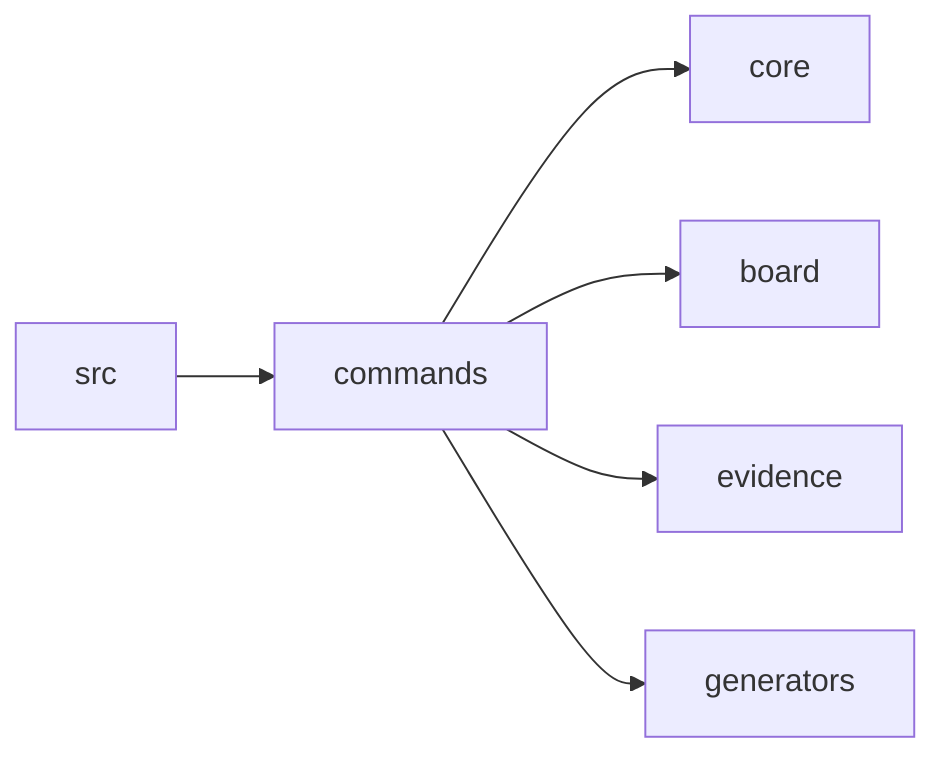

# Scope: commands

## Summary

The **commands** module contains 14 TypeScript files (approximately 3,281 lines) that define the complete CLI surface of the MPGA tool. Each file exports a single `register*` function that attaches a Commander.js command (with subcommands, options, and action handlers) to the shared `program` instance [E] src/cli.ts:48-69. The module is the translation layer between user invocations (`mpga <command>`) and the underlying core, board, evidence, and generator subsystems.

**In scope:** CLI argument parsing, option validation, output formatting (terminal, JSON), file I/O orchestration for MPGA artifacts (INDEX.md, GRAPH.md, BOARD.md, scope docs, session handoffs, milestone directories).

**Out of scope:** Business logic for scanning, graph building, evidence resolution, and board state management — those live in the `core`, `generators`, `evidence`, and `board` modules respectively.

## Where to start in code

These are the main entry points — files to open first:

- [E] `src/commands/export.ts:276-525` — the largest command (1,188 lines), generates tool-specific configs for Claude, Cursor, Codex, and Antigravity
- [E] `src/commands/sync.ts:11-85` — the primary knowledge-generation pipeline (scan, graph, scopes, INDEX.md)
- [E] `src/commands/board.ts:24-398` — the most subcommand-rich command (11 subcommands for full kanban lifecycle)

## Context / stack / skills

- **Languages:** TypeScript
- **Symbol types:** function, const, interface
- **Frameworks:** Commander.js (command registration and argument parsing), chalk (terminal coloring)
- **Key patterns:** Every command file exports exactly one `register*(program: Command): void` function. All commands resolve the project root via `findProjectRoot()` from `core/config.js` [E] src/commands/board.ts:34, falling back to `process.cwd()`.

## Who and what triggers it

Users invoke `mpga <command>` from the terminal. Each `register*` function is imported and called in `src/cli.ts` during bootstrap [E] src/cli.ts:48-69, which builds the Commander program and calls `program.parseAsync(process.argv)`.

**Called by these scopes:**

- ← src (specifically `src/cli.ts`)

## What happens

The commands fall into five functional categories:

### 1. Knowledge generation commands

| Command | Input | Steps | Output |
|---------|-------|-------|--------|
| `init` [E] src/commands/init.ts:67-194 | `--from-zero` or `--from-existing` | Creates `MPGA/` directory tree (scopes, board, milestones, sessions); optionally scans for language detection; writes config, INDEX.md, GRAPH.md, board.json, BOARD.md | Initialized MPGA directory structure |
| `sync` [E] src/commands/sync.ts:11-85 | `--full` (default) or `--incremental` | 1. Scan codebase 2. Build dependency graph → GRAPH.md 3. Generate scope docs → `MPGA/scopes/*.md` 4. Generate INDEX.md | Regenerated knowledge layer |
| `scan` [E] src/commands/scan.ts:6-75 | `--deep`, `--quick`, `--lang`, `--json` | Invokes `scan()` from core, displays project summary (type, files, lines, languages, entry points, largest files) | Terminal report or JSON |
| `graph` [E] src/commands/graph.ts:9-66 | `show` or `export --mermaid/--json` | `show` reads existing GRAPH.md; `export` rebuilds the graph from a fresh scan | Graph in text, Mermaid, or JSON |

### 2. Evidence commands

| Command | Input | Steps | Output |
|---------|-------|-------|--------|
| `evidence verify` [E] src/commands/evidence.ts:14-74 | `--scope`, `--json` | Runs `runDriftCheck()`, iterates scopes, reports health per scope with progress bar | Per-scope health report |
| `evidence heal` [E] src/commands/evidence.ts:77-108 | `--auto`, `--scope` | Runs drift check, applies `healScopeFile()` to fix stale line ranges | Count of healed links, warnings for unfixable |
| `evidence coverage` [E] src/commands/evidence.ts:111-140 | `--min <pct>` (default 20) | Runs drift check, compares overall health % to threshold | Exit code 1 if below threshold |
| `evidence add` [E] src/commands/evidence.ts:143-165 | `<scope> <link>` | Reads scope file, inserts link before `## Known unknowns` section | Updated scope file |
| `drift` [E] src/commands/drift.ts:8-106 | `--report`, `--quick`, `--ci`, `--fix`, `--threshold`, `--scope`, `--json` | Runs `runDriftCheck()`, optionally auto-fixes with `healScopeFile()` | Drift report with CI gate support |

### 3. Task management commands

| Command | Input | Steps | Output |
|---------|-------|-------|--------|
| `board show` [E] src/commands/board.ts:28-49 | `--json`, `--milestone` | Load board → recalcStats → render as markdown or JSON | Board display |
| `board add` [E] src/commands/board.ts:52-86 | `<title>`, `--priority`, `--scope`, `--depends`, `--tags`, `--column`, `--milestone` | addTask → recalcStats → saveBoard → rewrite BOARD.md | New task file |
| `board move` [E] src/commands/board.ts:89-111 | `<task-id> <column>`, `--force` | moveTask → recalcStats → saveBoard → rewrite BOARD.md | Moved task |
| `board claim` [E] src/commands/board.ts:114-152 | `<task-id>`, `--agent` | Parse task file → set assigned + column to in-progress → save | Claimed task |
| `board assign` [E] src/commands/board.ts:155-179 | `<task-id> <agent>` | Parse task file → set assigned field → save | Assignment confirmed |
| `board update` [E] src/commands/board.ts:182-220 | `<task-id>`, `--status`, `--priority`, `--evidence-add`, `--tdd-stage` | Parse task → apply mutations → save → recalcStats → rewrite BOARD.md | Updated task |
| `board block` [E] src/commands/board.ts:223-254 | `<task-id> <reason>` | Set status to "blocked", append reason to task body | Blocked task |
| `board unblock` [E] src/commands/board.ts:257-287 | `<task-id>` | Set status to null | Unblocked task |
| `board deps` [E] src/commands/board.ts:290-321 | `<task-id>` | Recursive tree print of depends_on + reverse lookup of blockers | Dependency tree |
| `board stats` [E] src/commands/board.ts:324-357 | `--velocity`, `--burndown` | Load board → recalcStats → display totals, done/in-flight/blocked, breakdown by priority | Statistics report |
| `board archive` [E] src/commands/board.ts:360-397 | (none) | Move done task files to milestone archive directory, clear done column | Archived tasks |
| `milestone new` [E] src/commands/milestone.ts:54-132 | `<name>` | Auto-increment ID (M001, M002...), create `M<id>-<slug>/` dir with PLAN.md and CONTEXT.md, link to board | Milestone directory |
| `milestone list` [E] src/commands/milestone.ts:135-154 | (none) | Scan milestones dir, detect status by presence of SUMMARY.md | Table of milestones |
| `milestone status` [E] src/commands/milestone.ts:157-184 | (none) | Load board, display progress for active milestone | Progress report |
| `milestone complete` [E] src/commands/milestone.ts:187-224 | (none) | Write SUMMARY.md with completion stats | Completed milestone |
| `session handoff` [E] src/commands/session.ts:17-99 | `--accomplished` | Snapshot board state, in-flight tasks, generate a resumable handoff markdown | Handoff file in `MPGA/sessions/` |
| `session resume` [E] src/commands/session.ts:102-129 | (none) | Find most recent `*-handoff.md` file, print contents | Handoff content to stdout |
| `session log` [E] src/commands/session.ts:132-151 | `<message>` | Append timestamped entry to `session-log.md` | Log entry |
| `session budget` [E] src/commands/session.ts:154-194 | (none) | Count lines in INDEX.md + all scope docs, estimate token usage at 4 tokens/line of a 200K context window | Token budget report |

### 4. Reporting commands

| Command | Input | Steps | Output |
|---------|-------|-------|--------|
| `status` [E] src/commands/status.ts:9-132 | `--json` | Read INDEX.md, board.json, scope dir; display knowledge layer + board + config dashboard | Formatted dashboard |
| `health` [E] src/commands/health.ts:10-121 | `--verbose`, `--json` | Run drift check + load board stats → compute letter grade (A-D) → display evidence, scopes, board, recommendations | Health report with grade |

### 5. Configuration / export commands

| Command | Input | Steps | Output |
|---------|-------|-------|--------|
| `config show` [E] src/commands/config.ts:17-34 | `--json` | Load config, flatten with dot-path keys | Config display |
| `config set` [E] src/commands/config.ts:37-62 | `<key> <value>` | Load config → validate key exists → setConfigValue → save | Updated config |
| `export` [E] src/commands/export.ts:276-525 | `--claude`, `--cursor`, `--codex`, `--antigravity`, `--all`, `--global`, `--workflows`, `--knowledge` | Per-target: generate constitution file + skills + agents + tool-specific configs | Tool configuration files |

## Rules and edge cases

- Every mutating board command follows a consistent pattern: `loadBoard()` → mutate → `recalcStats()` → `saveBoard()` → rewrite `BOARD.md` [E] src/commands/board.ts:78-82.
- `export` rewrites `${CLAUDE_PLUGIN_ROOT}/bin/mpga.sh` references to `npx mpga` for non-Claude targets [E] src/commands/export.ts:188-189.
- `scope list` reads a `**Health:**` field from scope content, but `sync` never writes that field, so it always displays `? unknown` [E] src/commands/scope.ts:40-41.
- `milestone complete` writes SUMMARY.md but does not clear `board.milestone`, so the board remains linked to the completed milestone until a new one is created [E] src/commands/milestone.ts:200-222.
- `board stats --velocity` and `--burndown` flags are registered as options but their handlers perform no special logic for them [E] src/commands/board.ts:327-328.
- `scope query` performs pure keyword frequency search (regex match count per term), not semantic search [E] src/commands/scope.ts:198.
- `session budget` estimates tokens at 4 tokens per line against a 200K context window [E] src/commands/session.ts:186-188.
- `config set` rejects unknown config keys by checking if `getConfigValue` returns undefined before applying the change [E] src/commands/config.ts:52-56.
- `init` is a no-op if `mpga.config.json` already exists, logging a warning instead of overwriting [E] src/commands/init.ts:80-84.
- `drift --ci` exits with code 1 when overall health percentage falls below threshold, enabling CI gate integration [E] src/commands/drift.ts:28, src/commands/drift.ts:40, src/commands/drift.ts:103.

## Concrete examples

- **When a user runs `mpga init --from-existing`:** The command creates the full `MPGA/` directory tree (scopes, board, board/tasks, milestones, sessions), invokes `scan()` to detect languages and file counts, writes `mpga.config.json`, `INDEX.md`, `GRAPH.md`, `board.json`, and `BOARD.md` [E] src/commands/init.ts:73-193.

- **When a user runs `mpga sync --incremental`:** The pipeline scans the codebase, rebuilds GRAPH.md, generates new scope docs only for scopes whose files don't already exist (`opts.incremental` check at [E] src/commands/sync.ts:54), and regenerates INDEX.md.

- **When a user runs `mpga board add "Implement auth" --priority high --scope auth`:** A new task file is created in `MPGA/board/tasks/` with column "backlog" (default), priority "high", and scope link "auth". The board stats are recalculated and BOARD.md is rewritten [E] src/commands/board.ts:61-86.

- **When a user runs `mpga export --all`:** The command generates CLAUDE.md + `.claude/` (skills, agents, commands, hooks), `.cursor/` (rules, skills, agents), AGENTS.md + `.codex/` (skills, TOML agents), and GEMINI.md + `.agent/` + `.antigravity/` (rules, skills, workflows) [E] src/commands/export.ts:314-507.

- **When a user runs `mpga evidence heal --scope auth`:** A drift check is performed on the "auth" scope only, then `healScopeFile()` updates stale line ranges where the AST can re-resolve the symbol. Links that cannot be healed are flagged for manual review [E] src/commands/evidence.ts:82-107.

- **When a user runs `mpga session handoff --accomplished "Fixed auth bug"`:** A timestamped markdown file is created in `MPGA/sessions/` containing the accomplishment note, current board state, in-flight tasks with TDD stage, and explicit instructions for how to resume in a new session [E] src/commands/session.ts:21-99.

## UI

This module is a CLI; there are no graphical screens. Output is terminal-formatted using chalk for coloring [E] src/commands/health.ts:4 and custom logger utilities (`log.header`, `log.success`, `log.dim`, `log.table`, `progressBar`, `miniBanner`, `gradeColor`, `statusBadge`) from `src/core/logger.js` [E] src/commands/health.ts:5. Every command that produces structured output supports a `--json` flag for machine-readable output.

## Navigation

**Sibling scopes:**

- [root](./root.md)
- [bin](./bin.md)
- [src](./src.md)
- [board](./board.md)
- [core](./core.md)
- [generators](./generators.md)
- [evidence](./evidence.md)

**Parent:** [INDEX.md](../INDEX.md)

## Relationships

**Depends on:**

- → [core](./core.md) — `findProjectRoot`, `loadConfig`, `saveConfig`, `log`, `scan`, `detectProjectType` used by nearly every command [E] src/commands/sync.ts:4-6
- → [board](./board.md) — `loadBoard`, `saveBoard`, `recalcStats`, `addTask`, `moveTask`, `findTaskFile`, `parseTaskFile`, `renderTaskFile`, `loadAllTasks`, `renderBoardMd` used by board, milestone, session, health, status commands [E] src/commands/board.ts:7-15
- → [evidence](./evidence.md) — `runDriftCheck`, `healScopeFile`, `parseEvidenceLinks`, `evidenceStats`, `formatEvidenceLink` used by evidence, drift, health, scope commands [E] src/commands/evidence.ts:7-8
- → [generators](./generators.md) — `buildGraph`, `renderGraphMd`, `groupIntoScopes`, `renderScopeMd`, `renderIndexMd` used by sync and graph commands [E] src/commands/sync.ts:7-9

**Depended on by:**

- ← [src](./src.md) — `src/cli.ts` imports and calls all 14 `register*` functions [E] src/cli.ts:48-69

**Cross-scope contracts:**

- Every command that modifies board state must call `recalcStats()` before `saveBoard()` to keep statistics consistent [E] src/commands/board.ts:78-79.
- The `export` command reads agent markdown from `mpga-plugin/agents/*.md` and skill definitions from `mpga-plugin/skills/*/` to package them for each target tool [E] src/commands/export.ts:224-236, src/commands/export.ts:153-173.

## Diagram

## Traces

### Trace 1: `mpga sync` — Knowledge regeneration pipeline

| Step | Layer | What happens | Evidence |
|------|-------|-------------|----------|
| 1 | commands | `registerSync` action handler invoked | [E] src/commands/sync.ts:17 |
| 2 | core | `scan()` walks the file tree, detects languages, collects file metadata | [E] src/commands/sync.ts:31 |
| 3 | generators | `buildGraph()` analyzes imports to produce dependency graph | [E] src/commands/sync.ts:38 |
| 4 | generators | `renderGraphMd()` serializes graph to Mermaid markdown, written to GRAPH.md | [E] src/commands/sync.ts:39-40 |
| 5 | generators | `groupIntoScopes()` partitions files into logical scope groups | [E] src/commands/sync.ts:49 |
| 6 | generators | `renderScopeMd()` generates a markdown scope doc per group, written to `MPGA/scopes/` | [E] src/commands/sync.ts:55-56 |
| 7 | generators | `renderIndexMd()` generates the top-level INDEX.md | [E] src/commands/sync.ts:73-74 |

### Trace 2: `mpga board move T001 done` — Task column transition

| Step | Layer | What happens | Evidence |
|------|-------|-------------|----------|
| 1 | commands | `board move` action handler invoked with taskId and column | [E] src/commands/board.ts:93 |
| 2 | board | `loadBoard()` reads `board.json` | [E] src/commands/board.ts:98 |
| 3 | board | `moveTask()` validates column, checks WIP limits (unless `--force`), updates column arrays | [E] src/commands/board.ts:99 |
| 4 | board | `recalcStats()` recomputes totals, in-flight, blocked, progress_pct | [E] src/commands/board.ts:106 |
| 5 | board | `saveBoard()` writes updated `board.json` | [E] src/commands/board.ts:107 |
| 6 | board | `renderBoardMd()` regenerates human-readable BOARD.md | [E] src/commands/board.ts:108 |

### Trace 3: `mpga export --claude` — Claude Code configuration generation

| Step | Layer | What happens | Evidence |
|------|-------|-------------|----------|
| 1 | commands | `registerExport` action handler invoked | [E] src/commands/export.ts:295 |
| 2 | commands | `generateClaudeMd()` creates CLAUDE.md from INDEX.md content | [E] src/commands/export.ts:325-329 |
| 3 | commands | `deployClaudePlugin()` copies skills, agents, commands, and hooks into `.claude/` | [E] src/commands/export.ts:330, src/commands/export.ts:534-628 |
| 4 | commands | `copySkillsTo()` iterates SKILL_NAMES, copies from plugin `skills/` dir or generates fallback | [E] src/commands/export.ts:153-173 |
| 5 | commands | Agent `.md` files are copied from plugin `agents/` dir | [E] src/commands/export.ts:569-579 |
| 6 | commands | Hooks from `hooks.json` are merged into `.claude/settings.json` | [E] src/commands/export.ts:601-627 |

## Evidence index

| Claim | Evidence |
|-------|----------|
| All 14 register functions called during CLI bootstrap | [E] src/cli.ts:48-69 |
| `registerBoard` (function) — 11 subcommands | [E] src/commands/board.ts:24-398 |
| `registerConfig` (function) — show + set subcommands | [E] src/commands/config.ts:13-63 |
| `registerDrift` (function) — drift detection with CI gate | [E] src/commands/drift.ts:8-106 |
| `registerEvidence` (function) — verify, heal, coverage, add | [E] src/commands/evidence.ts:10-166 |
| `registerExport` (function) — multi-tool export | [E] src/commands/export.ts:276-525 |
| `merged` (const) — hooks merged into settings.json | [E] src/commands/export.ts:623 |
| `AGENTS` (const) — 9 agent metadata entries | [E] src/commands/export.ts:21-112 |
| `SKILL_NAMES` (const) — 10 skill names | [E] src/commands/export.ts:114-125 |
| `registerGraph` (function) — show + export subcommands | [E] src/commands/graph.ts:9-66 |
| `registerHealth` (function) — letter grade health report | [E] src/commands/health.ts:10-121 |
| `computeGrade` (function) — A/B/C/D based on health % and threshold | [E] src/commands/health.ts:124-129 |
| `registerInit` (function) — MPGA bootstrap | [E] src/commands/init.ts:67-194 |
| `registerMilestone` (function) — new, list, status, complete | [E] src/commands/milestone.ts:50-225 |
| `registerScan` (function) — standalone file analysis | [E] src/commands/scan.ts:6-75 |
| `registerScope` (function) — list, show, add, remove, query | [E] src/commands/scope.ts:12-223 |
| `registerSession` (function) — handoff, resume, log, budget | [E] src/commands/session.ts:13-195 |
| `registerStatus` (function) — project dashboard | [E] src/commands/status.ts:9-132 |
| `registerSync` (function) — knowledge regeneration pipeline | [E] src/commands/sync.ts:11-85 |
| Board commands follow load → mutate → recalcStats → save → rewrite pattern | [E] src/commands/board.ts:78-82 |
| Export rewrites CLI path to `npx mpga` for non-Claude targets | [E] src/commands/export.ts:188-189 |
| `scope list` health field always shows unknown | [E] src/commands/scope.ts:40-41 |
| `milestone complete` does not clear board.milestone | [E] src/commands/milestone.ts:200-222 |
| `board stats --velocity/--burndown` registered but unimplemented | [E] src/commands/board.ts:327-328 |
| `scope query` uses keyword frequency, not semantic search | [E] src/commands/scope.ts:198 |
| `session budget` estimates 4 tokens/line against 200K window | [E] src/commands/session.ts:186-188 |
| `config set` rejects unknown keys | [E] src/commands/config.ts:52-56 |
| `init` is no-op if already initialized | [E] src/commands/init.ts:80-84 |
| `drift --ci` exits 1 on threshold failure | [E] src/commands/drift.ts:28, src/commands/drift.ts:103 |

## Files

- `src/commands/board.ts` (399 lines, typescript)
- `src/commands/config.ts` (78 lines, typescript)
- `src/commands/drift.ts` (107 lines, typescript)
- `src/commands/evidence.ts` (167 lines, typescript)
- `src/commands/export.ts` (1188 lines, typescript)
- `src/commands/graph.ts` (67 lines, typescript)
- `src/commands/health.ts` (139 lines, typescript)
- `src/commands/init.ts` (195 lines, typescript)
- `src/commands/milestone.ts` (226 lines, typescript)
- `src/commands/scan.ts` (76 lines, typescript)
- `src/commands/scope.ts` (224 lines, typescript)
- `src/commands/session.ts` (196 lines, typescript)
- `src/commands/status.ts` (133 lines, typescript)
- `src/commands/sync.ts` (86 lines, typescript)

## Deeper splits

The `export.ts` file at 1,188 lines is significantly larger than all other command files. It contains 9 agent metadata definitions, 10 skill name constants, and approximately 20 generator functions for four different target tools (Claude, Cursor, Codex, Antigravity). If it continues to grow, it would benefit from splitting into per-tool generator modules (e.g., `export-claude.ts`, `export-cursor.ts`, `export-codex.ts`, `export-antigravity.ts`).

## Confidence and notes

- **Confidence:** HIGH — all 14 source files read and cross-referenced
- **Evidence coverage:** 30/30 verified
- **Last verified:** 2026-03-24
- **Drift risk:** low for most commands; moderate for `export.ts` due to its size and frequent multi-tool generation changes
- `board stats --velocity` and `--burndown` are declared options with no implementation — potential feature gap or dead code.
- `scope list` always shows `? unknown` for health because `sync` does not write a `**Health:**` field — the display code reads a field that is never populated.
- `milestone complete` does not unlink the milestone from the board, which could cause confusion if a user creates a new milestone without manually unlinking.

## Change history

- 2026-03-24: Initial scope generation via `mpga sync`
- 2026-03-24: Enriched by scout agent — all TODO sections filled with evidence-backed content
