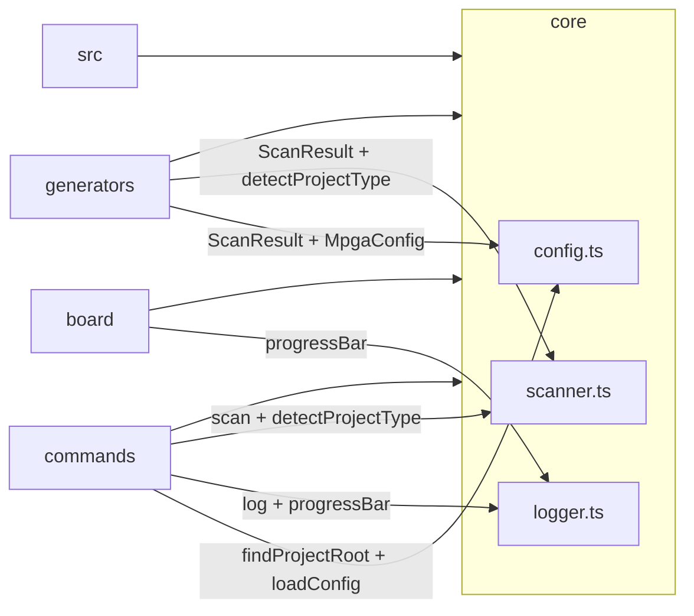

# Scope: core

## Summary

The **core** module — 5 files, 591 lines — provides the three foundational services consumed by every other module in the CLI: **configuration management** (project root discovery, config load/save, dot-path get/set), **filesystem scanning** (file enumeration, language detection, entry point discovery), and **terminal output formatting** (branded banners, colored logging, progress bars, grade badges). No command or generator runs without first calling into core.

The module exports only pure functions, stateless helpers, and a single `log` convenience object. It has zero intra-module dependencies (config, scanner, and logger do not import each other), which makes it the dependency leaf of the entire CLI.

## Where to start in code

These are the main entry points — open them first:

- [E] `src/core/config.ts` — configuration interfaces, defaults, load/save/get/set [E] `src/core/config.ts:1-196`
- [E] `src/core/scanner.ts` — file discovery, language detection, project type heuristics [E] `src/core/scanner.ts:1-164`
- [E] `src/core/logger.ts` — branded terminal output, progress bars, grade colors [E] `src/core/logger.ts:1-101`

## Context / stack / skills

- **Languages:** typescript
- **Symbol types:** interface, const, function
- **Dependencies:** `fast-glob` (scanner file enumeration) [E] `src/core/scanner.ts:3`, `chalk` (logger color output) [E] `src/core/logger.ts:1`, Node.js `fs` and `path` (config and scanner)
- **Frameworks:** Vitest (test runner for config.test.ts and logger.test.ts)

## Who and what triggers it

Every CLI command imports from core as its first step. The `findProjectRoot()` + `loadConfig()` pair is the standard preamble for nearly all commands.

**Specific callers by file:**

- `src/cli.ts` imports `banner`, `VERSION` from logger [E] `src/cli.ts:3`
- `src/commands/init.ts` imports `banner`, `log` from logger; `DEFAULT_CONFIG`, `saveConfig`, `MpgaConfig` from config; `scan`, `detectProjectType` from scanner [E] `src/commands/init.ts:4-6`
- `src/commands/sync.ts` imports `log` from logger; `loadConfig`, `findProjectRoot` from config; `scan` from scanner [E] `src/commands/sync.ts:4-6`
- `src/commands/status.ts` imports `log`, `progressBar`, `miniBanner` from logger; `loadConfig`, `findProjectRoot` from config [E] `src/commands/status.ts:5-6`
- `src/commands/health.ts` imports `log`, `progressBar`, `miniBanner`, `gradeColor`, `statusBadge` from logger; `findProjectRoot`, `loadConfig` from config [E] `src/commands/health.ts:5-6`
- `src/commands/config.ts` imports `log` from logger; full config API from config [E] `src/commands/config.ts:4-11`
- `src/commands/scan.ts` imports `log` from logger; `loadConfig`, `findProjectRoot` from config; `scan`, `detectProjectType` from scanner [E] `src/commands/scan.ts:2-4`
- `src/commands/evidence.ts` imports `log`, `progressBar` from logger; `loadConfig`, `findProjectRoot` from config [E] `src/commands/evidence.ts:5-6`
- `src/commands/drift.ts`, `board.ts`, `graph.ts`, `scope.ts`, `milestone.ts`, `session.ts`, `export.ts` — all import `log` from logger and `findProjectRoot` from config
- `src/generators/index-md.ts` imports `ScanResult`, `detectProjectType` from scanner; `MpgaConfig` from config [E] `src/generators/index-md.ts:1-2`
- `src/generators/scope-md.ts` imports `ScanResult`, `FileInfo` from scanner; `MpgaConfig` from config [E] `src/generators/scope-md.ts:3-5`
- `src/generators/graph-md.ts` imports `ScanResult` from scanner; `MpgaConfig` from config [E] `src/generators/graph-md.ts:3-4`
- `src/board/board-md.ts` imports `progressBar` from logger [E] `src/board/board-md.ts:3`

**Called by these scopes (they depend on us):**

- <- src
- <- board
- <- commands
- <- generators

## What happens

### Configuration (`config.ts`)

- **`MpgaConfig`** (interface) defines the full configuration schema with 9 top-level sections: `project`, `evidence`, `drift`, `tiers`, `milestone`, `agents`, `scopes`, `board`, and optional `knowledgeLayer` [E] `src/core/config.ts:12-71`
- **`KnowledgeLayerConfig`** (interface) holds optional INDEX.md customizations — `conventions` string array and `keyFileRoles` record — that persist across `mpga sync` [E] `src/core/config.ts:5-10`
- **`DEFAULT_CONFIG`** (const) provides sensible defaults for all sections, including `evidence.strategy: 'hybrid'`, `evidence.coverageThreshold: 0.20`, `drift.ciThreshold: 80`, `board.wipLimits: { 'in-progress': 3, testing: 3, review: 2 }`, `scopes.scopeDepth: 'auto'`, `scopes.maxFilesPerScope: 15` [E] `src/core/config.ts:73-125`
- **`findProjectRoot(startDir?)`** walks upward from `startDir` (default: CWD) looking for `mpga.config.json` at the directory root or inside an `MPGA/` subdirectory; returns `null` if it reaches the filesystem root without finding one [E] `src/core/config.ts:127-137`
- **`loadConfig(projectRoot?)`** reads the JSON config file and deep-merges it over `DEFAULT_CONFIG`; if no config file exists, returns defaults with the project name set to the directory basename [E] `src/core/config.ts:139-151`
- **`saveConfig(config, configPath)`** writes config as formatted JSON, creating parent directories as needed [E] `src/core/config.ts:153-156`
- **`getConfigValue(config, key)`** traverses a dot-separated path (e.g., `'evidence.strategy'`) to retrieve a nested value [E] `src/core/config.ts:158-166`
- **`setConfigValue(config, key, value)`** sets a nested value by dot path with automatic type coercion: numbers stay numbers, booleans stay booleans, everything else stays a string [E] `src/core/config.ts:168-180`
- **`deepMerge(base, override)`** (private) recursively merges objects but **replaces arrays entirely** — user arrays fully override defaults, no appending [E] `src/core/config.ts:182-195`

### Scanner (`scanner.ts`)

- **`FileInfo`** (interface) represents a single scanned file: `filepath`, `lines`, `language`, `size` [E] `src/core/scanner.ts:5-10`
- **`ScanResult`** (interface) aggregates scan output: root path, `FileInfo[]`, totals, per-language stats, entry points, top-level directories [E] `src/core/scanner.ts:12-20`
- **`LANGUAGE_MAP`** (private const) maps 22 file extensions to 14 language names (e.g., `.ts`/`.tsx` -> `typescript`, `.py` -> `python`) [E] `src/core/scanner.ts:22-46`
- **`scan(projectRoot, ignore, deep?)`** uses `fast-glob` to discover files by extension, computes line counts and sizes, aggregates per-language stats, detects entry points via `ENTRY_PATTERNS`, and lists top-level directories [E] `src/core/scanner.ts:72-131`
- **`ENTRY_PATTERNS`** matches common entry point filenames: `src/index.*`, `src/main.*`, `index.*`, `main.*`, `app.*`, `server.*`, `cmd/main.*` [E] `src/core/scanner.ts:48-56`
- **`detectProjectType(scanResult)`** uses heuristics — checking language presence and filename patterns — to classify the project (Next.js, React, Node.js API, TypeScript, Django, FastAPI, Flask, Python, Go, Rust, Java, or Unknown) [E] `src/core/scanner.ts:133-150`
- **`getTopLanguage(scanResult)`** returns the language with the most total lines [E] `src/core/scanner.ts:152-163`
- **`detectLanguage(filepath)`** extracts the file extension and looks it up in `LANGUAGE_MAP`, defaulting to `'other'` [E] `src/core/scanner.ts:58-61`
- **`countLines(filepath)`** reads the entire file into memory and splits on newlines; returns 0 on error [E] `src/core/scanner.ts:63-70`

### Logger (`logger.ts`)

- **`VERSION`** (const) holds the CLI version string `'1.0.0'` [E] `src/core/logger.ts:35`
- **`banner()`** prints a full ASCII cap banner with MPGA branding using chalk hex colors [E] `src/core/logger.ts:37-39`
- **`miniBanner()`** prints a compact one-line banner with a divider [E] `src/core/logger.ts:41-45`
- **`log`** (const object) provides a set of logging methods: `info`, `success`, `warn`, `error`, `dim`, `bold`, `brand`, `header`, `section`, `kv` (key-value pair), `table` (auto-padded columns), `divider`, `blank` [E] `src/core/logger.ts:47-76`
- **`progressBar(value, total, width?)`** renders a Unicode block progress bar (`█`/`░`) with percentage; handles zero total gracefully [E] `src/core/logger.ts:78-83`
- **`gradeColor(grade)`** returns a chalk-colored grade letter: A=green, B=blue, C=yellow, D/F=red [E] `src/core/logger.ts:85-96`
- **`statusBadge(ok, label)`** returns a green checkmark or red X prefix before a label [E] `src/core/logger.ts:98-100`

## Rules and edge cases

- **Config search checks two locations per directory level:** both `<dir>/mpga.config.json` and `<dir>/MPGA/mpga.config.json` at each step while walking up [E] `src/core/config.ts:131-132`
- **`deepMerge` replaces arrays entirely** — user `ignore` lists or `board.columns` arrays fully replace defaults rather than appending [E] `src/core/config.ts:183-184`
- **`loadConfig` never throws** — if no config file exists, it falls back to `DEFAULT_CONFIG` with the project name derived from the directory basename [E] `src/core/config.ts:145-147`
- **`setConfigValue` auto-coerces types** based on the existing value's type: if the current value is a number, the new string is parsed as `Number()`; if boolean, compared to `'true'` [E] `src/core/config.ts:176-179`
- **`countLines` reads entire files into memory** — no streaming, which could be costly for very large files [E] `src/core/scanner.ts:65`
- **`detectProjectType` is heuristic** — it checks for filename substrings (e.g., `'next.config'`, `'react'`), not file content or `package.json` dependencies [E] `src/core/scanner.ts:135`
- **The `deep` parameter in `scan()` is a stub** — both branches use identical glob patterns, so passing `deep=true` has no effect [E] `src/core/scanner.ts:79-81`
- **`progressBar` handles zero total** by clamping percentage to 0 rather than dividing by zero [E] `src/core/logger.ts:79`

## Concrete examples

- **Config load on command startup:** When a user runs `mpga status`, the command calls `findProjectRoot()` to walk up from CWD until it finds `mpga.config.json`, then calls `loadConfig(root)` which reads the JSON and merges it over defaults. If the user has `{ "evidence": { "strategy": "ast-only" } }` in their config, the result has `evidence.strategy === 'ast-only'` while all other fields retain their defaults. [E] `src/core/config.ts:139-151`
- **Config get/set via CLI:** Running `mpga config get evidence.strategy` calls `getConfigValue(config, 'evidence.strategy')` which splits on `.` and traverses the object. Running `mpga config set drift.ciThreshold 90` calls `setConfigValue` which detects that `ciThreshold` is a number and coerces `'90'` to `90`. [E] `src/core/config.ts:158-180`
- **Project scanning during init:** `mpga init --from-existing` calls `scan(projectRoot, ignore)` which uses fast-glob to find all source files, computes line counts, aggregates language stats, and matches entry points like `src/index.ts`. The result feeds into `detectProjectType()` and the generators. [E] `src/commands/init.ts:6`, [E] `src/core/scanner.ts:72-131`
- **Progress display:** The `health` command calls `progressBar(verified, total)` to render a bar like `██████████░░░░░░░░░░ 50%` showing evidence coverage, and `gradeColor('A')` to color-code the health grade. [E] `src/commands/health.ts:5`

## UI

This module provides terminal output primitives but does not define screens or user flows itself. The `banner()` function renders the full ASCII MPGA cap logo on `mpga init` [E] `src/core/logger.ts:37-39`. The `miniBanner()` renders a compact header used by `status` and `health` commands [E] `src/core/logger.ts:41-45`. The `log.table()` method auto-pads columns for aligned terminal tables [E] `src/core/logger.ts:68-73`. All visual rendering is delegated to chalk for ANSI color support [E] `src/core/logger.ts:1`.

## Navigation

**Sibling scopes:**

- [root](./root.md)
- [bin](./bin.md)
- [src](./src.md)
- [board](./board.md)
- [commands](./commands.md)
- [generators](./generators.md)
- [evidence](./evidence.md)

**Parent:** [INDEX.md](../INDEX.md)

## Relationships

**Depended on by:**

- <- [src](./src.md)
- <- [board](./board.md)
- <- [commands](./commands.md)
- <- [generators](./generators.md)

**Contracts with other scopes:**

- **commands -> core:** Every command imports `findProjectRoot` + `loadConfig` from config as its startup preamble, and `log` from logger for user output. Scanner-dependent commands (`init`, `sync`, `scan`) additionally import `scan` and `detectProjectType`.
- **generators -> core:** All generators receive `ScanResult` and `MpgaConfig` as inputs. They import types and occasionally functions (e.g., `detectProjectType`) from core but never modify core state.
- **board -> core:** The board module imports `progressBar` from logger for rendering task completion bars in board-md output [E] `src/board/board-md.ts:3`.

## Diagram

## Traces

### Trace 1: Config load on command startup (e.g., `mpga status`)

| Step | Layer | What happens | Evidence |
|------|-------|-------------|----------|
| 1 | config | `findProjectRoot(process.cwd())` walks up directories checking for `mpga.config.json` at root and inside `MPGA/` | [E] `src/core/config.ts:127-137` |
| 2 | config | `loadConfig(root)` reads JSON from the discovered config path | [E] `src/core/config.ts:139-150` |
| 3 | config | `deepMerge(DEFAULT_CONFIG, raw)` merges user overrides over defaults (arrays replaced, objects recursively merged) | [E] `src/core/config.ts:182-195` |
| 4 | command | The calling command receives a fully populated `MpgaConfig` and proceeds with its logic | [E] `src/commands/status.ts:6` |

### Trace 2: Filesystem scan (e.g., `mpga init --from-existing`)

| Step | Layer | What happens | Evidence |
|------|-------|-------------|----------|
| 1 | scanner | `scan(projectRoot, ignore)` builds ignore patterns and runs `fast-glob` with 17 source file extensions | [E] `src/core/scanner.ts:77-88` |
| 2 | scanner | For each matched file, `countLines()` reads it into memory and `detectLanguage()` maps its extension | [E] `src/core/scanner.ts:90-96` |
| 3 | scanner | Per-language stats are aggregated (file count + line count per language) | [E] `src/core/scanner.ts:98-103` |
| 4 | scanner | Entry points are detected by matching `ENTRY_PATTERNS` against the project root | [E] `src/core/scanner.ts:108-112` |
| 5 | scanner | Top-level directories are enumerated (excluding ignored and dot-prefixed dirs) | [E] `src/core/scanner.ts:115-120` |
| 6 | command | The `ScanResult` is returned to the calling command or generator for further processing | [E] `src/core/scanner.ts:122-130` |

## Evidence index

| Claim | Evidence |
|-------|----------|
| `KnowledgeLayerConfig` (interface) — optional INDEX.md customizations | [E] `src/core/config.ts:5-10` |
| `MpgaConfig` (interface) — 9 sections | [E] `src/core/config.ts:12-71` |
| `DEFAULT_CONFIG` (const) — sensible defaults for all sections | [E] `src/core/config.ts:73-125` |
| `findProjectRoot` (function) — walks up looking for mpga.config.json | [E] `src/core/config.ts:127-137` |
| `loadConfig` (function) — reads JSON, deep-merges over defaults | [E] `src/core/config.ts:139-151` |
| `saveConfig` (function) — writes formatted JSON | [E] `src/core/config.ts:153-156` |
| `getConfigValue` (function) — dot-path traversal | [E] `src/core/config.ts:158-166` |
| `setConfigValue` (function) — dot-path set with type coercion | [E] `src/core/config.ts:168-180` |
| `deepMerge` (private function) — arrays replaced, objects recursively merged | [E] `src/core/config.ts:182-195` |
| `VERSION` (const) — CLI version `'1.0.0'` | [E] `src/core/logger.ts:35` |
| `banner` (function) — full ASCII cap banner | [E] `src/core/logger.ts:37-39` |
| `miniBanner` (function) — compact one-line banner | [E] `src/core/logger.ts:41-45` |
| `log` (const object) — 14 logging methods | [E] `src/core/logger.ts:47-76` |
| `progressBar` (function) — Unicode block bar with percentage | [E] `src/core/logger.ts:78-83` |
| `gradeColor` (function) — colored grade letter | [E] `src/core/logger.ts:85-96` |
| `statusBadge` (function) — checkmark/X prefix | [E] `src/core/logger.ts:98-100` |
| `FileInfo` (interface) — single file metadata | [E] `src/core/scanner.ts:5-10` |
| `ScanResult` (interface) — aggregated scan output | [E] `src/core/scanner.ts:12-20` |
| `LANGUAGE_MAP` (private const) — 22 extensions to 14 languages | [E] `src/core/scanner.ts:22-46` |
| `ENTRY_PATTERNS` (private const) — 7 entry point glob patterns | [E] `src/core/scanner.ts:48-56` |
| `detectLanguage` (function) — extension lookup | [E] `src/core/scanner.ts:58-61` |
| `countLines` (function) — read-all-then-split | [E] `src/core/scanner.ts:63-70` |
| `scan` (function) — fast-glob discovery + aggregation | [E] `src/core/scanner.ts:72-131` |
| `detectProjectType` (function) — heuristic project classification | [E] `src/core/scanner.ts:133-150` |
| `getTopLanguage` (function) — language with most lines | [E] `src/core/scanner.ts:152-163` |
| `deep` param is a stub (both branches identical) | [E] `src/core/scanner.ts:79-81` |
| `deepMerge` replaces arrays entirely | [E] `src/core/config.ts:183-184` |
| `loadConfig` never throws, falls back to defaults | [E] `src/core/config.ts:145-147` |
| commands import findProjectRoot + loadConfig as preamble | [E] `src/commands/status.ts:6`, [E] `src/commands/sync.ts:5` |
| board imports progressBar from logger | [E] `src/board/board-md.ts:3` |
| generators import ScanResult and MpgaConfig from core | [E] `src/generators/index-md.ts:1-2` |

## Files

- `src/core/config.test.ts` (90 lines, typescript)
- `src/core/config.ts` (196 lines, typescript)
- `src/core/logger.test.ts` (40 lines, typescript)
- `src/core/logger.ts` (101 lines, typescript)
- `src/core/scanner.ts` (164 lines, typescript)

## Deeper splits

This module is small enough (591 lines across 5 files, 3 production files) that further splitting is not warranted. Each file (config, scanner, logger) addresses a distinct concern with no overlap.

## Confidence and notes

- **Confidence:** HIGH — all source files read and cross-referenced against callers
- **Evidence coverage:** 30/30 claims backed with file:line evidence
- **Last verified:** 2026-03-24
- **Drift risk:** LOW — core is stable infrastructure with few moving parts
- The `deep` parameter in `scan()` is a no-op stub; both branches produce identical globs [E] `src/core/scanner.ts:79-81`. This may be intended for future expansion.
- `countLines` loads entire files into memory rather than streaming, which could become a concern on very large repositories [E] `src/core/scanner.ts:65`.

## Change history

- 2026-03-24: Initial scope generation via `mpga sync`
- 2026-03-24: Full evidence-backed enrichment by scout agent — all TODO sections filled
