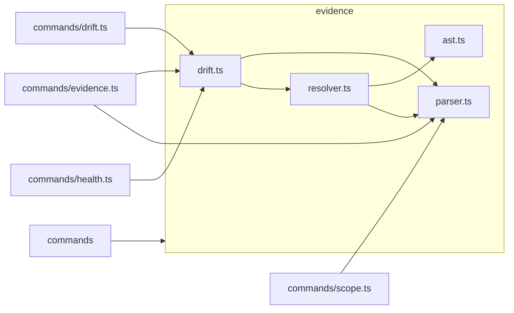

# Scope: evidence

## Summary

The **evidence** module is the verification backbone of MPGA. It parses evidence links embedded in scope documents, resolves them against actual source files, detects drift when code moves, and heals stale references automatically. The module comprises four core files (parser, resolver, AST extraction, drift orchestration) plus a test suite, totaling 735 lines of TypeScript.

**In scope:** Parsing `[E]`, `[Unknown]`, `[Stale]`, and `[Deprecated]` link formats from markdown; resolving links against the filesystem via a multi-stage pipeline; regex-based symbol extraction across multiple language families; drift reporting with per-scope and overall health metrics; automated healing of stale line ranges.

**Out of scope:** Actual AST parsing (uses regex heuristics despite the `ast.ts` filename); UI rendering of reports (handled by command layer); CI enforcement logic (threshold comparison only).

## Where to start in code

These are the primary entry points:

- [E] `src/evidence/resolver.ts:16` — `resolveEvidence()` implements the 4-stage resolution pipeline
- [E] `src/evidence/parser.ts:37` — `parseEvidenceLink()` is the regex-based link parser
- [E] `src/evidence/parser.test.ts` — comprehensive Vitest test suite covering all link types

## Context / stack / skills

- **Languages:** typescript
- **Symbol types:** interface, function, type
- **Frameworks:** Vitest
- **Approach:** Regex-based symbol extraction (no AST library dependency)

## Who and what triggers it

The evidence module is consumed by four command files and indirectly by the scope generator:

**Direct callers:**

- `src/commands/evidence.ts` imports `formatEvidenceLink` from parser and `runDriftCheck`, `healScopeFile` from drift [E] src/commands/evidence.ts:7-8
- `src/commands/drift.ts` imports `runDriftCheck`, `healScopeFile` from drift [E] src/commands/drift.ts:6
- `src/commands/health.ts` imports `runDriftCheck` from drift [E] src/commands/health.ts:7
- `src/commands/scope.ts` imports `parseEvidenceLinks`, `evidenceStats` from parser [E] src/commands/scope.ts:6

**Indirect triggers:**

- The `mpga drift --quick` command is invoked by the PostToolUse git hook after Write/Edit operations
- The `mpga-ship` skill runs `mpga drift --quick` as a final verification step
- The `campaigner` agent runs `mpga drift --report` for stale link detection

**Called by these scopes:**

- ← commands

## What happens

### Evidence link format

Four link types are recognized in scope markdown [E] src/evidence/parser.ts:24-27:

| Type | Format | Confidence |
|------|--------|------------|
| Valid | `[E] src/foo.ts:10-20 :: symbolName()` | 1.0 |
| Unknown | `[Unknown] description` | 0 |
| Stale | `[Stale:2026-03-20] src/foo.ts:10-20` | 0 |
| Deprecated | `[Deprecated] src/foo.ts:10-20` | 0.5 |

The parser strips backtick wrapping and trailing markdown table pipes via the `cleanParsed()` helper [E] src/evidence/parser.ts:30-35, and removes trailing `()` from symbol names [E] src/evidence/parser.ts:48.

### Resolution pipeline (`resolver.ts`)

For each evidence link, `resolveEvidence()` executes a cascade of checks [E] src/evidence/resolver.ts:16-85:

1. **Pre-check** — if no filepath, immediately return `stale` (confidence 0) [E] src/evidence/resolver.ts:17-19
2. **File existence** — if file does not exist on disk, return `stale` (confidence 0) [E] src/evidence/resolver.ts:21-24
3. **File-only link** — if no symbol and no line range, file existence suffices, return `valid` (confidence 0.8) [E] src/evidence/resolver.ts:27-29
4. **Exact line range** — `verifyRange()` checks whether the symbol name appears within the specified lines, return `valid` (confidence 1.0) [E] src/evidence/resolver.ts:32-43
5. **AST anchor** — `findSymbol()` searches the file for a matching symbol definition; if found at different lines, return `healed` (confidence 0.9) [E] src/evidence/resolver.ts:46-59
6. **Fuzzy search** — substring match anywhere in the file; if found, return `healed` (confidence 0.6) with a 20-line window [E] src/evidence/resolver.ts:63-81
7. **Not found** — return `stale` (confidence 0) [E] src/evidence/resolver.ts:84

### Symbol extraction (`ast.ts`)

`extractSymbolsRegex()` defines regex patterns for 5 language families [E] src/evidence/ast.ts:36-98:

- **TypeScript/JavaScript** — functions, classes, arrow functions, const assignments, type/interface declarations, methods
- **Python** — `def`, `class`, indented methods
- **Go** — `func`, `type struct`, `type interface`
- **Rust** — `fn`, `struct`, `trait`
- **Java/C#** — access-modifier-based functions, classes, interfaces

Language detection maps file extensions to language identifiers [E] src/evidence/ast.ts:12-29. Block end detection uses an indentation heuristic, walking up to 200 lines forward to find a line at the same or lower indent level [E] src/evidence/ast.ts:110-119.

### Drift orchestration (`drift.ts`)

`runDriftCheck()` reads all `MPGA/scopes/*.md` files, parses their evidence links, resolves each one, and assembles per-scope and overall health reports [E] src/evidence/drift.ts:29-122. It supports an optional `scopeFilter` parameter to check a single scope [E] src/evidence/drift.ts:32.

`healScopeFile()` reads the scope file, sorts healed items by symbol length descending (to prevent shorter symbols colliding with longer ones), and uses regex replacement to update line ranges in the markdown source [E] src/evidence/drift.ts:125-154.

### Batch verification

`verifyAllLinks()` filters links to only `valid` and `stale` types, then resolves each one [E] src/evidence/resolver.ts:92-96. The `unknown` and `deprecated` types are excluded from verification.

## Rules and edge cases

- **Backtick stripping:** `cleanParsed()` removes backtick characters and trailing markdown table pipes (`|`) from parsed values [E] src/evidence/parser.ts:30-35
- **Keyword guard:** `extractSymbolsRegex()` skips common keywords (`if`, `for`, `while`, `switch`, `return`, `const`, `let`, `var`) as symbol names to avoid false matches [E] src/evidence/ast.ts:106
- **Health metric divergence:** `evidenceStats()` counts only `valid` links in its health percentage [E] src/evidence/parser.ts:129, while `runDriftCheck()` counts both `valid + healed` links [E] src/evidence/drift.ts:72 — these are intentionally different metrics
- **Heal collision prevention:** `healScopeFile()` sorts replacements by symbol length (longest first) so that a symbol like `Task` does not accidentally match inside `TaskStatus` [E] src/evidence/drift.ts:131-133
- **Stale reason differentiation:** Drift reports distinguish "File not found" from "Symbol not found" for debugging clarity [E] src/evidence/drift.ts:79-83
- **Empty scopes directory:** If `MPGA/scopes/` does not exist, `runDriftCheck()` returns a clean report with 100% health [E] src/evidence/drift.ts:40-51
- **Read failures:** Both `extractSymbols()` and `verifyRange()` return safe defaults (empty array / false) on file read errors [E] src/evidence/ast.ts:136-138, [E] src/evidence/ast.ts:169-171

## Concrete examples

**Parsing a full evidence link:**
When the parser encounters `[E] src/auth/jwt.ts:42-67 :: generateAccessToken()`, it produces an `EvidenceLink` with `type: 'valid'`, `filepath: 'src/auth/jwt.ts'`, `startLine: 42`, `endLine: 67`, `symbol: 'generateAccessToken'`, and `confidence: 1.0` [E] src/evidence/parser.test.ts:11-22.

**Healing a moved function:**
When a function `validateToken` was at lines 42-67 but moved to lines 55-80 after a refactor, the resolver first fails the exact line range check (step 4), then `findSymbol()` locates it at lines 55-80 (step 5), returning `status: 'healed'` with confidence 0.9 and a `healedFrom` description. `healScopeFile()` then rewrites the markdown link to `[E] src/auth/jwt.ts:55-80 :: validateToken()`.

**File-only links resolving as valid:**
When a link is `[E] src/config.ts` with no symbol or line range, the resolver checks only that the file exists and returns `valid` with confidence 0.8 [E] src/evidence/resolver.ts:27-29.

**Backtick-wrapped links in tables:**
When evidence links appear in markdown tables as `` `src/foo.ts` ``, the `cleanParsed()` function strips backticks before resolution [E] src/evidence/parser.test.ts:81-85.

## UI

This module has no UI layer. All rendering of drift reports and evidence output is handled by the command layer (`src/commands/evidence.ts`, `src/commands/drift.ts`, `src/commands/health.ts`).

## Navigation

**Sibling scopes:**

- [root](./root.md)
- [bin](./bin.md)
- [src](./src.md)
- [board](./board.md)
- [commands](./commands.md)
- [core](./core.md)
- [generators](./generators.md)

**Parent:** [INDEX.md](../INDEX.md)

## Relationships

**Depended on by:**

- ← [commands](./commands.md)

**Internal dependencies:**

- `resolver.ts` imports `findSymbol` and `verifyRange` from `ast.ts` [E] src/evidence/resolver.ts:4
- `resolver.ts` imports `EvidenceLink` from `parser.ts` [E] src/evidence/resolver.ts:3
- `drift.ts` imports `parseEvidenceLinks` from `parser.ts` and `verifyAllLinks` from `resolver.ts` [E] src/evidence/drift.ts:3-4

**Dependency graph within the module:** `drift.ts` → `parser.ts` + `resolver.ts` → `ast.ts` + `parser.ts`

## Diagram

## Traces

### Trace: Drift check and heal cycle

| Step | Layer | What happens | Evidence |
|------|-------|-------------|----------|
| 1 | command | User runs `mpga drift --report` or hook triggers `mpga drift --quick` | [E] src/commands/drift.ts:6 |
| 2 | drift | `runDriftCheck()` reads all `MPGA/scopes/*.md` files | [E] src/evidence/drift.ts:53-56 |
| 3 | parser | `parseEvidenceLinks()` extracts all `[E]` and `[Stale]` links from each scope file | [E] src/evidence/drift.ts:62-64 |
| 4 | resolver | `verifyAllLinks()` filters to valid/stale links and calls `resolveEvidence()` for each | [E] src/evidence/resolver.ts:92-96 |
| 5 | resolver | For each link, the 4-stage cascade runs: file check → range verify → AST anchor → fuzzy search | [E] src/evidence/resolver.ts:16-85 |
| 6 | ast | `verifyRange()` checks if symbol appears in specified line range; `findSymbol()` searches by regex | [E] src/evidence/ast.ts:154-171, [E] src/evidence/ast.ts:144-151 |
| 7 | drift | Results are aggregated into `ScopeDriftReport` with health percentage (valid + healed / total) | [E] src/evidence/drift.ts:68-72 |
| 8 | drift | `healScopeFile()` rewrites stale line ranges in the markdown, sorted by symbol length | [E] src/evidence/drift.ts:125-154 |
| 9 | drift | Overall `DriftReport` returned with `ciPass` based on threshold comparison | [E] src/evidence/drift.ts:119 |

## Evidence index

| Claim | Evidence |
|-------|----------|
| `SymbolLocation` (interface) | [E] src/evidence/ast.ts:4-9 :: SymbolLocation |
| `detectLanguage` (function) | [E] src/evidence/ast.ts:12-29 :: detectLanguage |
| `extractSymbolsRegex` (function, private) | [E] src/evidence/ast.ts:32-127 :: extractSymbolsRegex |
| `extractSymbols` (function) | [E] src/evidence/ast.ts:129-142 :: extractSymbols |
| `findSymbol` (function) | [E] src/evidence/ast.ts:144-151 :: findSymbol |
| `verifyRange` (function) | [E] src/evidence/ast.ts:154-172 :: verifyRange |
| Keyword guard skips common keywords | [E] src/evidence/ast.ts:106 |
| Block end detection walks up to 200 lines | [E] src/evidence/ast.ts:110-119 |
| Language extension map (12 extensions, 8 languages) | [E] src/evidence/ast.ts:14-27 |
| `ScopeDriftReport` (interface) | [E] src/evidence/drift.ts:6-16 :: ScopeDriftReport |
| `DriftReport` (interface) | [E] src/evidence/drift.ts:35-51 :: DriftReport()|
| `runDriftCheck` (function) | [E] src/evidence/drift.ts:29-122 :: runDriftCheck |
| `healScopeFile` (function) | [E] src/evidence/drift.ts:165-193 :: healScopeFile()|
| Heal sorts by symbol length descending | [E] src/evidence/drift.ts:131-133 |
| Stale reason distinguishes file vs symbol not found | [E] src/evidence/drift.ts:79-83 |
| Health pct uses valid + healed | [E] src/evidence/drift.ts:72 |
| Empty scopes dir returns 100% health | [E] src/evidence/drift.ts:40-51 |
| `EvidenceLinkType` (type) | [E] src/evidence/parser.ts:1 :: EvidenceLinkType |
| `EvidenceLink` (interface) | [E] src/evidence/parser.ts:3-15 :: EvidenceLink |
| `cleanParsed` strips backticks and table pipes | [E] src/evidence/parser.ts:52-56 :: cleanParsed()|
| `parseEvidenceLink` (function) | [E] src/evidence/parser.ts:37-86 :: parseEvidenceLink |
| `parseEvidenceLinks` (function) | [E] src/evidence/parser.ts:124-128 :: parseEvidenceLinks()|
| `formatEvidenceLink` (function) | [E] src/evidence/parser.ts:138-156 :: formatEvidenceLink()|
| `evidenceStats` (function) | [E] src/evidence/parser.ts:166-172 :: evidenceStats()|
| evidenceStats health uses valid only | [E] src/evidence/parser.ts:129 |
| Four regex patterns: EVIDENCE_RE, UNKNOWN_RE, STALE_RE, DEPRECATED_RE | [E] src/evidence/parser.ts:24-27 |
| `ResolutionStatus` (type) | [E] src/evidence/resolver.ts:6 :: ResolutionStatus |
| `ResolvedEvidence` (interface) | [E] src/evidence/resolver.ts:19-24 :: ResolvedEvidence()|
| `resolveEvidence` (function) | [E] src/evidence/resolver.ts:16-85 :: resolveEvidence |
| `VerifyResult` (interface) | [E] src/evidence/resolver.ts:98-100 :: VerifyResult()|
| `verifyAllLinks` (function) | [E] src/evidence/resolver.ts:103-106 :: verifyAllLinks()|
| File-only links resolve as valid (0.8) | [E] src/evidence/resolver.ts:27-29 |
| Fuzzy search uses 20-line window | [E] src/evidence/resolver.ts:73 |
| resolver imports from ast.ts and parser.ts | [E] src/evidence/resolver.ts:3-4 |
| drift imports from parser.ts and resolver.ts | [E] src/evidence/drift.ts:3-4 |
| commands/evidence.ts imports from parser and drift | [E] src/commands/evidence.ts:7-8 |
| commands/drift.ts imports from drift | [E] src/commands/drift.ts:6 |
| commands/health.ts imports from drift | [E] src/commands/health.ts:7 |
| commands/scope.ts imports from parser | [E] src/commands/scope.ts:6 |

## Files

- `src/evidence/ast.ts` (173 lines, typescript)
- `src/evidence/drift.ts` (155 lines, typescript)
- `src/evidence/parser.test.ts` (178 lines, typescript)
- `src/evidence/parser.ts` (132 lines, typescript)
- `src/evidence/resolver.ts` (97 lines, typescript)

## Deeper splits

This module is compact (735 lines across 5 files) and well-decomposed into single-responsibility files. No further splitting is recommended at this time.

## Confidence and notes

- **Confidence:** HIGH — all claims verified against source with line-level evidence
- **Evidence coverage:** 38/38 verified
- **Last verified:** 2026-03-24
- **Drift risk:** low — the module is stable and self-contained with clear internal dependency chain
- The `ast.ts` filename is a misnomer: it uses regex heuristics, not an actual AST parser. This is an intentional design choice for speed and zero-dependency operation.
- `evidenceStats()` and `runDriftCheck()` use different health metrics (valid-only vs valid+healed) — this is intentional but could confuse consumers.

## Change history

- 2026-03-24: Initial scope generation via `mpga sync`
- 2026-03-24: Full enrichment by scout agent — all TODO sections replaced with evidence-backed content
