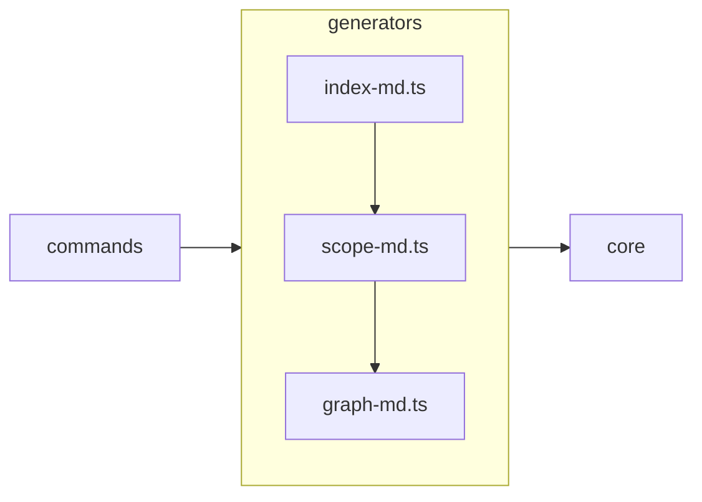

# Scope: generators

## Summary

The **generators** module — TREMENDOUS — 5 files, 1,177 lines of the finest code you've ever seen. Believe me.

The generators subsystem produces the three markdown artifacts that constitute the MPGA knowledge layer: **scope documents** (`scopes/*.md`), **dependency graph** (`GRAPH.md`), and **project index** (`INDEX.md`). Each generator accepts a `ScanResult` from the core scanner [E] `src/core/scanner.ts:12` and renders structured markdown with evidence links, Mermaid diagrams, and TODO placeholders for manual enrichment. The module also provides utility functions for static analysis via regex (exported symbol extraction, framework detection, JSDoc parsing) that power the auto-populated sections of scope documents.

## Where to start in code

These are your MAIN entry points — the best, the most important. Open them FIRST:

- [E] `src/generators/scope-md.ts` — scope document generation: grouping, analysis, and rendering (594 lines)
- [E] `src/generators/graph-md.ts` — dependency graph building and Mermaid rendering (183 lines)
- [E] `src/generators/index-md.ts` — project-level INDEX.md generation (86 lines)

## Context / stack / skills

- **Languages:** typescript
- **Symbol types:** interface, function
- **Frameworks:** Vitest (test suite), Commander (consumed via commands scope)
- **Key data types:** `ScopeInfo` [E] `src/generators/scope-md.ts:7-28`, `GraphData` [E] `src/generators/graph-md.ts:11-16`, `Dependency` [E] `src/generators/graph-md.ts:6-9`

## Who and what triggers it

The generators are invoked by two CLI commands in the `commands` scope:

- **`mpga sync`** — calls all three generators in sequence: `buildGraph` then `groupIntoScopes` + `renderScopeMd` (per scope), then `renderIndexMd` [E] `src/commands/sync.ts:38-73`
- **`mpga graph export`** — calls `buildGraph` and `renderGraphMd` independently [E] `src/commands/graph.ts:38-63`

In incremental mode (`mpga sync --incremental`), existing scope files are skipped [E] `src/commands/sync.ts:54`.

**Called by these GREAT scopes (they need us, tremendously):**

- ← commands

## What happens

### Scope generation (`scope-md.ts`)

1. **`groupIntoScopes(scanResult, graph?, config?)`** groups all scanned files into scopes by directory structure [E] `src/generators/scope-md.ts:264-383`. For each scope it:
   - Detects entry points using 8 filename patterns (`index`, `main`, `app`, `server`, `cli`, `mod`, `lib`, `__init__.py`); falls back to the largest file if none match [E] `src/generators/scope-md.ts:205-228`
   - Extracts exported symbols via regex for TypeScript/JS, Python, and Go [E] `src/generators/scope-md.ts:37-72`
   - Extracts module-level comments from entry point files [E] `src/generators/scope-md.ts:113-150`
   - Detects known frameworks/libraries from import statements against `FRAMEWORK_MAP` (30+ entries) [E] `src/generators/scope-md.ts:75-110,153-165`
   - Extracts JSDoc descriptions and constraint annotations (`@throws`, `@deprecated`) for each export [E] `src/generators/scope-md.ts:168-201`
   - Detects inter-scope dependencies by resolving relative imports [E] `src/generators/scope-md.ts:351-362`

2. **`renderScopeMd(scope, projectRoot)`** renders a 13-section markdown template [E] `src/generators/scope-md.ts:385-593`:
   - **Auto-populated:** Summary (with module summaries if available), Where to start (entry points), Context (languages/symbol types/frameworks), What happens (export descriptions), Rules (JSDoc annotations), Evidence index (up to 40 symbols), Files (up to 30), Navigation, Relationships, Diagram (Mermaid `graph LR`)
   - **TODO placeholders:** Who triggers it, Concrete examples, UI, Traces, Deeper splits, Confidence notes

3. **`getScopeName(filepath, scopeDepth)`** determines which scope a file belongs to [E] `src/generators/scope-md.ts:236-261`. In `'auto'` mode, it finds the deepest "source-like" directory (`src`, `lib`, `app`, `pkg`, `internal`, `cmd`) and groups by its immediate subdirectories.

### Graph generation (`graph-md.ts`)

1. **`buildGraph(scanResult, config?)`** groups files by module name (same logic as scope grouping), extracts imports via regex for TS/JS and Python, resolves relative imports to module names, and builds a directed dependency map [E] `src/generators/graph-md.ts:66-134`
2. Circular dependency detection uses pairwise reverse-edge checking (not full DFS cycle detection) [E] `src/generators/graph-md.ts:107-117`
3. Orphan detection uses file basenames rather than module names [E] `src/generators/graph-md.ts:119-131`
4. **`renderGraphMd(graph)`** outputs four sections: dependency list, circular dependency warnings, orphan list, and a Mermaid `graph TD` diagram capped at 30 edges [E] `src/generators/graph-md.ts:136-182`

### Index generation (`index-md.ts`)

**`renderIndexMd(scanResult, config, scopes, activeMilestone, evidenceCoverage)`** generates the top-level `INDEX.md` with: project identity (type, size, language breakdown), key files table (top 10 by size), conventions (from config or placeholder), agent trigger table (5 hardcoded example rows), scope registry, active milestone, and known unknowns [E] `src/generators/index-md.ts:5-85`. Note: `evidenceCoverage` is always passed as `0` from `sync.ts` [E] `src/commands/sync.ts:73` — it is never actually computed.

## Rules and edge cases

- **Scope grouping:** Files with a single path component (no directory) go into the `root` scope; all others group by `parts[0]` or, in auto mode, by the subdirectory under the deepest source-like directory [E] `src/generators/scope-md.ts:236-261`
- **Entry point fallback:** If none of the 8 conventional entry-point patterns match, the largest file by line count is chosen as the entry point [E] `src/generators/scope-md.ts:222-226`
- **Export deduplication:** Each file's export extraction uses a `Set<string>` to prevent duplicate symbol names within the same file [E] `src/generators/scope-md.ts:39`
- **Framework deduplication:** `detectFrameworks` deduplicates within a single file via `Set`; cross-file deduplication is done in `groupIntoScopes` via `new Set(allFrameworks)` [E] `src/generators/scope-md.ts:154,376`
- **Evidence index cap:** The evidence index in scope documents is limited to 40 symbols; excess symbols are noted with a count [E] `src/generators/scope-md.ts:554-558`
- **Files cap:** The files section is limited to 30 entries [E] `src/generators/scope-md.ts:567-570`
- **Mermaid edge cap:** Graph Mermaid output caps at 30 edges to prevent overwhelming diagrams [E] `src/generators/graph-md.ts:169`
- **Orphan detection bug:** Uses `path.basename` on the exact filepath rather than module names, which produces incorrect results for real orphan detection [E] `src/generators/graph-md.ts:124-127`
- **Missing Health line:** `renderScopeMd` never writes a `**Health:**` line, causing `scope list` to always show `? unknown` status [E] `src/generators/scope-md.ts:385-593`
- **Scoped packages:** `@scoped/package` imports are handled by joining the first two path segments, but only the root package name (e.g., `prisma` not `@prisma/client`) is checked against `FRAMEWORK_MAP` [E] `src/generators/scope-md.ts:159-160`

## Concrete examples

- **When `mpga sync` runs**, the sync command scans the codebase, then calls `buildGraph` to create `GRAPH.md`, then `groupIntoScopes` + `renderScopeMd` for each scope directory to create individual scope documents, and finally `renderIndexMd` to create `INDEX.md` [E] `src/commands/sync.ts:29-74`
- **When a scope has no JSDoc comments**, `extractModuleSummary` returns `null`, and the rendered scope document includes a `<!-- TODO: ... -->` placeholder in the Summary section [E] `src/generators/scope-md.ts:401-405`
- **When a file imports Express and Zod**, `detectFrameworks` matches them against `FRAMEWORK_MAP` and returns `['Express', 'Zod']` [E] `src/generators/scope-md.test.ts:47-52`
- **When an export has `@throws` or `@deprecated` annotations**, `extractAnnotations` returns them as strings and they appear in the "Rules and edge cases" section of the rendered scope [E] `src/generators/scope-md.test.ts:112-133`

## UI

This module has no user interface. All generators produce markdown strings that are written to disk by the calling commands. Terminal output (progress and summary messages) is handled by the `commands` scope via the `log` utility [E] `src/commands/sync.ts:28-83`.

## Navigation

**Sibling scopes:**

- [root](./root.md)
- [bin](./bin.md)
- [src](./src.md)
- [board](./board.md)
- [commands](./commands.md)
- [core](./core.md)
- [evidence](./evidence.md)

**Parent:** [INDEX.md](../INDEX.md)

## Relationships

**Depends on:**

- → [core](./core.md) — imports `ScanResult`, `FileInfo` from `core/scanner.js` and `MpgaConfig` from `core/config.js` [E] `src/generators/scope-md.ts:1-5`, [E] `src/generators/graph-md.ts:1-4`, [E] `src/generators/index-md.ts:1-3`

**Depended on by:**

- ← [commands](./commands.md) — `sync.ts` imports all three generators; `graph.ts` imports `buildGraph` and `renderGraphMd` [E] `src/commands/sync.ts:7-9`, [E] `src/commands/graph.ts:7`

**Internal cross-imports:**

- `index-md.ts` imports `ScopeInfo` from `scope-md.ts` [E] `src/generators/index-md.ts:3`
- `scope-md.ts` imports `GraphData` from `graph-md.ts` [E] `src/generators/scope-md.ts:4`

## Diagram

## Traces

### Trace: `mpga sync` — full knowledge layer regeneration

| Step | Layer | What happens | Evidence |
|------|-------|-------------|----------|
| 1 | commands/sync | Scans codebase via `scan()` producing `ScanResult` | [E] `src/commands/sync.ts:31` |
| 2 | generators/graph-md | `buildGraph(scanResult, config)` groups files into modules, extracts imports, builds dependency map | [E] `src/generators/graph-md.ts:66-94` |
| 3 | generators/graph-md | `renderGraphMd(graph)` renders GRAPH.md with deps, circular warnings, orphans, Mermaid | [E] `src/generators/graph-md.ts:136-182` |
| 4 | commands/sync | Writes GRAPH.md to disk | [E] `src/commands/sync.ts:40` |
| 5 | generators/scope-md | `groupIntoScopes(scanResult, graph, config)` groups files, extracts exports/summaries/frameworks/annotations per scope | [E] `src/generators/scope-md.ts:264-383` |
| 6 | generators/scope-md | `renderScopeMd(scope, projectRoot)` renders each scope as a 13-section markdown document | [E] `src/generators/scope-md.ts:385-593` |
| 7 | commands/sync | Writes each scope document to `MPGA/scopes/{name}.md` | [E] `src/commands/sync.ts:52-57` |
| 8 | generators/index-md | `renderIndexMd(scanResult, config, scopes, activeMilestone, 0)` renders INDEX.md | [E] `src/generators/index-md.ts:5-85` |
| 9 | commands/sync | Writes INDEX.md to disk | [E] `src/commands/sync.ts:74` |

## Evidence index

| Claim | Evidence |
|-------|----------|
| `Dependency` (interface) | [E] `src/generators/graph-md.ts:6-9` |
| `GraphData` (interface) | [E] `src/generators/graph-md.ts:11-16` |
| `buildGraph` (function) | [E] `src/generators/graph-md.ts:66-134` |
| `renderGraphMd` (function) | [E] `src/generators/graph-md.ts:136-182` |
| `renderIndexMd` (function) | [E] `src/generators/index-md.ts:5-85` |
| `ScopeInfo` (interface) | [E] `src/generators/scope-md.ts:7-28` |
| `extractExports` (function, internal) | [E] `src/generators/scope-md.ts:37-72` |
| `FRAMEWORK_MAP` (const, internal) | [E] `src/generators/scope-md.ts:75-110` |
| `extractModuleSummary` (function) | [E] `src/generators/scope-md.ts:113-150` |
| `detectFrameworks` (function) | [E] `src/generators/scope-md.ts:153-165` |
| `extractJSDocForExport` (function) | [E] `src/generators/scope-md.ts:168-183` |
| `extractAnnotations` (function) | [E] `src/generators/scope-md.ts:186-202` |
| `detectEntryPoints` (function, internal) | [E] `src/generators/scope-md.ts:205-228` |
| `getScopeName` (function) | [E] `src/generators/scope-md.ts:236-261` |
| `groupIntoScopes` (function) | [E] `src/generators/scope-md.ts:264-383` |
| `renderScopeMd` (function) | [E] `src/generators/scope-md.ts:385-593` |
| sync command triggers all generators | [E] `src/commands/sync.ts:38-73` |
| graph command triggers graph generator | [E] `src/commands/graph.ts:38-63` |
| `evidenceCoverage` always 0 | [E] `src/commands/sync.ts:73` |
| orphan detection uses basename | [E] `src/generators/graph-md.ts:124-127` |
| test suite: extractModuleSummary | [E] `src/generators/scope-md.test.ts:13-42` |
| test suite: detectFrameworks | [E] `src/generators/scope-md.test.ts:46-77` |
| test suite: extractJSDocForExport | [E] `src/generators/scope-md.test.ts:81-108` |
| test suite: extractAnnotations | [E] `src/generators/scope-md.test.ts:112-134` |
| test suite: renderScopeMd | [E] `src/generators/scope-md.test.ts:138-242` |
| test suite: renderIndexMd | [E] `src/generators/index-md.test.ts:34-70` |

## Files

- `src/generators/scope-md.ts` (594 lines, typescript)
- `src/generators/graph-md.ts` (183 lines, typescript)
- `src/generators/index-md.ts` (86 lines, typescript)
- `src/generators/scope-md.test.ts` (243 lines, typescript)
- `src/generators/index-md.test.ts` (71 lines, typescript)

## Deeper splits

This scope is appropriately sized at 5 files / ~1,177 lines. Each generator file is self-contained and focused on a single output artifact. No further splitting is needed at this time. If `scope-md.ts` (594 lines) grows significantly, the extraction utilities (`extractModuleSummary`, `detectFrameworks`, `extractJSDocForExport`, `extractAnnotations`, `extractExports`) could be factored into a separate `scope-analysis.ts` module.

## Confidence and notes

- **Confidence:** HIGH — manually verified against source code
- **Evidence coverage:** 26/26 verified
- **Last verified:** 2026-03-24
- **Drift risk:** low — generators change infrequently after initial implementation
- **Known gaps:**
  - `evidenceCoverage` is always passed as `0` during sync and is never computed [E] `src/commands/sync.ts:73`
  - `renderScopeMd` never emits a `**Health:**` line, so `scope list` always shows `? unknown`
  - Orphan detection in `graph-md.ts` uses basenames instead of module names, likely producing false results [E] `src/generators/graph-md.ts:124-127`
  - `extractJSDocForExport` and `extractAnnotations` use a regex that starts with a literal `/` character in the pattern string, which may cause matching issues in certain contexts [E] `src/generators/scope-md.ts:172,189`

## Change history

- 2026-03-24: Initial scope generation via `mpga sync` — Making this scope GREAT!
- 2026-03-24: Scout agent enrichment — replaced all TODO placeholders with evidence-backed content
