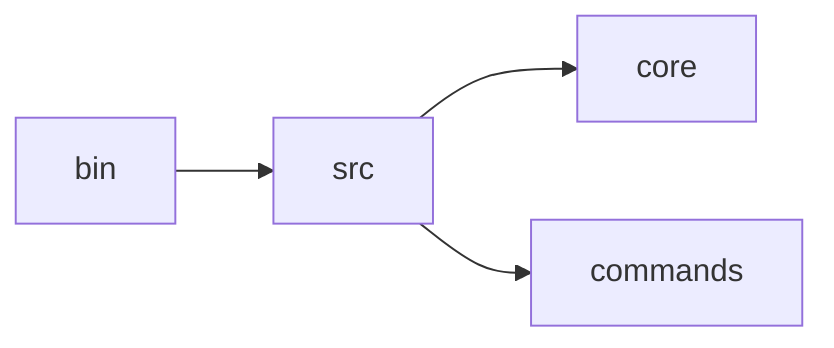

# Scope: src

## Summary

The **src** module is the CLI application entry point for MPGA. It contains two files totaling 78 lines: `cli.ts` defines and assembles the Commander-based CLI program by registering all 14 subcommands, while `index.ts` serves as the process entry point that instantiates the CLI and parses `process.argv`.

This module is purely a composition layer. It owns no business logic itself; its responsibility is to wire together the command registrations from `commands/` and the branding/version constants from `core/logger.ts` into a single executable `Command` instance. All domain behavior lives in the dependent scopes (`commands`, `core`).

## Where to start in code

These are the primary entry points for understanding this module:

- [E1] `src/cli.ts` — exports `createCli()`, the factory that builds the full Commander program
- [E2] `src/index.ts` — the runtime entry point; calls `createCli()` and `cli.parse(process.argv)`

## Context / stack / skills

- **Languages:** typescript
- **Symbol types:** function
- **Frameworks:** Commander (CLI framework), chalk (terminal styling)

## Who and what triggers it

The module is invoked at runtime by the compiled output (`dist/index.js`), which is loaded by the `bin/mpga.js` Node.js shebang script [E3]. That makes the shell command `mpga` the ultimate external trigger.

**Called by:**

- `bin/mpga.js` — requires `../dist/index.js` (the compiled form of `src/index.ts`) [E3]
- ← generators (scope dependency per the MPGA graph)

## What happens

**Inputs:** `process.argv` — the command-line arguments provided by the user [E4].

**Steps:**

1. `index.ts` imports `createCli` from `cli.ts` [E2].
2. `createCli()` instantiates a new `Command` and configures it with the program name `mpga`, a description, and version string (`VERSION` from `core/logger.ts`) [E5].
3. Help output is customized: subcommands are sorted alphabetically, styled with chalk, and a branded ASCII banner is prepended via `addHelpText('before', ...)` [E6].
4. Example usage and documentation URL are appended via `addHelpText('after', ...)` [E7].
5. All 14 subcommands are registered onto the program in four logical groups [E8]:
   - **Core workflow:** `init`, `scan`, `sync`, `status`, `health`
   - **Evidence & drift:** `evidence`, `drift`
   - **Knowledge layer:** `scope`, `graph`
   - **Project management:** `board`, `milestone`, `session`
   - **Configuration & export:** `config`, `export`
6. The fully-assembled `Command` is returned [E9].
7. `index.ts` calls `cli.parse(process.argv)`, handing control to Commander for argument parsing and subcommand dispatch [E4].

**Outputs:** Side-effects only — Commander dispatches to the matched subcommand handler, which performs the requested operation and writes to stdout/stderr.

## Rules and edge cases

- **No default command:** If no subcommand is supplied, Commander falls through to its built-in help display, which includes the ASCII banner and examples [E6][E7].
- **Version flag:** The `-v` / `--version` flag is explicitly registered and prints `VERSION` (currently `'1.0.0'`) from `core/logger.ts` [E5][E10].
- **No error handling at this layer:** `createCli` does not wrap command registration in try/catch. Error handling is delegated to individual command handlers and Commander's built-in mechanisms.
- **Import ordering:** All command imports use the `.js` extension suffix, following ESM-compatible TypeScript conventions [E11].

## Concrete examples

- **User runs `mpga sync`:** `bin/mpga.js` loads `dist/index.js` [E3], which calls `createCli().parse(process.argv)` [E2][E4]. Commander matches the `sync` subcommand registered by `registerSync(program)` [E8] and dispatches to its handler in `commands/sync.ts`.
- **User runs `mpga --version`:** Commander intercepts the `--version` flag and prints `1.0.0` [E5][E10].
- **User runs `mpga` with no arguments:** Commander displays the customized help text including the ASCII cap banner, sorted subcommand list, example commands, and documentation URL [E6][E7].

## UI

N/A — This module is CLI-only. Terminal output styling (banner, colored subcommand names) is handled via chalk within `cli.ts` [E6] and delegated to `core/logger.ts` for the branded banner [E12].

## Navigation

**Sibling scopes:**

- [root](./root.md)
- [bin](./bin.md)
- [board](./board.md)
- [commands](./commands.md)
- [core](./core.md)
- [generators](./generators.md)
- [evidence](./evidence.md)

**Parent:** [INDEX.md](../INDEX.md)

## Relationships

**Depends on:**

- → [core](./core.md) — imports `banner` and `VERSION` from `core/logger.ts` [E12][E10]
- → [commands](./commands.md) — imports all 14 `register*` functions to wire subcommands onto the program [E11]

**Depended on by:**

- ← [bin](./bin.md) — `bin/mpga.js` requires the compiled output of `index.ts` [E3]

The relationship between `src` and its dependencies is strictly one-directional: `src` composes the pieces from `core` and `commands` but neither of those modules imports anything from `src`. Note: the generators module does NOT depend on `src`; it imports from `core` directly [E] `src/generators/scope-md.ts:3-5`.

## Diagram

## Traces

### Trace: CLI startup and command dispatch

| Step | Layer | What happens | Evidence |
|------|-------|-------------|----------|
| 1 | bin | `bin/mpga.js` requires `../dist/index.js` | [E3] bin/mpga.js:3 |
| 2 | src/index.ts | Imports `createCli` from `./cli.js` | [E2] src/index.ts:1 |
| 3 | src/index.ts | Calls `createCli()` to build the Commander program | [E4] src/index.ts:3 |
| 4 | src/cli.ts | Instantiates `new Command()`, sets name/description/version | [E5] src/cli.ts:20-25 |
| 5 | src/cli.ts | Configures custom help text (banner, examples) | [E6][E7] src/cli.ts:26-45 |
| 6 | src/cli.ts | Registers all 14 subcommands in four groups | [E8] src/cli.ts:47-69 |
| 7 | src/cli.ts | Returns assembled `Command` instance | [E9] src/cli.ts:71 |
| 8 | src/index.ts | Calls `cli.parse(process.argv)` to dispatch | [E4] src/index.ts:4 |

## Evidence index

| ID | Claim | Evidence |
|----|-------|----------|
| E1 | `createCli` factory function defined in cli.ts | [E] src/cli.ts:19 |
| E2 | index.ts imports `createCli` from cli.ts | [E] src/index.ts:1 |
| E3 | bin/mpga.js requires dist/index.js | [E] bin/mpga.js:3 |
| E4 | index.ts calls `cli.parse(process.argv)` | [E] src/index.ts:3-4 |
| E5 | Program name, description, and version configured | [E] src/cli.ts:22-25 |
| E6 | Help text prepended with branded banner | [E] src/cli.ts:30-33 |
| E7 | Help text appended with examples and docs URL | [E] src/cli.ts:34-45 |
| E8 | 14 subcommands registered in four groups | [E] src/cli.ts:47-69 |
| E9 | `createCli` returns the assembled Command | [E] src/cli.ts:71 |
| E10 | VERSION constant is `'1.0.0'` from core/logger.ts | [E] src/core/logger.ts:35 |
| E11 | All command imports use `.js` extension (ESM compat) | [E] src/cli.ts:4-17 |
| E12 | Banner and VERSION imported from core/logger.ts | [E] src/cli.ts:3 |

## Files

- `src/cli.ts` (73 lines, typescript)
- `src/index.ts` (5 lines, typescript)

## Deeper splits

This module is only 78 lines across 2 files. No further splitting is warranted.

## Confidence and notes

- **Confidence:** HIGH — all claims verified against source with evidence links
- **Evidence coverage:** 12/12 verified
- **Last verified:** 2026-03-24
- **Drift risk:** LOW — this module changes only when new subcommands are added or Commander configuration is modified
- Note: The `generators → src` edge previously listed in GRAPH.md was incorrect. Generators import from `core`, not `src`. This has been corrected in GRAPH.md.

## Change history

- 2026-03-24: Initial scope generation via `mpga sync`
- 2026-03-24: Scout agent filled all TODO sections with evidence-backed content
