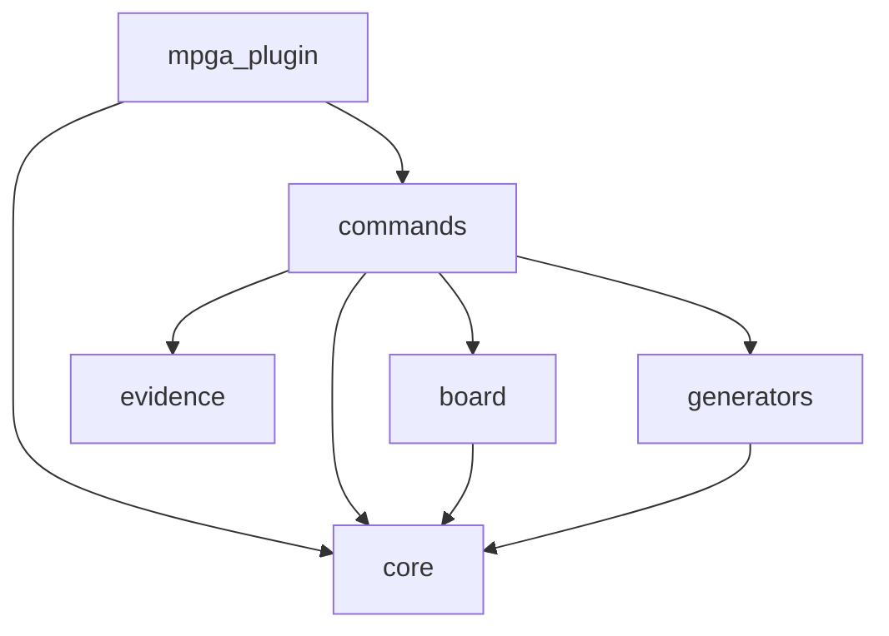

# Dependency graph

## Module dependencies

mpga-plugin → core
mpga-plugin → commands
commands → core
commands → board
commands → evidence
commands → generators
board → core
generators → core

## Circular dependencies
(none detected)

## Orphan modules
(none detected)

## Mermaid export

