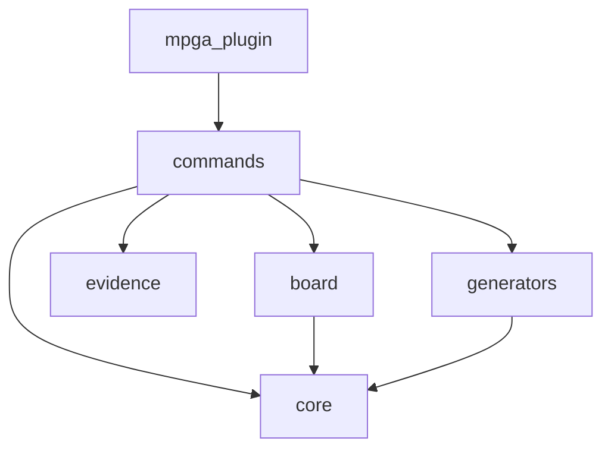

# Dependency graph

## Module dependencies

mpga-plugin → commands
commands → core
commands → board
commands → evidence
commands → generators
board → core
generators → core

## Circular dependencies
(none detected)

## Orphan modules
- mpga-plugin/bin/mpga.sh
- mpga-plugin/cli/bin/mpga.js
- mpga-plugin/cli/src/cli.ts
- mpga-plugin/cli/src/index.ts
- mpga-plugin/scripts/check-cli.sh
- mpga-plugin/scripts/format-evidence.sh
- mpga-plugin/scripts/setup.sh
- mpga-plugin/cli/src/commands/config.ts
- mpga-plugin/cli/src/commands/drift.ts
- mpga-plugin/cli/src/commands/export.ts

## Mermaid export

