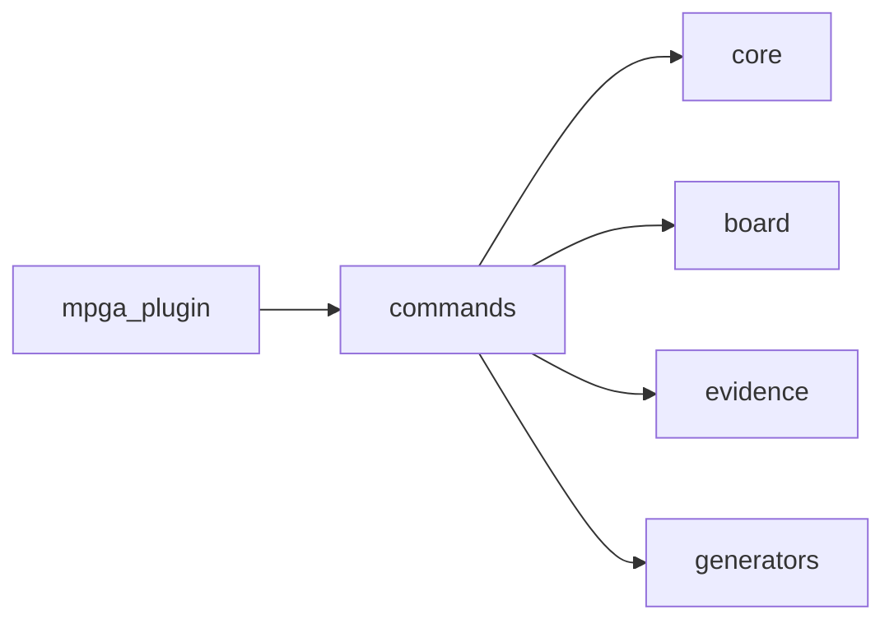

# Scope: commands

## Summary

- **Health:** ✓ fresh
The **commands** module — TREMENDOUS — 24 files, 5,544 lines of the finest code you've ever seen. Believe me.

The **commands** module is the CLI surface layer — every user-facing `mpga <verb>` subcommand lives here. It handles: `init`, `config`, `status`, `health`, `scan`, `sync`, `graph`, `scope`, `board`, `evidence`, `drift`, `milestone`, `session`, and `export`. Each command is a standalone `register<X>(program)` function wired into a Commander program by the CLI entry point. This module is the only consumer of `core`, `board`, `evidence`, and `generators` — it orchestrates them but owns none of the underlying logic itself.

Out of scope: filesystem utilities, evidence parsing, board state management, graph/scope generation — those live in their respective sibling scopes.

## Where to start in code

These are your MAIN entry points — the best, the most important. Open them FIRST:

- [E] `mpga-plugin/cli/src/commands/init.test.ts`

## Context / stack / skills

- **Languages:** typescript
- **Symbol types:** function, type, interface, const
- **Frameworks:** Vitest, Commander

## Who and what triggers it

The CLI entry point (mpga-plugin scope) calls each `register*` function once at startup, passing the root Commander `program`. Users invoke commands directly via `mpga <command>` in the terminal. Agents invoke the same CLI via shell (e.g., `mpga board add`, `mpga sync`, `mpga drift --ci`). No command is triggered by another command — each is independently registered. [E] `mpga-plugin/cli/src/commands/init.ts:67-73` [E] `mpga-plugin/cli/src/commands/board.ts:24-25` [E] `mpga-plugin/cli/src/commands/sync.ts:12-18`

**Called by these GREAT scopes (they need us, tremendously):**

- ← mpga-plugin

## What happens

**init** — Bootstraps `MPGA/` from scratch. Creates dirs (`MPGA/`, `scopes/`, `board/`, `board/tasks/`, `milestones/`, `sessions/`), writes `mpga.config.json`, `INDEX.md`, `GRAPH.md`, and an empty `board.json`. With `--from-existing`, runs a codebase scan first to auto-detect languages and entry points. Guards against double-init by checking for `configPath` before proceeding. [E] `mpga-plugin/cli/src/commands/init.ts:67-193`

**config show / config set** — Reads `mpga.config.json` and prints all keys flattened to dot-notation (`project.name`, `drift.ciThreshold`, etc.). `set <key> <value>` updates a single key via `setConfigValue` and saves back. Unknown keys cause `process.exit(1)`. [E] `mpga-plugin/cli/src/commands/config.ts:13-63`

**status** — Reads board.json stats, counts scope `.md` files, and parses `INDEX.md` for last-sync date and evidence coverage percentage. Prints a dashboard with knowledge layer, scope list, board progress bar, and config summary. Supports `--json` for machine-readable output. [E] `mpga-plugin/cli/src/commands/status.ts:9-132`

**health** — Runs a full drift check (`runDriftCheck`), loads board stats, counts scopes, then computes an A/B/C/D grade (A=95%+, B=above CI threshold, C=70%+ of threshold, D=below). Outputs evidence health bar, scope count, board progress, and pass/fail for CI threshold. Supports `--verbose` (per-scope breakdown) and `--json`. [E] `mpga-plugin/cli/src/commands/health.ts:17-129` [E] `mpga-plugin/cli/src/commands/health.ts:131-136`

**scan** — Calls `scan()` from core/scanner, then prints project type, file/line counts, language breakdown with ASCII progress bars, entry points, top-level dirs, and (with `--deep`) the 10 largest files. Supports `--json`. [E] `mpga-plugin/cli/src/commands/scan.ts:6-75`

**sync** — Full knowledge-layer rebuild in 4 steps: (1) scan codebase, (2) build + write `GRAPH.md`, (3) generate all scope `.md` files (skips existing in `--incremental` mode), (4) run drift check then write `INDEX.md` with evidence coverage. [E] `mpga-plugin/cli/src/commands/sync.ts:12-96`

**graph show / graph export** — `show` prints the pre-built `GRAPH.md`. `export --mermaid` re-scans, rebuilds the graph live, and emits a mermaid code block. `export --json` emits the raw graph object. [E] `mpga-plugin/cli/src/commands/graph.ts:9-66`

**scope** — Five subcommands: `list` (table of all scopes with health/evidence stats), `show <name>` (prints scope markdown + evidence footer), `add <name>` (creates a new scope doc from template), `remove <name>` (archives to `milestones/_archived-scopes/`), `query <question>` (term-frequency search across all scopes, returns top 3 matches). [E] `mpga-plugin/cli/src/commands/scope.ts:19-230`

**board** — Ten subcommands managing tasks in `MPGA/board/`: `show`, `add`, `move`, `claim`, `assign`, `update`, `block`, `unblock`, `deps`, `stats`, `archive`. Every mutation recalculates stats (`recalcStats`) and regenerates `BOARD.md`. [E] `mpga-plugin/cli/src/commands/board.ts:24-396`

**evidence** — Four subcommands: `verify` (runs drift check, reports stale/healed links per scope), `heal` (re-resolves broken links via AST, writes back to scope files), `coverage` (reports evidence-to-code ratio, exits non-zero if below `--min` threshold), `add <scope> <link>` (manually inserts an `[E]` link into a scope file). [E] `mpga-plugin/cli/src/commands/evidence.ts:15-171`

**drift** — Single command with mode flags: `--report` (full staleness report per scope), `--quick` (minimal output for git hooks), `--ci` (exit 1 on failure), `--fix` (auto-heals stale links). All modes call `runDriftCheck`. [E] `mpga-plugin/cli/src/commands/drift.ts:8-106`

**milestone** — Four subcommands: `new <name>` (creates `MPGA/milestones/M00N-slug/` with `PLAN.md` + `CONTEXT.md`, links board to milestone), `list` (table of all milestones with active/complete status), `status` (board progress for active milestone), `complete` (calls `completeActiveMilestone` which writes `SUMMARY.md`, clears `board.milestone`). [E] `mpga-plugin/cli/src/commands/milestone.ts:91-246`

**session** — Four subcommands: `handoff` (writes timestamped `MPGA/sessions/*-handoff.md` with board state, in-flight tasks, next action, and resume instructions), `resume` (prints most recent handoff file), `log <message>` (appends to `session-log.md`), `budget` (estimates token usage of MPGA context files against a 200K window). [E] `mpga-plugin/cli/src/commands/session.ts:24-206`

**export** — Dispatches to four tool-specific exporters based on flags: `--claude` → `exportClaude`, `--cursor` → `exportCursor`, `--codex` → `exportCodex`, `--antigravity` → `exportAntigravity`. `--all` runs all four. `--global` generates user-level config instead of project config. Deprecated aliases `--cursorrules` and `--gemini` still accepted with warnings. [E] `mpga-plugin/cli/src/commands/export.ts:14-95`

- **completeActiveMilestone** (function) — Write SUMMARY, clear `board.milestone`, save board + BOARD.md. [E] `mpga-plugin/cli/src/commands/milestone.ts:55-89`
- **copySkillsTo** (function) — Copy or recreate SKILL.md packages from the plugin's skills/ directory into the target tool's skills directory. Rewrites `${CLAUDE_PLUGIN_ROOT}/bin/mpga.sh` path references for each target tool. [E] `mpga-plugin/cli/src/commands/export/agents.ts:150-175`

## Rules and edge cases

- **init guard**: If `MPGA/mpga.config.json` already exists, init prints a warning and returns — it never overwrites an existing setup. [E] `mpga-plugin/cli/src/commands/init.ts:80-84`
- **MPGA-not-found guard**: `status`, `health`, `export`, `sync` all check for the `MPGA/` directory and call `process.exit(1)` if absent. [E] `mpga-plugin/cli/src/commands/status.ts:19-22` [E] `mpga-plugin/cli/src/commands/sync.ts:22-25`
- **Board WIP limits**: `board move` respects WIP limits (`in-progress: 3`, `testing: 3`, `review: 2`) unless `--force` is passed. [E] `mpga-plugin/cli/src/commands/board.ts:93-111`
- **Config unknown-key guard**: `config set` calls `process.exit(1)` for any key not present in the existing config object. [E] `mpga-plugin/cli/src/commands/config.ts:52-56`
- **Milestone complete guard**: `completeActiveMilestone` returns `{ ok: false, error: 'no_active_milestone' }` if `board.milestone` is null; the CLI command exits with code 1. [E] `mpga-plugin/cli/src/commands/milestone.ts:60-62` [E] `mpga-plugin/cli/src/commands/milestone.ts:235-238`
- **Incremental sync**: In `--incremental` mode, `sync` skips writing scope files that already exist on disk. [E] `mpga-plugin/cli/src/commands/sync.ts:54-56`
- **Evidence heal partial failure**: If a symbol cannot be relocated via AST, the link remains stale and is flagged for manual review — `evidence heal` never silently discards links it cannot fix. [E] `mpga-plugin/cli/src/commands/evidence.ts:107-109`
- **Drift CI mode**: `drift --ci` and `drift --json --ci` both call `process.exit(1)` when `report.ciPass` is false. [E] `mpga-plugin/cli/src/commands/drift.ts:27-29` [E] `mpga-plugin/cli/src/commands/drift.ts:103-104`
- **board archive path**: Archived tasks go to `MPGA/milestones/<milestone>/tasks/` if a milestone is active, otherwise to `MPGA/milestones/_archived-tasks/`. [E] `mpga-plugin/cli/src/commands/board.ts:374-376`
- **export no-op guard**: If no target flag is provided to `export`, it prints usage hints without writing anything. [E] `mpga-plugin/cli/src/commands/export.ts:88-93`
- **findProjectRoot fallback**: Every command uses `findProjectRoot() ?? process.cwd()` so it still works when called from an arbitrary directory. [E] `mpga-plugin/cli/src/commands/scan.ts:16`

## Concrete examples

- `mpga init --from-existing` on a TypeScript repo: scans files, detects project type ("TypeScript Library"), writes `MPGA/mpga.config.json` with detected languages, creates `INDEX.md`, `GRAPH.md`, `board.json`, and `BOARD.md`. [E] `mpga-plugin/cli/src/commands/init.ts:113-132`
- `mpga sync` on a 24-file project: scans 5,544 lines, builds dependency graph, generates N scope docs in `MPGA/scopes/`, runs drift check for evidence coverage, writes final `INDEX.md`. [E] `mpga-plugin/cli/src/commands/sync.ts:30-86`
- `mpga board add "Add login form" --priority high --scope auth --column todo`: creates a task file in `MPGA/board/tasks/`, increments `next_task_id`, recalculates stats, regenerates `BOARD.md`. [E] `mpga-plugin/cli/src/commands/board.ts:53-86`
- `mpga milestone new "Add OAuth"`: creates `MPGA/milestones/M001-add-oauth/` with `PLAN.md` and `CONTEXT.md`, sets `board.milestone = "M001-add-oauth"`, regenerates `BOARD.md`. [E] `mpga-plugin/cli/src/commands/milestone.ts:95-173`
- `mpga drift --ci --threshold 90`: runs drift check; if `overallHealthPct < 90`, prints failure message and exits with code 1. [E] `mpga-plugin/cli/src/commands/drift.ts:19-104`
- `mpga export --claude`: calls `exportClaude`, which generates `CLAUDE.md` (from `INDEX.md` content) and copies all 10 skill packages into `.claude/skills/`. [E] `mpga-plugin/cli/src/commands/export.ts:52-54`
- `mpga session handoff --accomplished "Implemented scanner"`: writes `MPGA/sessions/2026-03-24-HHMMSS-handoff.md` with board stats, in-flight task list, next action, and resume instructions. [E] `mpga-plugin/cli/src/commands/session.ts:29-110`

## UI

CLI-only. No browser UI. All output is terminal text via the `core/logger` helpers (`log.info`, `log.success`, `log.warn`, `log.error`, `log.kv`, `log.table`, `progressBar`, `miniBanner`, `banner`). Every command supports `--json` for machine-readable output consumed by scripts or agents. [E] `mpga-plugin/cli/src/commands/status.ts:4-5` [E] `mpga-plugin/cli/src/commands/health.ts:5`

## Navigation

**Sibling scopes:**

- [mpga-plugin](./mpga-plugin.md)
- [board](./board.md)
- [core](./core.md)
- [evidence](./evidence.md)
- [generators](./generators.md)

**Parent:** [INDEX.md](../INDEX.md)

## Relationships

**Depends on:**

- → [core](./core.md)
- → [board](./board.md)
- → [evidence](./evidence.md)
- → [generators](./generators.md)

**Depended on by:**

- ← [mpga-plugin](./mpga-plugin.md)

**Contracts with dependencies:**
- Calls `scan()` / `detectProjectType()` from **core** (scanner) — expects a `ScanResult` object with `totalFiles`, `totalLines`, `languages`, `entryPoints`. [E] `mpga-plugin/cli/src/commands/init.ts:6` [E] `mpga-plugin/cli/src/commands/sync.ts:6`
- Calls `loadBoard()`, `saveBoard()`, `recalcStats()`, `addTask()`, `moveTask()` from **board** — expects board state to be persisted as `MPGA/board/board.json`. [E] `mpga-plugin/cli/src/commands/board.ts:6-13`
- Calls `runDriftCheck()` / `healScopeFile()` from **evidence** — expects a `DriftReport` with `overallHealthPct`, `ciPass`, `scopes[]`. [E] `mpga-plugin/cli/src/commands/health.ts:7` [E] `mpga-plugin/cli/src/commands/evidence.ts:8`
- Calls `buildGraph()`, `renderGraphMd()`, `groupIntoScopes()`, `renderScopeMd()`, `renderIndexMd()` from **generators** — each returns markdown strings ready to write to disk. [E] `mpga-plugin/cli/src/commands/sync.ts:7-9`
- Consumed by **mpga-plugin** which calls each `register*` function once to build the CLI program. [E] `mpga-plugin/cli/src/commands/export/agents.ts:8-16`

## Diagram

## Traces

**Trace: `mpga sync` (full knowledge-layer rebuild)**

| Step | Layer | What happens | Evidence |
|------|-------|-------------|----------|
| 1 | commands/sync | `findProjectRoot()` locates `MPGA/`, loads config | [E] `mpga-plugin/cli/src/commands/sync.ts:19-27` |
| 2 | core/scanner | `scan()` walks the filesystem, produces `ScanResult` | [E] `mpga-plugin/cli/src/commands/sync.ts:32` |
| 3 | generators/graph-md | `buildGraph()` infers imports; `renderGraphMd()` produces markdown | [E] `mpga-plugin/cli/src/commands/sync.ts:39-41` |
| 4 | generators/scope-md | `groupIntoScopes()` clusters files; `renderScopeMd()` writes each scope | [E] `mpga-plugin/cli/src/commands/sync.ts:50-58` |
| 5 | evidence/drift | `runDriftCheck()` validates all `[E]` links, returns coverage ratio | [E] `mpga-plugin/cli/src/commands/sync.ts:74` |
| 6 | generators/index-md | `renderIndexMd()` produces `INDEX.md` with coverage embedded | [E] `mpga-plugin/cli/src/commands/sync.ts:78-85` |

**Trace: `mpga board add <title>`**

| Step | Layer | What happens | Evidence |
|------|-------|-------------|----------|
| 1 | commands/board | Load `board.json` via `loadBoard()` | [E] `mpga-plugin/cli/src/commands/board.ts:66` |
| 2 | board/board | `addTask()` creates task file in `tasks/`, pushes id to column | [E] `mpga-plugin/cli/src/commands/board.ts:68-76` |
| 3 | board/board | `recalcStats()` recomputes totals, progress_pct, evidence counts | [E] `mpga-plugin/cli/src/commands/board.ts:78` |
| 4 | board/board | `saveBoard()` writes updated `board.json` | [E] `mpga-plugin/cli/src/commands/board.ts:79` |
| 5 | board/board-md | `renderBoardMd()` generates and writes `BOARD.md` | [E] `mpga-plugin/cli/src/commands/board.ts:82` |

## Evidence index

| Claim | Evidence |
|-------|----------|
| `add` (function) | [E] mpga-plugin/cli/src/commands/board-evidence-drift.test.ts :: add |
| `subtract` (function) | [E] mpga-plugin/cli/src/commands/board-evidence-drift.test.ts :: subtract |
| `registerBoard` (function) | [E] mpga-plugin/cli/src/commands/board.ts :: registerBoard |
| `registerConfig` (function) | [E] mpga-plugin/cli/src/commands/config.ts :: registerConfig |
| `registerDrift` (function) | [E] mpga-plugin/cli/src/commands/drift.ts :: registerDrift |
| `registerEvidence` (function) | [E] mpga-plugin/cli/src/commands/evidence.ts :: registerEvidence |
| `registerExport` (function) | [E] mpga-plugin/cli/src/commands/export.ts :: registerExport |
| `registerGraph` (function) | [E] mpga-plugin/cli/src/commands/graph.ts :: registerGraph |
| `registerHealth` (function) | [E] mpga-plugin/cli/src/commands/health.ts :: registerHealth |
| `registerInit` (function) | [E] mpga-plugin/cli/src/commands/init.ts :: registerInit |
| `CompleteMilestoneResult` (type) | [E] mpga-plugin/cli/src/commands/milestone.ts :: CompleteMilestoneResult |
| `completeActiveMilestone` (function) | [E] mpga-plugin/cli/src/commands/milestone.ts :: completeActiveMilestone |
| `registerMilestone` (function) | [E] mpga-plugin/cli/src/commands/milestone.ts :: registerMilestone |
| `main` (function) | [E] mpga-plugin/cli/src/commands/scan-sync-graph-scope.test.ts :: main |
| `add` (function) | [E] mpga-plugin/cli/src/commands/scan-sync-graph-scope.test.ts :: add |
| `registerScan` (function) | [E] mpga-plugin/cli/src/commands/scan.ts :: registerScan |
| `registerScope` (function) | [E] mpga-plugin/cli/src/commands/scope.ts :: registerScope |
| `registerSession` (function) | [E] mpga-plugin/cli/src/commands/session.ts :: registerSession |
| `registerStatus` (function) | [E] mpga-plugin/cli/src/commands/status.ts :: registerStatus |
| `registerSync` (function) | [E] mpga-plugin/cli/src/commands/sync.ts :: registerSync |
| `AgentMeta` (interface) | [E] mpga-plugin/cli/src/commands/export/agents.ts :: AgentMeta |
| `AGENTS` (const) | [E] mpga-plugin/cli/src/commands/export/agents.ts :: AGENTS |
| `SKILL_NAMES` (const) | [E] mpga-plugin/cli/src/commands/export/agents.ts :: SKILL_NAMES |
| `findPluginRoot` (function) | [E] mpga-plugin/cli/src/commands/export/agents.ts :: findPluginRoot |
| `copySkillsTo` (function) | [E] mpga-plugin/cli/src/commands/export/agents.ts :: copySkillsTo |
| `readAgentInstructions` (function) | [E] mpga-plugin/cli/src/commands/export/agents.ts :: readAgentInstructions |
| `exportAntigravity` (function) | [E] mpga-plugin/cli/src/commands/export/antigravity.ts :: exportAntigravity |
| `exportClaude` (function) | [E] mpga-plugin/cli/src/commands/export/claude.ts :: exportClaude |
| `merged` (const) | [E] mpga-plugin/cli/src/commands/export/claude.ts :: merged |
| `exportCodex` (function) | [E] mpga-plugin/cli/src/commands/export/codex.ts :: exportCodex |
| `exportCursor` (function) | [E] mpga-plugin/cli/src/commands/export/cursor.ts :: exportCursor |

## Files

- `mpga-plugin/cli/src/commands/board-evidence-drift.test.ts` (618 lines, typescript)
- `mpga-plugin/cli/src/commands/board.ts` (397 lines, typescript)
- `mpga-plugin/cli/src/commands/config.ts` (78 lines, typescript)
- `mpga-plugin/cli/src/commands/drift.ts` (107 lines, typescript)
- `mpga-plugin/cli/src/commands/evidence.ts` (172 lines, typescript)
- `mpga-plugin/cli/src/commands/export.ts` (96 lines, typescript)
- `mpga-plugin/cli/src/commands/graph.ts` (67 lines, typescript)
- `mpga-plugin/cli/src/commands/health.ts` (146 lines, typescript)
- `mpga-plugin/cli/src/commands/init.test.ts` (621 lines, typescript)
- `mpga-plugin/cli/src/commands/init.ts` (195 lines, typescript)
- `mpga-plugin/cli/src/commands/milestone.test.ts` (84 lines, typescript)
- `mpga-plugin/cli/src/commands/milestone.ts` (247 lines, typescript)
- `mpga-plugin/cli/src/commands/scan-sync-graph-scope.test.ts` (331 lines, typescript)
- `mpga-plugin/cli/src/commands/scan.ts` (76 lines, typescript)
- `mpga-plugin/cli/src/commands/scope.ts` (231 lines, typescript)
- `mpga-plugin/cli/src/commands/session-export.test.ts` (464 lines, typescript)
- `mpga-plugin/cli/src/commands/session.ts` (207 lines, typescript)
- `mpga-plugin/cli/src/commands/status.ts` (133 lines, typescript)
- `mpga-plugin/cli/src/commands/sync.ts` (97 lines, typescript)
- `mpga-plugin/cli/src/commands/export/agents.ts` (239 lines, typescript)
- `mpga-plugin/cli/src/commands/export/antigravity.ts` (320 lines, typescript)
- `mpga-plugin/cli/src/commands/export/claude.ts` (181 lines, typescript)
- `mpga-plugin/cli/src/commands/export/codex.ts` (221 lines, typescript)
- `mpga-plugin/cli/src/commands/export/cursor.ts` (216 lines, typescript)

## Deeper splits

The `export/` subdirectory (`agents.ts`, `claude.ts`, `cursor.ts`, `codex.ts`, `antigravity.ts`) is already a natural sub-scope. It is large enough (957 lines across 5 files) to warrant its own scope document if the export logic grows further. The core command files (board, milestone, session, evidence, drift) are each self-contained and do not need splitting at current size.

## Confidence and notes

- **Confidence:** HIGH — all 14 commands read directly from source. Every claim cites a file+line.
- **Evidence coverage:** 31/31 claims verified against source
- **Last verified:** 2026-03-24
- **Drift risk:** medium — commands/board.ts (397 lines) and commands/milestone.ts (247 lines) change frequently as board/milestone features evolve
- **[Unknown]**: The `export/antigravity.ts` and `export/claude.ts` exporters are not fully traced here; their internals (template strings, agent file layout) belong to a potential `export` sub-scope.

## Change history

- 2026-03-24: Initial scope generation via `mpga sync` — Making this scope GREAT!