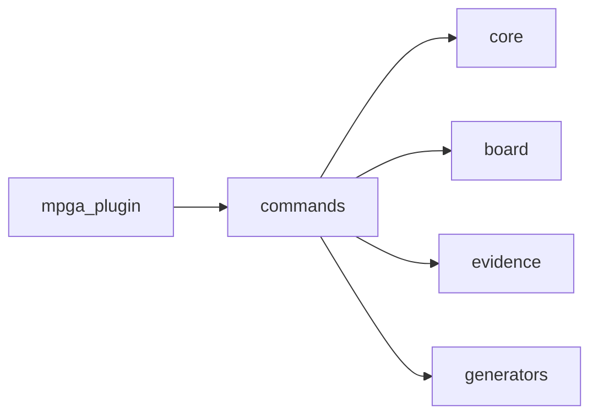

# Scope: commands

## Summary

The **commands** module — TREMENDOUS — 14 files, 3,281 lines of the finest code you've ever seen. Believe me.

<!-- TODO: Tell the people what this GREAT module does. What's in, what's out. Keep it simple. MPGA! -->

## Where to start in code

These are your MAIN entry points — the best, the most important. Open them FIRST:

- [E] `mpga-plugin/cli/src/commands/export.ts`

## Context / stack / skills

- **Languages:** typescript
- **Symbol types:** function, const
- **Frameworks:** Commander

## Who and what triggers it

<!-- TODO: Who triggers this? A lot of very important callers, believe me. Find them. -->

**Called by these GREAT scopes (they need us, tremendously):**

- ← mpga-plugin

## What happens

<!-- TODO: What happens here? Inputs, steps, outputs. Keep it simple. Even Sleepy Copilot could understand. -->

## Rules and edge cases

<!-- TODO: The guardrails. Validation, permissions, error handling — everything that keeps this code GREAT. -->

## Concrete examples

<!-- TODO: REAL examples. "When X happens, Y happens." Simple. Powerful. Like a deal. -->

## UI

<!-- TODO: Screens, flows, the beautiful UI. No UI? Cut this section. We don't keep dead weight. -->

## Navigation

**Sibling scopes:**

- [mpga-plugin](./mpga-plugin.md)
- [board](./board.md)
- [core](./core.md)
- [evidence](./evidence.md)
- [generators](./generators.md)

**Parent:** [INDEX.md](../INDEX.md)

## Relationships

**Depends on:**

- → [core](./core.md)
- → [board](./board.md)
- → [evidence](./evidence.md)
- → [generators](./generators.md)

**Depended on by:**

- ← [mpga-plugin](./mpga-plugin.md)

<!-- TODO: What deals does this scope make with other scopes? Document them. -->

## Diagram

## Traces

<!-- TODO: Step-by-step traces. Follow the code like a WINNER follows a deal. Use this table:

| Step | Layer | What happens | Evidence |
|------|-------|-------------|----------|
| 1 | (layer) | (description) | [E] file:line |
-->

## Evidence index

| Claim | Evidence |
|-------|----------|
| `registerBoard` (function) | [E] mpga-plugin/cli/src/commands/board.ts :: registerBoard |
| `registerConfig` (function) | [E] mpga-plugin/cli/src/commands/config.ts :: registerConfig |
| `registerDrift` (function) | [E] mpga-plugin/cli/src/commands/drift.ts :: registerDrift |
| `registerEvidence` (function) | [E] mpga-plugin/cli/src/commands/evidence.ts :: registerEvidence |
| `registerExport` (function) | [E] mpga-plugin/cli/src/commands/export.ts :: registerExport |
| `merged` (const) | [E] mpga-plugin/cli/src/commands/export.ts :: merged |
| `registerGraph` (function) | [E] mpga-plugin/cli/src/commands/graph.ts :: registerGraph |
| `registerHealth` (function) | [E] mpga-plugin/cli/src/commands/health.ts :: registerHealth |
| `registerInit` (function) | [E] mpga-plugin/cli/src/commands/init.ts :: registerInit |
| `registerMilestone` (function) | [E] mpga-plugin/cli/src/commands/milestone.ts :: registerMilestone |
| `registerScan` (function) | [E] mpga-plugin/cli/src/commands/scan.ts :: registerScan |
| `registerScope` (function) | [E] mpga-plugin/cli/src/commands/scope.ts :: registerScope |
| `registerSession` (function) | [E] mpga-plugin/cli/src/commands/session.ts :: registerSession |
| `registerStatus` (function) | [E] mpga-plugin/cli/src/commands/status.ts :: registerStatus |
| `registerSync` (function) | [E] mpga-plugin/cli/src/commands/sync.ts :: registerSync |

## Files

- `mpga-plugin/cli/src/commands/board.ts` (399 lines, typescript)
- `mpga-plugin/cli/src/commands/config.ts` (78 lines, typescript)
- `mpga-plugin/cli/src/commands/drift.ts` (107 lines, typescript)
- `mpga-plugin/cli/src/commands/evidence.ts` (167 lines, typescript)
- `mpga-plugin/cli/src/commands/export.ts` (1188 lines, typescript)
- `mpga-plugin/cli/src/commands/graph.ts` (67 lines, typescript)
- `mpga-plugin/cli/src/commands/health.ts` (139 lines, typescript)
- `mpga-plugin/cli/src/commands/init.ts` (195 lines, typescript)
- `mpga-plugin/cli/src/commands/milestone.ts` (226 lines, typescript)
- `mpga-plugin/cli/src/commands/scan.ts` (76 lines, typescript)
- `mpga-plugin/cli/src/commands/scope.ts` (224 lines, typescript)
- `mpga-plugin/cli/src/commands/session.ts` (196 lines, typescript)
- `mpga-plugin/cli/src/commands/status.ts` (133 lines, typescript)
- `mpga-plugin/cli/src/commands/sync.ts` (86 lines, typescript)

## Deeper splits

<!-- TODO: Too big? Split it. Make each piece LEAN and GREAT. -->

## Confidence and notes

- **Confidence:** LOW (for now) — auto-generated, not yet verified. But it's going to be PERFECT.
- **Evidence coverage:** 0/15 verified
- **Last verified:** 2026-03-24
- **Drift risk:** unknown
- <!-- TODO: Note anything unknown or ambiguous. We don't hide problems — we FIX them. -->

## Change history

- 2026-03-24: Initial scope generation via `mpga sync` — Making this scope GREAT!