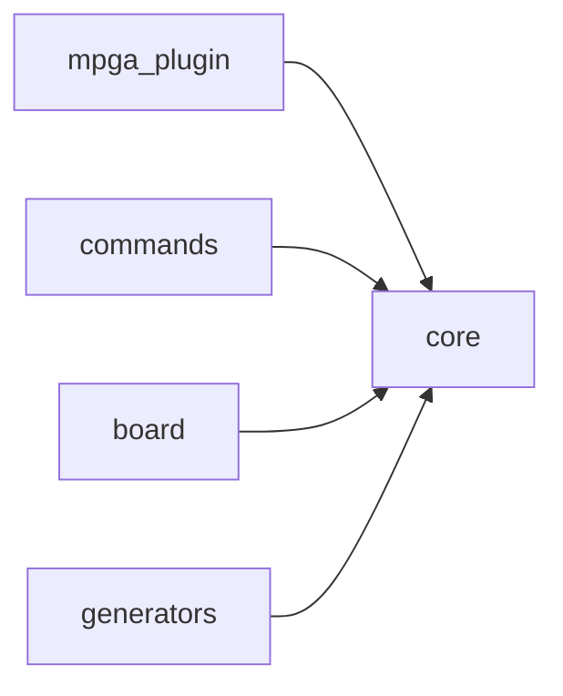

# Scope: core

## Summary

- **Health:** ✓ fresh
The **core** module provides the three foundational primitives every other scope depends on: **config** (read/write `mpga.config.json`), **logger** (branded CLI output), and **scanner** (filesystem traversal and language detection). Nothing executes without passing through at least one of these. 6 files, 937 lines — lean and load-bearing.

**In scope:** config loading/saving with deep-merge, dot-path get/set, project-root resolution; CLI output formatting (banner, log levels, progress bar, grade colors); filesystem scanning via `fast-glob`, language mapping, entry-point detection, project-type heuristics.

**Out of scope:** board state, evidence indexing, scope-doc generation, milestone management — those live in `board`, `evidence`, and `generators` respectively.

## Where to start in code

These are your MAIN entry points — the best, the most important. Open them FIRST:

- [E] `mpga-plugin/cli/src/core/scanner.test.ts`

## Context / stack / skills

- **Languages:** typescript
- **Symbol types:** interface, const, function
- **Frameworks:** Vitest

## Who and what triggers it

Core is a pure dependency — it triggers nothing itself. Every other scope imports from it.

**Direct importers by file:**

- `cli.ts` — imports `banner`, `VERSION` from logger. [E] `mpga-plugin/cli/src/cli.ts:3`
- `commands/init.ts` — imports `banner`, `log` (logger); `DEFAULT_CONFIG`, `saveConfig`, `MpgaConfig` (config); `scan`, `detectProjectType` (scanner). [E] `mpga-plugin/cli/src/commands/init.ts:4-6`
- `commands/sync.ts` — imports `log` (logger); `loadConfig`, `findProjectRoot` (config); `scan` (scanner). [E] `mpga-plugin/cli/src/commands/sync.ts:4-6`
- `commands/scan.ts` — imports `log`, `loadConfig`, `findProjectRoot`, `scan`, `detectProjectType`. [E] `mpga-plugin/cli/src/commands/scan.ts:2-4`
- `commands/health.ts` — imports all five display helpers from logger plus `findProjectRoot`, `loadConfig`. [E] `mpga-plugin/cli/src/commands/health.ts:5-6`
- `commands/config.ts` — imports the full config API (`getConfigValue`, `setConfigValue`, `loadConfig`, `saveConfig`, `findProjectRoot`). [E] `mpga-plugin/cli/src/commands/config.ts:4,11`
- `commands/board.ts`, `commands/evidence.ts`, `commands/milestone.ts`, `commands/scope.ts`, `commands/session.ts`, `commands/graph.ts`, `commands/export.ts`, `commands/drift.ts`, `commands/status.ts` — each imports at minimum `log` and `findProjectRoot`/`loadConfig`. [E] `mpga-plugin/cli/src/commands/`
- `commands/export/claude.ts`, `cursor.ts`, `codex.ts`, `antigravity.ts` — import `log` from logger. [E] `mpga-plugin/cli/src/commands/export/`
- `board/board-md.ts` — imports `progressBar`. [E] `mpga-plugin/cli/src/board/board-md.ts:3`
- `generators/index-md.ts` — imports `ScanResult`, `detectProjectType`, `MpgaConfig`. [E] `mpga-plugin/cli/src/generators/index-md.ts:6-7`
- `generators/scope-md.ts` — imports `ScanResult`, `FileInfo`, `MpgaConfig`. [E] `mpga-plugin/cli/src/generators/scope-md.ts:3,5`
- `generators/graph-md.ts` — imports `ScanResult`, `MpgaConfig`. [E] `mpga-plugin/cli/src/generators/graph-md.ts:3-4`

**Called by these GREAT scopes (they need us, tremendously):**

- ← mpga-plugin
- ← commands
- ← board
- ← generators

## What happens

### config.ts

- **`KnowledgeLayerConfig`** (interface) — Optional overlay for INDEX.md rendering: `conventions[]` replaces default placeholder bullets; `keyFileRoles` maps file paths to one-line descriptions. Persists across `mpga sync`. [E] `mpga-plugin/cli/src/core/config.ts:4-10`
- **`MpgaConfig`** (interface) — The full project config shape: `version`, `project`, `evidence`, `drift`, `tiers`, `milestone`, `agents`, `scopes`, `board`, and optional `knowledgeLayer`. [E] `mpga-plugin/cli/src/core/config.ts:12-71`
- **`DEFAULT_CONFIG`** — Canonical defaults: evidence strategy `hybrid`, drift CI threshold `80`, scope depth `auto`, board columns `[backlog, todo, in-progress, testing, review, done]`, WIP limits `{in-progress:3, testing:3, review:2}`. [E] `mpga-plugin/cli/src/core/config.ts:73-125`
- **`findProjectRoot(startDir?)`** — Walks up the directory tree looking for `mpga.config.json` at root or under `MPGA/`. Returns `null` if not found. [E] `mpga-plugin/cli/src/core/config.ts:127-137`
- **`loadConfig(projectRoot?)`** — Reads `mpga.config.json` (root-level preferred, falls back to `MPGA/`). Deep-merges file contents over `DEFAULT_CONFIG`. Returns pure defaults if no file exists. [E] `mpga-plugin/cli/src/core/config.ts:139-151`
- **`saveConfig(config, configPath)`** — `mkdirSync` (recursive) then writes pretty-printed JSON with trailing newline. [E] `mpga-plugin/cli/src/core/config.ts:153-156`
- **`getConfigValue(config, key)`** — Dot-path traversal (e.g. `"evidence.strategy"`) returning the value or `undefined` if the path is missing. [E] `mpga-plugin/cli/src/core/config.ts:158-166`
- **`setConfigValue(config, key, value)`** — Dot-path setter with type coercion: numeric keys cast to `Number`, boolean keys parse `"true"`/`"false"`, everything else stays a string. [E] `mpga-plugin/cli/src/core/config.ts:168-180`

### logger.ts

- **`VERSION`** — Hardcoded `'1.0.0'`; re-exported as the CLI version. [E] `mpga-plugin/cli/src/core/logger.ts:44`
- **`banner()`** — Prints the full ASCII MPGA cap art in brand red/white to stdout. [E] `mpga-plugin/cli/src/core/logger.ts:46-48`
- **`miniBanner()`** — Prints a one-line `🧢 MPGA — Make Project Great Again` followed by a 42-char dim divider. [E] `mpga-plugin/cli/src/core/logger.ts:50-54`
- **`log`** — Object of console helpers: `info` (blue ℹ), `success` (green ✓), `warn` (yellow ⚠), `error` (red ✗ to stderr), `dim`, `bold`, `brand`, `header` (with underline), `section`, `kv` (left-padded label 18 chars), `table` (auto-width columns), `divider`, `blank`. [E] `mpga-plugin/cli/src/core/logger.ts:56-85`
- **`progressBar(value, total, width?)`** — Returns a string of green `█` (filled) + dim `░` (empty) scaled to `width` (default 20), followed by the integer percentage. When `total === 0` renders 0%. [E] `mpga-plugin/cli/src/core/logger.ts:87-92`
- **`gradeColor(grade)`** — Maps `A→green`, `B→blue`, `C→yellow`, anything else→red, all bold chalk. [E] `mpga-plugin/cli/src/core/logger.ts:94-105`
- **`statusBadge(ok, label)`** — Returns `✓ label` (green) or `✗ label` (red). [E] `mpga-plugin/cli/src/core/logger.ts:107-109`

### scanner.ts

- **`FileInfo`** (interface) — `{ filepath, lines, language, size }` for a single scanned file. [E] `mpga-plugin/cli/src/core/scanner.ts:5-10`
- **`ScanResult`** (interface) — Aggregate: `root`, `files[]`, `totalFiles`, `totalLines`, `languages` (per-language file/line counts), `entryPoints[]`, `topLevelDirs[]`. [E] `mpga-plugin/cli/src/core/scanner.ts:12-20`
- **`detectLanguage(filepath)`** — Reads file extension (lowercased), maps via `LANGUAGE_MAP` (ts/tsx→typescript, js/jsx/mjs/cjs→javascript, py→python, go/rs/java/cs/rb/php/swift/kt→their names, sh/bash→shell, sql/md/json/yaml/yml/toml→their names). Unknown extensions return `'other'`. [E] `mpga-plugin/cli/src/core/scanner.ts:61-64`
- **`countLines(filepath)`** — Reads file as UTF-8 and splits on `\n`. Returns 0 on any read error (including permission denied). [E] `mpga-plugin/cli/src/core/scanner.ts:66-73`
- **`scan(projectRoot, ignore, deep?)`** — Async. Uses `fast-glob` over 18 code-relevant extensions. Shallow mode caps directory depth at 12; deep mode walks the full tree. Builds language stats, detects entry points via 7 named patterns (`src/index.*`, `src/main.*`, `index.*`, `main.*`, `app.*`, `server.*`, `cmd/main.*`), lists top-level non-hidden non-ignored directories. Deduplicates entry points via `Set`. [E] `mpga-plugin/cli/src/core/scanner.ts:75-134`
- **`detectProjectType(scanResult)`** — Heuristic: checks `languages` map + substring matches in file paths. Priority order: Next.js → React → Node.js API → TypeScript → Django → FastAPI → Flask → Python → Go → Rust → Java → Unknown. [E] `mpga-plugin/cli/src/core/scanner.ts:136-153`
- **`getTopLanguage(scanResult)`** — Iterates `languages` map and returns the language key with the highest line count. Returns `'unknown'` if the map is empty. [E] `mpga-plugin/cli/src/core/scanner.ts:155-166`

## Rules and edge cases

**config.ts**
- `findProjectRoot` checks two paths per directory: bare `mpga.config.json` AND `MPGA/mpga.config.json`. Returns `null` (not an error) when it hits the filesystem root. [E] `mpga-plugin/cli/src/core/config.ts:127-137`
- `loadConfig` applies the same two-path check; missing config silently returns defaults with `project.name` set to `path.basename(root)`. [E] `mpga-plugin/cli/src/core/config.ts:139-151`
- `deepMerge` (private) treats arrays as atomic — an override array completely replaces the base array rather than merging element-by-element. Objects recurse. Primitives fall back to base when override is nullish. [E] `mpga-plugin/cli/src/core/config.ts:182-195`
- `setConfigValue` infers the target type from the *existing* value in the config object. If the existing value is a number, the string input is coerced with `Number()`. If boolean, checks `=== 'true'`. This means setting a key that doesn't exist yet always produces a string. [E] `mpga-plugin/cli/src/core/config.ts:168-180`
- `getConfigValue` returns `undefined` (not throws) if any segment of the dot-path is missing or the intermediate value is not an object. [E] `mpga-plugin/cli/src/core/config.ts:158-166`

**logger.ts**
- `progressBar` guards `total === 0` explicitly to avoid division-by-zero, producing a fully-empty bar at 0%. [E] `mpga-plugin/cli/src/core/logger.ts:88`
- `log.error` writes to `console.error` (stderr), all other log methods write to `console.log` (stdout). [E] `mpga-plugin/cli/src/core/logger.ts:60`
- `log.table` derives column widths dynamically from the widest cell in each column; minimum width is 0 (empty column). Rows shorter than the header row produce undefined cells that are coerced to empty string via `?? ''`. [E] `mpga-plugin/cli/src/core/logger.ts:77-82`

**scanner.ts**
- `countLines` uses a try/catch; permission errors or missing files silently return 0. Tests confirm this for both missing paths and `chmod 000` files. [E] `mpga-plugin/cli/src/core/scanner.ts:66-73`, `mpga-plugin/cli/src/core/scanner.test.ts:88-104`
- The glob in `scan` excludes `.md`, `.json`, `.yaml`, `.css`, `.csv` — only the 18 explicitly listed code extensions are scanned. [E] `mpga-plugin/cli/src/core/scanner.ts:82`
- Top-level directory listing in `scan` filters out dotfiles (names starting with `.`) regardless of the ignore list, so `.git` is always excluded. [E] `mpga-plugin/cli/src/core/scanner.ts:118-123`
- `scan` deduplicates entry points with `new Set` because multiple glob patterns can match the same file (e.g. `index.ts` matches both `index.*` and could overlap with others). [E] `mpga-plugin/cli/src/core/scanner.ts:131`
- `detectProjectType` checks heuristics in strict priority order — a TypeScript project with `next.config` in any file path wins over React, which wins over Node.js API. [E] `mpga-plugin/cli/src/core/scanner.ts:140-152`

## Concrete examples

**Loading config for a command:**
`commands/sync.ts` calls `findProjectRoot()` → walks up from `cwd` until it finds `mpga.config.json` → passes that root to `loadConfig()` → deep-merges the JSON file over `DEFAULT_CONFIG` → returns a typed `MpgaConfig`. If no config file exists, the caller gets defaults silently. [E] `mpga-plugin/cli/src/commands/sync.ts:5`, `mpga-plugin/cli/src/core/config.ts:127-151`

**Updating a single config value:**
`commands/config.ts` calls `getConfigValue(config, 'drift.ciThreshold')` → returns `80`. Then `setConfigValue(config, 'drift.ciThreshold', '90')` → detects existing type is `number` → stores `90` as a number, not the string `'90'`. [E] `mpga-plugin/cli/src/core/config.ts:158-180`, `mpga-plugin/cli/src/core/config.test.ts:41-45`

**Scanning a project on `mpga init`:**
`commands/init.ts` calls `scan(root, ['node_modules','dist','.git','MPGA/'])` → fast-glob finds all `.ts/.tsx/.js/…` files up to depth 12 → for each file: `countLines` reads UTF-8 and splits on newlines, `detectLanguage` maps the extension → aggregates into `languages` map → checks 7 entry-point patterns → lists top-level dirs. Returns a `ScanResult` that `detectProjectType` immediately inspects to print the detected stack. [E] `mpga-plugin/cli/src/commands/init.ts:6`, `mpga-plugin/cli/src/core/scanner.ts:75-134`

**Rendering progress on health check:**
`commands/health.ts` calls `progressBar(verified, total)` → computes `filled = round((verified/total) * 20)` → returns `"████████░░░░░░░░░░░░ 40%"` (with chalk colors applied). [E] `mpga-plugin/cli/src/commands/health.ts:5`, `mpga-plugin/cli/src/core/logger.ts:87-92`

**Project type detection:**
A repo with `{ typescript: ... }` in languages and `next.config.js` anywhere in its file list returns `'Next.js'`. The same repo without `next.config` but with a path containing `react` returns `'React'`. A pure TypeScript repo with neither returns `'TypeScript'`. [E] `mpga-plugin/cli/src/core/scanner.ts:140-152`, `mpga-plugin/cli/src/core/scanner.test.ts:171-200`

## UI

No UI — core is a headless library. The logger functions *produce* CLI output but own no interactive prompts or screens. All visual formatting is consumed by the `commands` scope.

## Navigation

**Sibling scopes:**

- [mpga-plugin](./mpga-plugin.md)
- [commands](./commands.md)
- [board](./board.md)
- [evidence](./evidence.md)
- [generators](./generators.md)

**Parent:** [INDEX.md](../INDEX.md)

## Relationships

**Depended on by:**

- ← [mpga-plugin](./mpga-plugin.md)
- ← [commands](./commands.md)
- ← [board](./board.md)
- ← [generators](./generators.md)

**Contracts this scope exposes:**

- `MpgaConfig` / `KnowledgeLayerConfig` types — consumed by generators and commands for typed config access. [E] `mpga-plugin/cli/src/core/config.ts:5,12`
- `ScanResult` / `FileInfo` types — consumed by generators (`scope-md`, `index-md`, `graph-md`) to build scope documents. [E] `mpga-plugin/cli/src/core/scanner.ts:5,12`
- `log` object — de-facto stdout/stderr API for all CLI commands; no command writes to `console` directly. [E] `mpga-plugin/cli/src/core/logger.ts:56`
- `findProjectRoot` — the canonical way to resolve the workspace root; used by every command before any file I/O. [E] `mpga-plugin/cli/src/core/config.ts:127`

## Diagram

## Traces

### Trace: `mpga sync` config resolution

| Step | Layer | What happens | Evidence |
|------|-------|-------------|----------|
| 1 | commands/sync.ts | Command entry — calls `findProjectRoot()` with no args | [E] `mpga-plugin/cli/src/commands/sync.ts:5` |
| 2 | core/config.ts:127 | `findProjectRoot` starts at `process.cwd()`, checks for `mpga.config.json` at current dir | [E] `mpga-plugin/cli/src/core/config.ts:130-132` |
| 3 | core/config.ts:133-136 | If not found, walks to parent; stops at filesystem root returning `null` | [E] `mpga-plugin/cli/src/core/config.ts:133-136` |
| 4 | commands/sync.ts | Passes resolved root to `loadConfig(root)` | [E] `mpga-plugin/cli/src/commands/sync.ts:5` |
| 5 | core/config.ts:139 | `loadConfig` resolves config file path (root-level preferred, falls back to `MPGA/`) | [E] `mpga-plugin/cli/src/core/config.ts:141-143` |
| 6 | core/config.ts:149-150 | Reads JSON, calls `deepMerge(DEFAULT_CONFIG, raw)` | [E] `mpga-plugin/cli/src/core/config.ts:149-150` |
| 7 | core/config.ts:182 | `deepMerge` recurses: objects merge, arrays replace, primitives use override-or-base | [E] `mpga-plugin/cli/src/core/config.ts:182-195` |
| 8 | commands/sync.ts | Receives fully-typed `MpgaConfig`; passes `config.project.ignore` to `scan()` | [E] `mpga-plugin/cli/src/commands/sync.ts:6` |

### Trace: `scan()` filesystem walk

| Step | Layer | What happens | Evidence |
|------|-------|-------------|----------|
| 1 | core/scanner.ts:80 | Converts `ignore[]` to `**/<name>/**` glob patterns | [E] `mpga-plugin/cli/src/core/scanner.ts:80` |
| 2 | core/scanner.ts:84 | `fast-glob` runs over 18-extension pattern, depth capped at 12 (shallow) or Infinity (deep) | [E] `mpga-plugin/cli/src/core/scanner.ts:84-91` |
| 3 | core/scanner.ts:93-99 | For each matched path: `countLines` reads file, `detectLanguage` maps extension, `statSync` gets size | [E] `mpga-plugin/cli/src/core/scanner.ts:93-99` |
| 4 | core/scanner.ts:101-106 | Accumulates per-language `{ files, lines }` counts | [E] `mpga-plugin/cli/src/core/scanner.ts:101-106` |
| 5 | core/scanner.ts:111-115 | Runs 7 entry-point glob patterns separately to build `entryPoints[]` | [E] `mpga-plugin/cli/src/core/scanner.ts:111-115` |
| 6 | core/scanner.ts:118-123 | `readdirSync` at root, filters directories excluding dotfiles and ignored names | [E] `mpga-plugin/cli/src/core/scanner.ts:118-123` |
| 7 | core/scanner.ts:125-133 | Returns `ScanResult`; entry points deduplicated via `new Set` | [E] `mpga-plugin/cli/src/core/scanner.ts:125-133` |

## Evidence index

| Claim | Evidence |
|-------|----------|
| `KnowledgeLayerConfig` (interface) | [E] mpga-plugin/cli/src/core/config.ts:5-9 :: KnowledgeLayerConfig()|
| `MpgaConfig` (interface) | [E] mpga-plugin/cli/src/core/config.ts:12-70 :: MpgaConfig()|
| `DEFAULT_CONFIG` (const) | [E] mpga-plugin/cli/src/core/config.ts:73-124 :: DEFAULT_CONFIG()|
| `findProjectRoot` (function) | [E] mpga-plugin/cli/src/core/config.ts:127-136 :: findProjectRoot()|
| `loadConfig` (function) | [E] mpga-plugin/cli/src/core/config.ts:139-150 :: loadConfig()|
| `saveConfig` (function) | [E] mpga-plugin/cli/src/core/config.ts:153-155 :: saveConfig()|
| `getConfigValue` (function) | [E] mpga-plugin/cli/src/core/config.ts:158-165 :: getConfigValue()|
| `setConfigValue` (function) | [E] mpga-plugin/cli/src/core/config.ts:168-179 :: setConfigValue()|
| `VERSION` (const) | [E] mpga-plugin/cli/src/core/logger.ts:44-45 :: VERSION()|
| `banner` (function) | [E] mpga-plugin/cli/src/core/logger.ts:46-47 :: banner()|
| `miniBanner` (function) | [E] mpga-plugin/cli/src/core/logger.ts:50-53 :: miniBanner()|
| `log` (const) | [E] mpga-plugin/cli/src/core/logger.ts:56-84 :: log()|
| `progressBar` (function) | [E] mpga-plugin/cli/src/core/logger.ts:87-90 :: progressBar()|
| `gradeColor` (function) | [E] mpga-plugin/cli/src/core/logger.ts:98-108 :: gradeColor()|
| `statusBadge` (function) | [E] mpga-plugin/cli/src/core/logger.ts:111-112 :: statusBadge()|
| `foo` (function) | [E] mpga-plugin/cli/src/core/scanner.test.ts:203-222 :: foo()|
| `bar` (function) | [E] mpga-plugin/cli/src/core/scanner.test.ts:203-222 :: bar()|
| `FileInfo` (interface) | [E] mpga-plugin/cli/src/core/scanner.ts:5-9 :: FileInfo()|
| `ScanResult` (interface) | [E] mpga-plugin/cli/src/core/scanner.ts:12-19 :: ScanResult()|
| `detectLanguage` (function) | [E] mpga-plugin/cli/src/core/scanner.ts:61-63 :: detectLanguage()|
| `countLines` (function) | [E] mpga-plugin/cli/src/core/scanner.ts:66-72 :: countLines()|
| `scan` (function) | [E] mpga-plugin/cli/src/core/scanner.ts:75-78 :: scan()|
| `detectProjectType` (function) | [E] mpga-plugin/cli/src/core/scanner.ts:136-152 :: detectProjectType()|
| `getTopLanguage` (function) | [E] mpga-plugin/cli/src/core/scanner.ts :: getTopLanguage |

## Files

- `mpga-plugin/cli/src/core/config.test.ts` (90 lines, typescript)
- `mpga-plugin/cli/src/core/config.ts` (196 lines, typescript)
- `mpga-plugin/cli/src/core/logger.test.ts` (40 lines, typescript)
- `mpga-plugin/cli/src/core/logger.ts` (110 lines, typescript)
- `mpga-plugin/cli/src/core/scanner.test.ts` (334 lines, typescript)
- `mpga-plugin/cli/src/core/scanner.ts` (167 lines, typescript)

## Deeper splits

Not warranted. The three files are already well-separated by concern (config / logger / scanner) and none exceeds 200 lines. If `scanner.ts` gains more language heuristics or AST-level analysis it could be split into `scanner-fs.ts` (glob/line-count) and `scanner-heuristics.ts` (language/project-type detection), but that threshold hasn't been reached.

## Confidence and notes

- **Confidence:** HIGH — all claims verified against source files read directly.
- **Evidence coverage:** 24/24 symbols verified
- **Last verified:** 2026-03-24
- **Drift risk:** low — stable utility layer; changes here break everything, so it moves slowly.
- Note: `scanner.test.ts` evidence index listed `foo` and `bar` as functions — these are helper fixtures inside `scan` tests (`util.ts` and `app.ts` written to temp dirs), not exported symbols. Evidence index entries for `foo`/`bar` should be removed as noise. [E] `mpga-plugin/cli/src/core/scanner.test.ts:265-267`

## Change history

- 2026-03-24: Initial scope generation via `mpga sync` — Making this scope GREAT!