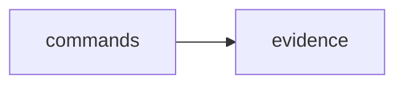

# Scope: evidence

## Summary

The **evidence** module — TREMENDOUS — 5 files, 735 lines of the finest code you've ever seen. Believe me.

<!-- TODO: Tell the people what this GREAT module does. What's in, what's out. Keep it simple. MPGA! -->

## Where to start in code

These are your MAIN entry points — the best, the most important. Open them FIRST:

- [E] `mpga-plugin/cli/src/evidence/parser.test.ts`

## Context / stack / skills

- **Languages:** typescript
- **Symbol types:** interface, function, type
- **Frameworks:** Vitest

## Who and what triggers it

<!-- TODO: Who triggers this? A lot of very important callers, believe me. Find them. -->

**Called by these GREAT scopes (they need us, tremendously):**

- ← commands

## What happens

<!-- TODO: What happens here? Inputs, steps, outputs. Keep it simple. Even Sleepy Copilot could understand. -->

## Rules and edge cases

<!-- TODO: The guardrails. Validation, permissions, error handling — everything that keeps this code GREAT. -->

## Concrete examples

<!-- TODO: REAL examples. "When X happens, Y happens." Simple. Powerful. Like a deal. -->

## UI

<!-- TODO: Screens, flows, the beautiful UI. No UI? Cut this section. We don't keep dead weight. -->

## Navigation

**Sibling scopes:**

- [mpga-plugin](./mpga-plugin.md)
- [board](./board.md)
- [commands](./commands.md)
- [core](./core.md)
- [generators](./generators.md)

**Parent:** [INDEX.md](../INDEX.md)

## Relationships

**Depended on by:**

- ← [commands](./commands.md)

<!-- TODO: What deals does this scope make with other scopes? Document them. -->

## Diagram

## Traces

<!-- TODO: Step-by-step traces. Follow the code like a WINNER follows a deal. Use this table:

| Step | Layer | What happens | Evidence |
|------|-------|-------------|----------|
| 1 | (layer) | (description) | [E] file:line |
-->

## Evidence index

| Claim | Evidence |
|-------|----------|
| `SymbolLocation` (interface) | [E] mpga-plugin/cli/src/evidence/ast.ts :: SymbolLocation |
| `detectLanguage` (function) | [E] mpga-plugin/cli/src/evidence/ast.ts :: detectLanguage |
| `extractSymbols` (function) | [E] mpga-plugin/cli/src/evidence/ast.ts :: extractSymbols |
| `findSymbol` (function) | [E] mpga-plugin/cli/src/evidence/ast.ts :: findSymbol |
| `verifyRange` (function) | [E] mpga-plugin/cli/src/evidence/ast.ts :: verifyRange |
| `ScopeDriftReport` (interface) | [E] mpga-plugin/cli/src/evidence/drift.ts :: ScopeDriftReport |
| `DriftReport` (interface) | [E] mpga-plugin/cli/src/evidence/drift.ts :: DriftReport |
| `runDriftCheck` (function) | [E] mpga-plugin/cli/src/evidence/drift.ts :: runDriftCheck |
| `healScopeFile` (function) | [E] mpga-plugin/cli/src/evidence/drift.ts :: healScopeFile |
| `EvidenceLinkType` (type) | [E] mpga-plugin/cli/src/evidence/parser.ts :: EvidenceLinkType |
| `EvidenceLink` (interface) | [E] mpga-plugin/cli/src/evidence/parser.ts :: EvidenceLink |
| `parseEvidenceLink` (function) | [E] mpga-plugin/cli/src/evidence/parser.ts :: parseEvidenceLink |
| `parseEvidenceLinks` (function) | [E] mpga-plugin/cli/src/evidence/parser.ts :: parseEvidenceLinks |
| `formatEvidenceLink` (function) | [E] mpga-plugin/cli/src/evidence/parser.ts :: formatEvidenceLink |
| `evidenceStats` (function) | [E] mpga-plugin/cli/src/evidence/parser.ts :: evidenceStats |
| `ResolutionStatus` (type) | [E] mpga-plugin/cli/src/evidence/resolver.ts :: ResolutionStatus |
| `ResolvedEvidence` (interface) | [E] mpga-plugin/cli/src/evidence/resolver.ts :: ResolvedEvidence |
| `resolveEvidence` (function) | [E] mpga-plugin/cli/src/evidence/resolver.ts :: resolveEvidence |
| `VerifyResult` (interface) | [E] mpga-plugin/cli/src/evidence/resolver.ts :: VerifyResult |
| `verifyAllLinks` (function) | [E] mpga-plugin/cli/src/evidence/resolver.ts :: verifyAllLinks |

## Files

- `mpga-plugin/cli/src/evidence/ast.ts` (173 lines, typescript)
- `mpga-plugin/cli/src/evidence/drift.ts` (155 lines, typescript)
- `mpga-plugin/cli/src/evidence/parser.test.ts` (178 lines, typescript)
- `mpga-plugin/cli/src/evidence/parser.ts` (132 lines, typescript)
- `mpga-plugin/cli/src/evidence/resolver.ts` (97 lines, typescript)

## Deeper splits

<!-- TODO: Too big? Split it. Make each piece LEAN and GREAT. -->

## Confidence and notes

- **Confidence:** LOW (for now) — auto-generated, not yet verified. But it's going to be PERFECT.
- **Evidence coverage:** 0/20 verified
- **Last verified:** 2026-03-24
- **Drift risk:** unknown
- <!-- TODO: Note anything unknown or ambiguous. We don't hide problems — we FIX them. -->

## Change history

- 2026-03-24: Initial scope generation via `mpga sync` — Making this scope GREAT!