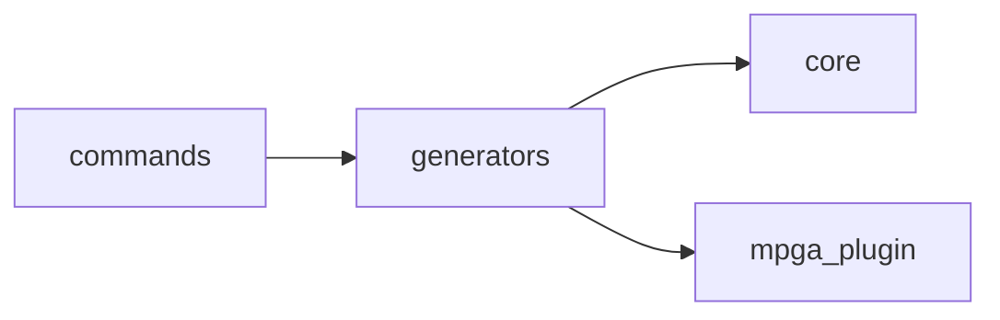

# Scope: generators

## Summary

The **generators** module — TREMENDOUS — 5 files, 1,177 lines of the finest code you've ever seen. Believe me.

<!-- TODO: Tell the people what this GREAT module does. What's in, what's out. Keep it simple. MPGA! -->

## Where to start in code

These are your MAIN entry points — the best, the most important. Open them FIRST:

- [E] `mpga-plugin/cli/src/generators/scope-md.ts`

## Context / stack / skills

- **Languages:** typescript
- **Symbol types:** interface, function
- **Frameworks:** Vitest, Express, Zod

## Who and what triggers it

<!-- TODO: Who triggers this? A lot of very important callers, believe me. Find them. -->

**Called by these GREAT scopes (they need us, tremendously):**

- ← commands

## What happens

- **extractModuleSummary** (function) — Module-level comments extracted from entry point files */ moduleSummaries: Array<{ filepath: string; summary: string }>; /** Frameworks/libraries detected from imports */ detectedFrameworks: string[]; /** Exported functions with their JSDoc descriptions */ exportDescriptions: Array<{ symbol: string; filepath: string; kind: string; description: string; }>; /** JSDoc annotations: @throws, @deprecated, etc. */ rulesAndConstraints: Array<{ filepath: string; symbol: string; annotation: string }>; } interface ExportedSymbol { symbol: string; filepath: string; kind: string; } // Extract exported symbols with their kind function extractExports(filepath: string, content: string): ExportedSymbol[] { const exports: ExportedSymbol[] = []; const seen = new Set<string>(); // TypeScript/JS exports const tsRe = /export\s+(?:default\s+)?(?:async\s+)?(function|class|const|let|var|type|interface|enum)\s+(\w+)/g; let m; while ((m = tsRe.exec(content)) !== null) { const kind = m[1] === 'let' || m[1] === 'var' ? 'variable' : m[1]; if (!seen.has(m[2])) { seen.add(m[2]); exports.push({ symbol: m[2], filepath, kind }); } } // Python def/class at module level const pyRe = /^(def|class)\s+(\w+)/gm; while ((m = pyRe.exec(content)) !== null) { if (!seen.has(m[2])) { seen.add(m[2]); exports.push({ symbol: m[2], filepath, kind: m[1] }); } } // Go func const goRe = /^func\s+(\w+)/gm; while ((m = goRe.exec(content)) !== null) { if (!seen.has(m[1])) { seen.add(m[1]); exports.push({ symbol: m[1], filepath, kind: 'function' }); } } return exports; } // Known frameworks/libraries to detect from imports const FRAMEWORK_MAP: Record<string, string> = { express: 'Express', fastify: 'Fastify', hono: 'Hono', koa: 'Koa', react: 'React', 'react-dom': 'React', vue: 'Vue', svelte: 'Svelte', next: 'Next.js', nuxt: 'Nuxt', angular: 'Angular', commander: 'Commander', yargs: 'Yargs', inquirer: 'Inquirer', zod: 'Zod', joi: 'Joi', ajv: 'Ajv', prisma: 'Prisma', drizzle: 'Drizzle', typeorm: 'TypeORM', sequelize: 'Sequelize', vitest: 'Vitest', jest: 'Jest', mocha: 'Mocha', tailwindcss: 'Tailwind CSS', 'styled-components': 'styled-components', graphql: 'GraphQL', trpc: 'tRPC', axios: 'Axios', mongoose: 'Mongoose', knex: 'Knex', flask: 'Flask', django: 'Django', fastapi: 'FastAPI', }; /** Extract the leading module-level comment (JSDoc or // block) from file content [E] `mpga-plugin/cli/src/generators/scope-md.ts`
- **detectFrameworks** (function) — Module-level comments extracted from entry point files */ moduleSummaries: Array<{ filepath: string; summary: string }>; /** Frameworks/libraries detected from imports */ detectedFrameworks: string[]; /** Exported functions with their JSDoc descriptions */ exportDescriptions: Array<{ symbol: string; filepath: string; kind: string; description: string; }>; /** JSDoc annotations: @throws, @deprecated, etc. */ rulesAndConstraints: Array<{ filepath: string; symbol: string; annotation: string }>; } interface ExportedSymbol { symbol: string; filepath: string; kind: string; } // Extract exported symbols with their kind function extractExports(filepath: string, content: string): ExportedSymbol[] { const exports: ExportedSymbol[] = []; const seen = new Set<string>(); // TypeScript/JS exports const tsRe = /export\s+(?:default\s+)?(?:async\s+)?(function|class|const|let|var|type|interface|enum)\s+(\w+)/g; let m; while ((m = tsRe.exec(content)) !== null) { const kind = m[1] === 'let' || m[1] === 'var' ? 'variable' : m[1]; if (!seen.has(m[2])) { seen.add(m[2]); exports.push({ symbol: m[2], filepath, kind }); } } // Python def/class at module level const pyRe = /^(def|class)\s+(\w+)/gm; while ((m = pyRe.exec(content)) !== null) { if (!seen.has(m[2])) { seen.add(m[2]); exports.push({ symbol: m[2], filepath, kind: m[1] }); } } // Go func const goRe = /^func\s+(\w+)/gm; while ((m = goRe.exec(content)) !== null) { if (!seen.has(m[1])) { seen.add(m[1]); exports.push({ symbol: m[1], filepath, kind: 'function' }); } } return exports; } // Known frameworks/libraries to detect from imports const FRAMEWORK_MAP: Record<string, string> = { express: 'Express', fastify: 'Fastify', hono: 'Hono', koa: 'Koa', react: 'React', 'react-dom': 'React', vue: 'Vue', svelte: 'Svelte', next: 'Next.js', nuxt: 'Nuxt', angular: 'Angular', commander: 'Commander', yargs: 'Yargs', inquirer: 'Inquirer', zod: 'Zod', joi: 'Joi', ajv: 'Ajv', prisma: 'Prisma', drizzle: 'Drizzle', typeorm: 'TypeORM', sequelize: 'Sequelize', vitest: 'Vitest', jest: 'Jest', mocha: 'Mocha', tailwindcss: 'Tailwind CSS', 'styled-components': 'styled-components', graphql: 'GraphQL', trpc: 'tRPC', axios: 'Axios', mongoose: 'Mongoose', knex: 'Knex', flask: 'Flask', django: 'Django', fastapi: 'FastAPI', }; /** Extract the leading module-level comment (JSDoc or // block) from file content */ export function extractModuleSummary(content: string): string | null { // Try JSDoc block comment at the top (before any import/code) const jsdocMatch = content.match(/^\s*\/\*\*([\s\S]*?)\*\//); if (jsdocMatch) { const beforeComment = content.slice(0, jsdocMatch.index ?? 0).trim(); if (beforeComment === '') { const cleaned = jsdocMatch[1] .split('\n') .map((l) => l.replace(/^\s*\*\s?/, '').trim()) .filter((l) => !l.startsWith('@') && l.length > 0) .join(' ') .trim(); if (cleaned.length > 0) return cleaned; } } // Try leading // comment block const lines = content.split('\n'); const commentLines: string[] = []; for (const line of lines) { const trimmed = line.trim(); if (trimmed === '' && commentLines.length === 0) continue; if (trimmed.startsWith('//')) { commentLines.push(trimmed.replace(/^\/\/\s?/, '').trim()); } else { break; } } if (commentLines.length > 0) { const joined = commentLines .filter((l) => l.length > 0) .join(' ') .trim(); if (joined.length > 0) return joined; } return null; } /** Detect known frameworks/libraries from import statements [E] `mpga-plugin/cli/src/generators/scope-md.ts`
- **extractJSDocForExport** (function) — Module-level comments extracted from entry point files */ moduleSummaries: Array<{ filepath: string; summary: string }>; /** Frameworks/libraries detected from imports */ detectedFrameworks: string[]; /** Exported functions with their JSDoc descriptions */ exportDescriptions: Array<{ symbol: string; filepath: string; kind: string; description: string; }>; /** JSDoc annotations: @throws, @deprecated, etc. */ rulesAndConstraints: Array<{ filepath: string; symbol: string; annotation: string }>; } interface ExportedSymbol { symbol: string; filepath: string; kind: string; } // Extract exported symbols with their kind function extractExports(filepath: string, content: string): ExportedSymbol[] { const exports: ExportedSymbol[] = []; const seen = new Set<string>(); // TypeScript/JS exports const tsRe = /export\s+(?:default\s+)?(?:async\s+)?(function|class|const|let|var|type|interface|enum)\s+(\w+)/g; let m; while ((m = tsRe.exec(content)) !== null) { const kind = m[1] === 'let' || m[1] === 'var' ? 'variable' : m[1]; if (!seen.has(m[2])) { seen.add(m[2]); exports.push({ symbol: m[2], filepath, kind }); } } // Python def/class at module level const pyRe = /^(def|class)\s+(\w+)/gm; while ((m = pyRe.exec(content)) !== null) { if (!seen.has(m[2])) { seen.add(m[2]); exports.push({ symbol: m[2], filepath, kind: m[1] }); } } // Go func const goRe = /^func\s+(\w+)/gm; while ((m = goRe.exec(content)) !== null) { if (!seen.has(m[1])) { seen.add(m[1]); exports.push({ symbol: m[1], filepath, kind: 'function' }); } } return exports; } // Known frameworks/libraries to detect from imports const FRAMEWORK_MAP: Record<string, string> = { express: 'Express', fastify: 'Fastify', hono: 'Hono', koa: 'Koa', react: 'React', 'react-dom': 'React', vue: 'Vue', svelte: 'Svelte', next: 'Next.js', nuxt: 'Nuxt', angular: 'Angular', commander: 'Commander', yargs: 'Yargs', inquirer: 'Inquirer', zod: 'Zod', joi: 'Joi', ajv: 'Ajv', prisma: 'Prisma', drizzle: 'Drizzle', typeorm: 'TypeORM', sequelize: 'Sequelize', vitest: 'Vitest', jest: 'Jest', mocha: 'Mocha', tailwindcss: 'Tailwind CSS', 'styled-components': 'styled-components', graphql: 'GraphQL', trpc: 'tRPC', axios: 'Axios', mongoose: 'Mongoose', knex: 'Knex', flask: 'Flask', django: 'Django', fastapi: 'FastAPI', }; /** Extract the leading module-level comment (JSDoc or // block) from file content */ export function extractModuleSummary(content: string): string | null { // Try JSDoc block comment at the top (before any import/code) const jsdocMatch = content.match(/^\s*\/\*\*([\s\S]*?)\*\//); if (jsdocMatch) { const beforeComment = content.slice(0, jsdocMatch.index ?? 0).trim(); if (beforeComment === '') { const cleaned = jsdocMatch[1] .split('\n') .map((l) => l.replace(/^\s*\*\s?/, '').trim()) .filter((l) => !l.startsWith('@') && l.length > 0) .join(' ') .trim(); if (cleaned.length > 0) return cleaned; } } // Try leading // comment block const lines = content.split('\n'); const commentLines: string[] = []; for (const line of lines) { const trimmed = line.trim(); if (trimmed === '' && commentLines.length === 0) continue; if (trimmed.startsWith('//')) { commentLines.push(trimmed.replace(/^\/\/\s?/, '').trim()); } else { break; } } if (commentLines.length > 0) { const joined = commentLines .filter((l) => l.length > 0) .join(' ') .trim(); if (joined.length > 0) return joined; } return null; } /** Detect known frameworks/libraries from import statements */ export function detectFrameworks(content: string): string[] { const found = new Set<string>(); const importRe = /(?:from|import|require)\s*\(?\s*['"]([^'"./][^'"]*)['"]/g; let m; while ((m = importRe.exec(content)) !== null) { // Get the package name (handle scoped packages like @foo/bar) const raw = m[1]; const pkg = raw.startsWith('@') ? raw.split('/').slice(0, 2).join('/') : raw.split('/')[0]; const framework = FRAMEWORK_MAP[pkg]; if (framework) found.add(framework); } return [...found]; } /** Extract JSDoc description for a specific exported symbol [E] `mpga-plugin/cli/src/generators/scope-md.ts`
- **extractAnnotations** (function) — Module-level comments extracted from entry point files */ moduleSummaries: Array<{ filepath: string; summary: string }>; /** Frameworks/libraries detected from imports */ detectedFrameworks: string[]; /** Exported functions with their JSDoc descriptions */ exportDescriptions: Array<{ symbol: string; filepath: string; kind: string; description: string; }>; /** JSDoc annotations: @throws, @deprecated, etc. */ rulesAndConstraints: Array<{ filepath: string; symbol: string; annotation: string }>; } interface ExportedSymbol { symbol: string; filepath: string; kind: string; } // Extract exported symbols with their kind function extractExports(filepath: string, content: string): ExportedSymbol[] { const exports: ExportedSymbol[] = []; const seen = new Set<string>(); // TypeScript/JS exports const tsRe = /export\s+(?:default\s+)?(?:async\s+)?(function|class|const|let|var|type|interface|enum)\s+(\w+)/g; let m; while ((m = tsRe.exec(content)) !== null) { const kind = m[1] === 'let' || m[1] === 'var' ? 'variable' : m[1]; if (!seen.has(m[2])) { seen.add(m[2]); exports.push({ symbol: m[2], filepath, kind }); } } // Python def/class at module level const pyRe = /^(def|class)\s+(\w+)/gm; while ((m = pyRe.exec(content)) !== null) { if (!seen.has(m[2])) { seen.add(m[2]); exports.push({ symbol: m[2], filepath, kind: m[1] }); } } // Go func const goRe = /^func\s+(\w+)/gm; while ((m = goRe.exec(content)) !== null) { if (!seen.has(m[1])) { seen.add(m[1]); exports.push({ symbol: m[1], filepath, kind: 'function' }); } } return exports; } // Known frameworks/libraries to detect from imports const FRAMEWORK_MAP: Record<string, string> = { express: 'Express', fastify: 'Fastify', hono: 'Hono', koa: 'Koa', react: 'React', 'react-dom': 'React', vue: 'Vue', svelte: 'Svelte', next: 'Next.js', nuxt: 'Nuxt', angular: 'Angular', commander: 'Commander', yargs: 'Yargs', inquirer: 'Inquirer', zod: 'Zod', joi: 'Joi', ajv: 'Ajv', prisma: 'Prisma', drizzle: 'Drizzle', typeorm: 'TypeORM', sequelize: 'Sequelize', vitest: 'Vitest', jest: 'Jest', mocha: 'Mocha', tailwindcss: 'Tailwind CSS', 'styled-components': 'styled-components', graphql: 'GraphQL', trpc: 'tRPC', axios: 'Axios', mongoose: 'Mongoose', knex: 'Knex', flask: 'Flask', django: 'Django', fastapi: 'FastAPI', }; /** Extract the leading module-level comment (JSDoc or // block) from file content */ export function extractModuleSummary(content: string): string | null { // Try JSDoc block comment at the top (before any import/code) const jsdocMatch = content.match(/^\s*\/\*\*([\s\S]*?)\*\//); if (jsdocMatch) { const beforeComment = content.slice(0, jsdocMatch.index ?? 0).trim(); if (beforeComment === '') { const cleaned = jsdocMatch[1] .split('\n') .map((l) => l.replace(/^\s*\*\s?/, '').trim()) .filter((l) => !l.startsWith('@') && l.length > 0) .join(' ') .trim(); if (cleaned.length > 0) return cleaned; } } // Try leading // comment block const lines = content.split('\n'); const commentLines: string[] = []; for (const line of lines) { const trimmed = line.trim(); if (trimmed === '' && commentLines.length === 0) continue; if (trimmed.startsWith('//')) { commentLines.push(trimmed.replace(/^\/\/\s?/, '').trim()); } else { break; } } if (commentLines.length > 0) { const joined = commentLines .filter((l) => l.length > 0) .join(' ') .trim(); if (joined.length > 0) return joined; } return null; } /** Detect known frameworks/libraries from import statements */ export function detectFrameworks(content: string): string[] { const found = new Set<string>(); const importRe = /(?:from|import|require)\s*\(?\s*['"]([^'"./][^'"]*)['"]/g; let m; while ((m = importRe.exec(content)) !== null) { // Get the package name (handle scoped packages like @foo/bar) const raw = m[1]; const pkg = raw.startsWith('@') ? raw.split('/').slice(0, 2).join('/') : raw.split('/')[0]; const framework = FRAMEWORK_MAP[pkg]; if (framework) found.add(framework); } return [...found]; } /** Extract JSDoc description for a specific exported symbol */ export function extractJSDocForExport(content: string, symbolName: string): string | null { // Match /** ... */ immediately before an export containing the symbol name const escaped = symbolName.replace(/[.*+?^${}()|[\]\\]/g, '\\$&'); const re = new RegExp( `/\\*\\*([\\s\\S]*?)\\*/\\s*export\\s+(?:default\\s+)?(?:async\\s+)?(?:function|class|const|let|var|type|interface|enum)\\s+${escaped}\\b`, ); const match = content.match(re); if (!match) return null; const lines = match[1] .split('\n') .map((l) => l.replace(/^\s*\*\s?/, '').trim()) .filter((l) => l.length > 0 && !l.startsWith('@')); return lines.length > 0 ? lines.join(' ').trim() : null; } /** Extract constraint annotations (@throws, @deprecated, @param with validation) from JSDoc [E] `mpga-plugin/cli/src/generators/scope-md.ts`
- **getScopeName** (function) — Module-level comments extracted from entry point files */ moduleSummaries: Array<{ filepath: string; summary: string }>; /** Frameworks/libraries detected from imports */ detectedFrameworks: string[]; /** Exported functions with their JSDoc descriptions */ exportDescriptions: Array<{ symbol: string; filepath: string; kind: string; description: string; }>; /** JSDoc annotations: @throws, @deprecated, etc. */ rulesAndConstraints: Array<{ filepath: string; symbol: string; annotation: string }>; } interface ExportedSymbol { symbol: string; filepath: string; kind: string; } // Extract exported symbols with their kind function extractExports(filepath: string, content: string): ExportedSymbol[] { const exports: ExportedSymbol[] = []; const seen = new Set<string>(); // TypeScript/JS exports const tsRe = /export\s+(?:default\s+)?(?:async\s+)?(function|class|const|let|var|type|interface|enum)\s+(\w+)/g; let m; while ((m = tsRe.exec(content)) !== null) { const kind = m[1] === 'let' || m[1] === 'var' ? 'variable' : m[1]; if (!seen.has(m[2])) { seen.add(m[2]); exports.push({ symbol: m[2], filepath, kind }); } } // Python def/class at module level const pyRe = /^(def|class)\s+(\w+)/gm; while ((m = pyRe.exec(content)) !== null) { if (!seen.has(m[2])) { seen.add(m[2]); exports.push({ symbol: m[2], filepath, kind: m[1] }); } } // Go func const goRe = /^func\s+(\w+)/gm; while ((m = goRe.exec(content)) !== null) { if (!seen.has(m[1])) { seen.add(m[1]); exports.push({ symbol: m[1], filepath, kind: 'function' }); } } return exports; } // Known frameworks/libraries to detect from imports const FRAMEWORK_MAP: Record<string, string> = { express: 'Express', fastify: 'Fastify', hono: 'Hono', koa: 'Koa', react: 'React', 'react-dom': 'React', vue: 'Vue', svelte: 'Svelte', next: 'Next.js', nuxt: 'Nuxt', angular: 'Angular', commander: 'Commander', yargs: 'Yargs', inquirer: 'Inquirer', zod: 'Zod', joi: 'Joi', ajv: 'Ajv', prisma: 'Prisma', drizzle: 'Drizzle', typeorm: 'TypeORM', sequelize: 'Sequelize', vitest: 'Vitest', jest: 'Jest', mocha: 'Mocha', tailwindcss: 'Tailwind CSS', 'styled-components': 'styled-components', graphql: 'GraphQL', trpc: 'tRPC', axios: 'Axios', mongoose: 'Mongoose', knex: 'Knex', flask: 'Flask', django: 'Django', fastapi: 'FastAPI', }; /** Extract the leading module-level comment (JSDoc or // block) from file content */ export function extractModuleSummary(content: string): string | null { // Try JSDoc block comment at the top (before any import/code) const jsdocMatch = content.match(/^\s*\/\*\*([\s\S]*?)\*\//); if (jsdocMatch) { const beforeComment = content.slice(0, jsdocMatch.index ?? 0).trim(); if (beforeComment === '') { const cleaned = jsdocMatch[1] .split('\n') .map((l) => l.replace(/^\s*\*\s?/, '').trim()) .filter((l) => !l.startsWith('@') && l.length > 0) .join(' ') .trim(); if (cleaned.length > 0) return cleaned; } } // Try leading // comment block const lines = content.split('\n'); const commentLines: string[] = []; for (const line of lines) { const trimmed = line.trim(); if (trimmed === '' && commentLines.length === 0) continue; if (trimmed.startsWith('//')) { commentLines.push(trimmed.replace(/^\/\/\s?/, '').trim()); } else { break; } } if (commentLines.length > 0) { const joined = commentLines .filter((l) => l.length > 0) .join(' ') .trim(); if (joined.length > 0) return joined; } return null; } /** Detect known frameworks/libraries from import statements */ export function detectFrameworks(content: string): string[] { const found = new Set<string>(); const importRe = /(?:from|import|require)\s*\(?\s*['"]([^'"./][^'"]*)['"]/g; let m; while ((m = importRe.exec(content)) !== null) { // Get the package name (handle scoped packages like @foo/bar) const raw = m[1]; const pkg = raw.startsWith('@') ? raw.split('/').slice(0, 2).join('/') : raw.split('/')[0]; const framework = FRAMEWORK_MAP[pkg]; if (framework) found.add(framework); } return [...found]; } /** Extract JSDoc description for a specific exported symbol */ export function extractJSDocForExport(content: string, symbolName: string): string | null { // Match /** ... */ immediately before an export containing the symbol name const escaped = symbolName.replace(/[.*+?^${}()|[\]\\]/g, '\\$&'); const re = new RegExp( `/\\*\\*([\\s\\S]*?)\\*/\\s*export\\s+(?:default\\s+)?(?:async\\s+)?(?:function|class|const|let|var|type|interface|enum)\\s+${escaped}\\b`, ); const match = content.match(re); if (!match) return null; const lines = match[1] .split('\n') .map((l) => l.replace(/^\s*\*\s?/, '').trim()) .filter((l) => l.length > 0 && !l.startsWith('@')); return lines.length > 0 ? lines.join(' ').trim() : null; } /** Extract constraint annotations (@throws, @deprecated, @param with validation) from JSDoc */ export function extractAnnotations(content: string, symbolName: string): string[] { const escaped = symbolName.replace(/[.*+?^${}()|[\]\\]/g, '\\$&'); const re = new RegExp( `/\\*\\*([\\s\\S]*?)\\*/\\s*export\\s+(?:default\\s+)?(?:async\\s+)?(?:function|class|const|let|var|type|interface|enum)\\s+${escaped}\\b`, ); const match = content.match(re); if (!match) return []; const annotations: string[] = []; const lines = match[1].split('\n').map((l) => l.replace(/^\s*\*\s?/, '').trim()); for (const line of lines) { if (line.startsWith('@throws') || line.startsWith('@deprecated')) { annotations.push(line); } } return annotations; } // Detect entry-point files within a scope function detectEntryPoints(files: FileInfo[]): string[] { const entryPatterns = [ /(?:^|\/)index\.\w+$/, /(?:^|\/)main\.\w+$/, /(?:^|\/)app\.\w+$/, /(?:^|\/)server\.\w+$/, /(?:^|\/)cli\.\w+$/, /(?:^|\/)mod\.\w+$/, /(?:^|\/)lib\.\w+$/, /(?:^|\/)__init__\.py$/, ]; const entries: string[] = []; for (const file of files) { if (entryPatterns.some((p) => p.test(file.filepath))) { entries.push(file.filepath); } } // If no conventional entry points, pick the largest files (likely the main ones) if (entries.length === 0 && files.length > 0) { const sorted = [...files].sort((a, b) => b.lines - a.lines); entries.push(sorted[0].filepath); } return entries; } /** Determine the scope name for a file based on its path. With scopeDepth='auto', finds the deepest "source-like" directory (src/, lib/, core/, commands/, etc.) and uses its subdirectories as scopes. With a numeric depth, uses that many path segments. [E] `mpga-plugin/cli/src/generators/scope-md.ts`

## Rules and edge cases

<!-- TODO: The guardrails. Validation, permissions, error handling — everything that keeps this code GREAT. -->

## Concrete examples

<!-- TODO: REAL examples. "When X happens, Y happens." Simple. Powerful. Like a deal. -->

## UI

<!-- TODO: Screens, flows, the beautiful UI. No UI? Cut this section. We don't keep dead weight. -->

## Navigation

**Sibling scopes:**

- [mpga-plugin](./mpga-plugin.md)
- [board](./board.md)
- [commands](./commands.md)
- [core](./core.md)
- [evidence](./evidence.md)

**Parent:** [INDEX.md](../INDEX.md)

## Relationships

**Depends on:**

- → [core](./core.md)
- → [mpga-plugin](./mpga-plugin.md)

**Depended on by:**

- ← [commands](./commands.md)

<!-- TODO: What deals does this scope make with other scopes? Document them. -->

## Diagram

## Traces

<!-- TODO: Step-by-step traces. Follow the code like a WINNER follows a deal. Use this table:

| Step | Layer | What happens | Evidence |
|------|-------|-------------|----------|
| 1 | (layer) | (description) | [E] file:line |
-->

## Evidence index

| Claim | Evidence |
|-------|----------|
| `Dependency` (interface) | [E] mpga-plugin/cli/src/generators/graph-md.ts :: Dependency |
| `GraphData` (interface) | [E] mpga-plugin/cli/src/generators/graph-md.ts :: GraphData |
| `buildGraph` (function) | [E] mpga-plugin/cli/src/generators/graph-md.ts :: buildGraph |
| `renderGraphMd` (function) | [E] mpga-plugin/cli/src/generators/graph-md.ts :: renderGraphMd |
| `renderIndexMd` (function) | [E] mpga-plugin/cli/src/generators/index-md.ts :: renderIndexMd |
| `foo` (function) | [E] mpga-plugin/cli/src/generators/scope-md.test.ts :: foo |
| `loadBoard` (function) | [E] mpga-plugin/cli/src/generators/scope-md.test.ts :: loadBoard |
| `saveBoard` (function) | [E] mpga-plugin/cli/src/generators/scope-md.test.ts :: saveBoard |
| `noDoc` (function) | [E] mpga-plugin/cli/src/generators/scope-md.test.ts :: noDoc |
| `exists` (function) | [E] mpga-plugin/cli/src/generators/scope-md.test.ts :: exists |
| `scan` (function) | [E] mpga-plugin/cli/src/generators/scope-md.test.ts :: scan |
| `doThing` (function) | [E] mpga-plugin/cli/src/generators/scope-md.test.ts :: doThing |
| `oldFunc` (function) | [E] mpga-plugin/cli/src/generators/scope-md.test.ts :: oldFunc |
| `simple` (function) | [E] mpga-plugin/cli/src/generators/scope-md.test.ts :: simple |
| `ScopeInfo` (interface) | [E] mpga-plugin/cli/src/generators/scope-md.ts :: ScopeInfo |
| `extractModuleSummary` (function) | [E] mpga-plugin/cli/src/generators/scope-md.ts :: extractModuleSummary |
| `detectFrameworks` (function) | [E] mpga-plugin/cli/src/generators/scope-md.ts :: detectFrameworks |
| `extractJSDocForExport` (function) | [E] mpga-plugin/cli/src/generators/scope-md.ts :: extractJSDocForExport |
| `extractAnnotations` (function) | [E] mpga-plugin/cli/src/generators/scope-md.ts :: extractAnnotations |
| `getScopeName` (function) | [E] mpga-plugin/cli/src/generators/scope-md.ts :: getScopeName |
| `groupIntoScopes` (function) | [E] mpga-plugin/cli/src/generators/scope-md.ts :: groupIntoScopes |
| `renderScopeMd` (function) | [E] mpga-plugin/cli/src/generators/scope-md.ts :: renderScopeMd |

## Files

- `mpga-plugin/cli/src/generators/graph-md.ts` (183 lines, typescript)
- `mpga-plugin/cli/src/generators/index-md.test.ts` (71 lines, typescript)
- `mpga-plugin/cli/src/generators/index-md.ts` (86 lines, typescript)
- `mpga-plugin/cli/src/generators/scope-md.test.ts` (243 lines, typescript)
- `mpga-plugin/cli/src/generators/scope-md.ts` (594 lines, typescript)

## Deeper splits

<!-- TODO: Too big? Split it. Make each piece LEAN and GREAT. -->

## Confidence and notes

- **Confidence:** LOW (for now) — auto-generated, not yet verified. But it's going to be PERFECT.
- **Evidence coverage:** 0/22 verified
- **Last verified:** 2026-03-24
- **Drift risk:** unknown
- <!-- TODO: Note anything unknown or ambiguous. We don't hide problems — we FIX them. -->

## Change history

- 2026-03-24: Initial scope generation via `mpga sync` — Making this scope GREAT!