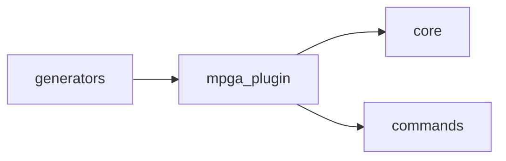

# Scope: mpga-plugin

## Summary

The **mpga-plugin** module — TREMENDOUS — 8 files, 182 lines of the finest code you've ever seen. Believe me.

<!-- TODO: Tell the people what this GREAT module does. What's in, what's out. Keep it simple. MPGA! -->

## Where to start in code

These are your MAIN entry points — the best, the most important. Open them FIRST:

- [E] `mpga-plugin/cli/src/cli.ts`
- [E] `mpga-plugin/cli/src/index.ts`

## Context / stack / skills

- **Languages:** shell, typescript, javascript
- **Symbol types:** function
- **Frameworks:** Vitest, Commander

## Who and what triggers it

<!-- TODO: Who triggers this? A lot of very important callers, believe me. Find them. -->

**Called by these GREAT scopes (they need us, tremendously):**

- ← generators

## What happens

<!-- TODO: What happens here? Inputs, steps, outputs. Keep it simple. Even Sleepy Copilot could understand. -->

## Rules and edge cases

<!-- TODO: The guardrails. Validation, permissions, error handling — everything that keeps this code GREAT. -->

## Concrete examples

<!-- TODO: REAL examples. "When X happens, Y happens." Simple. Powerful. Like a deal. -->

## UI

<!-- TODO: Screens, flows, the beautiful UI. No UI? Cut this section. We don't keep dead weight. -->

## Navigation

**Sibling scopes:**

- [board](./board.md)
- [commands](./commands.md)
- [core](./core.md)
- [evidence](./evidence.md)
- [generators](./generators.md)

**Parent:** [INDEX.md](../INDEX.md)

## Relationships

**Depends on:**

- → [core](./core.md)
- → [commands](./commands.md)

**Depended on by:**

- ← [generators](./generators.md)

<!-- TODO: What deals does this scope make with other scopes? Document them. -->

## Diagram

## Traces

<!-- TODO: Step-by-step traces. Follow the code like a WINNER follows a deal. Use this table:

| Step | Layer | What happens | Evidence |
|------|-------|-------------|----------|
| 1 | (layer) | (description) | [E] file:line |
-->

## Evidence index

| Claim | Evidence |
|-------|----------|
| `createCli` (function) | [E] mpga-plugin/cli/src/cli.ts :: createCli |

## Files

- `mpga-plugin/bin/mpga.sh` (17 lines, shell)
- `mpga-plugin/cli/vitest.config.ts` (19 lines, typescript)
- `mpga-plugin/scripts/check-cli.sh` (20 lines, shell)
- `mpga-plugin/scripts/format-evidence.sh` (16 lines, shell)
- `mpga-plugin/scripts/setup.sh` (28 lines, shell)
- `mpga-plugin/cli/bin/mpga.js` (4 lines, javascript)
- `mpga-plugin/cli/src/cli.ts` (73 lines, typescript)
- `mpga-plugin/cli/src/index.ts` (5 lines, typescript)

## Deeper splits

<!-- TODO: Too big? Split it. Make each piece LEAN and GREAT. -->

## Confidence and notes

- **Confidence:** LOW (for now) — auto-generated, not yet verified. But it's going to be PERFECT.
- **Evidence coverage:** 0/1 verified
- **Last verified:** 2026-03-24
- **Drift risk:** unknown
- <!-- TODO: Note anything unknown or ambiguous. We don't hide problems — we FIX them. -->

## Change history

- 2026-03-24: Initial scope generation via `mpga sync` — Making this scope GREAT!