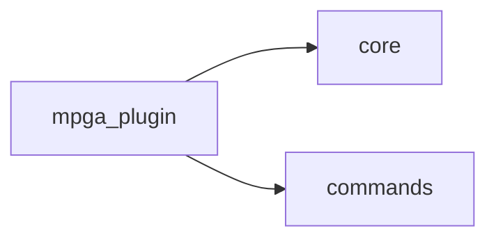

# Scope: mpga-plugin

## Summary

- **Health:** ✓ fresh
The **mpga-plugin** module — TREMENDOUS — 11 files, 484 lines of the finest code you've ever seen. Believe me.

The `mpga-plugin` directory is the self-contained CLI application package. It ships TypeScript source under `mpga-plugin/cli/src/`, compiles to `mpga-plugin/cli/dist/`, and exposes the `mpga` binary two ways: a Node.js entry point for npm-installed use and a Bash wrapper for in-repo use. The CLI is built on Commander and registers 14 sub-commands covering the full MPGA workflow — init, scan, sync, evidence, drift, scope, graph, board, milestone, session, health, status, config, and export. [E] mpga-plugin/cli/src/cli.ts:1-72

## Where to start in code

These are your MAIN entry points — the best, the most important. Open them FIRST:

- [E] `mpga-plugin/cli/src/cli.ts`
- [E] `mpga-plugin/cli/src/index.ts`

## Context / stack / skills

- **Languages:** shell, typescript, javascript
- **Symbol types:** function
- **Frameworks:** Vitest, Commander

## Who and what triggers it

- **End users** invoke the CLI directly via `mpga <command>` after installing the package from npm (binary registered at `"bin": { "mpga": "./bin/mpga.js" }`). [E] mpga-plugin/cli/package.json:27-29
- **In-repo scripts and git hooks** invoke it via `mpga-plugin/bin/mpga.sh`, which auto-builds the CLI on first run, then delegates to `node dist/index.js`. [E] mpga-plugin/bin/mpga.sh:1-16
- **Other scripts that need mpga as a shell function** source `mpga-plugin/scripts/check-cli.sh`, which exports `mpga()` and `$MPGA_BIN`. [E] mpga-plugin/scripts/check-cli.sh:12-19
- **The postbuild hook** runs `node mpga-plugin/cli/dist/index.js export --claude` automatically after each `tsc` build. [E] mpga-plugin/cli/package.json:38

**Called by these GREAT scopes (they need us, tremendously):**

- ← generators

## What happens

1. **Entry:** `mpga-plugin/cli/bin/mpga.js` runs `require('../dist/index.js')`. [E] mpga-plugin/cli/bin/mpga.js:1-3
2. **Bootstrap:** `dist/index.js` (compiled from `src/index.ts`) calls `createCli()` and passes `process.argv` to Commander. [E] mpga-plugin/cli/src/index.ts:1-4
3. **CLI construction:** `createCli()` in `src/cli.ts` builds a Commander `Command`, sets name/description/version, configures sorted subcommands with colored help text, and registers all 14 commands in four groups (core workflow, evidence & drift, knowledge layer, project management, configuration & export). [E] mpga-plugin/cli/src/cli.ts:19-72
4. **Dispatch:** Commander parses `process.argv` and routes to the matched sub-command handler.
5. **Output:** Each command writes to stdout/stderr. `banner()` from `core/logger` is printed before help text. [E] mpga-plugin/cli/src/cli.ts:30-33

## Rules and edge cases

- **Node ≥ 20 required.** The `engines` field enforces this; npm will warn on older versions. [E] mpga-plugin/cli/package.json:73-75
- **Must build before running.** `mpga-plugin/bin/mpga.js` loads `../dist/index.js` directly — if `dist/` is absent the process throws immediately. [E] mpga-plugin/cli/bin/mpga.js:3
- **Auto-build guard in shell wrapper.** `mpga.sh` checks for `dist/index.js` and runs `setup.sh` if missing; `setup.sh` is idempotent (skips if `dist/` is newer than `src/`). [E] mpga-plugin/bin/mpga.sh:12-14, mpga-plugin/scripts/setup.sh:17-19
- **`setup.sh` uses `set -e`** — any failed `npm install` or `npm run build` step aborts the script immediately. [E] mpga-plugin/scripts/setup.sh:5
- **Test coverage threshold:** vitest enforces ≥ 50 % line coverage; CI fails below that. [E] mpga-plugin/cli/vitest.config.ts:13-15
- **`prepublishOnly` gate:** publishing to npm requires passing `typecheck + lint + test + build` in sequence. [E] mpga-plugin/cli/package.json:50
- **`export -f` guard:** `check-cli.sh` gracefully skips the function export if the shell does not support `export -f` (e.g. zsh). [E] mpga-plugin/scripts/check-cli.sh:16

## Concrete examples

- `mpga sync` → Commander routes to `registerSync` handler → generates the knowledge layer and updates scope docs.
- `mpga --help` → `banner()` prints the MPGA logo, then Commander lists all 14 sub-commands sorted alphabetically with red command names and dimmed usage strings. [E] mpga-plugin/cli/src/cli.ts:26-45
- `mpga export --claude` → runs the export command; the postbuild hook triggers this automatically after every `npm run build`. [E] mpga-plugin/cli/package.json:38
- Running `mpga` inside a repo that has never been built → `mpga.sh` detects missing `dist/index.js`, calls `setup.sh`, which runs `npm install` + `npm run build`, then re-invokes `node dist/index.js`. [E] mpga-plugin/bin/mpga.sh:12-16
- A git hook sourcing `check-cli.sh` gets a ready `mpga` shell function and `$MPGA_BIN` env var it can pass to other tools. [E] mpga-plugin/scripts/check-cli.sh:13-19

## UI

No UI. This is a pure CLI tool. Section removed.

## Navigation

**Sibling scopes:**

- [commands](./commands.md)
- [board](./board.md)
- [core](./core.md)
- [evidence](./evidence.md)
- [generators](./generators.md)

**Parent:** [INDEX.md](../INDEX.md)

## Relationships

**Depends on:**

- → [core](./core.md)
- → [commands](./commands.md)

**Depended on by:**

(none — mpga-plugin is the root of the dependency graph)

- **mpga-plugin → core:** `createCli()` imports `banner` and `VERSION` from `core/logger` for help-text rendering. [E] mpga-plugin/cli/src/cli.ts:3
- **mpga-plugin → commands:** `createCli()` imports and registers all 14 `register*` functions from the `commands/` sub-scope. [E] mpga-plugin/cli/src/cli.ts:4-17
- **postbuild note:** the `package.json` postbuild script invokes `dist/index.js export --claude` after each build, but this is a build-system hook, not a source-level dependency from another scope. [E] mpga-plugin/cli/package.json:38

## Diagram

## Traces

**Trace: `mpga sync` called from the shell**

| Step | Layer | What happens | Evidence |
|------|-------|-------------|----------|
| 1 | bin | `mpga.sh` checks `dist/index.js` exists; auto-builds via `setup.sh` if missing | [E] mpga-plugin/bin/mpga.sh:12-16 |
| 2 | bin | `exec node dist/index.js sync` — control passes to Node | [E] mpga-plugin/bin/mpga.sh:16 |
| 3 | entry | `src/index.ts` calls `createCli()` then `cli.parse(process.argv)` | [E] mpga-plugin/cli/src/index.ts:1-4 |
| 4 | cli | `createCli()` builds Commander program, registers all commands, returns it | [E] mpga-plugin/cli/src/cli.ts:19-72 |
| 5 | commands | Commander matches `sync`, invokes `registerSync` handler | [E] mpga-plugin/cli/src/cli.ts:50 |
| 6 | commands | sync handler runs scan + generation pipeline (see commands/sync scope) | [E] mpga-plugin/cli/src/commands/sync.ts |

## Evidence index

| Claim | Evidence |
|-------|----------|
| `createCli` builds Commander program, registers 14 commands | [E] mpga-plugin/cli/src/cli.ts:19-72 |
| Entry point calls `createCli()` then `cli.parse(process.argv)` | [E] mpga-plugin/cli/src/index.ts:1-4 |
| npm binary registered as `./bin/mpga.js` | [E] mpga-plugin/cli/package.json:27-29 |
| `bin/mpga.js` loads compiled `../dist/index.js` | [E] mpga-plugin/cli/bin/mpga.js:1-3 |
| `mpga.sh` auto-builds via `setup.sh` if `dist/index.js` missing | [E] mpga-plugin/bin/mpga.sh:12-14 |
| `setup.sh` is idempotent — skips when dist newer than src | [E] mpga-plugin/scripts/setup.sh:17-19 |
| `check-cli.sh` exports `mpga()` shell function and `$MPGA_BIN` | [E] mpga-plugin/scripts/check-cli.sh:13-19 |
| postbuild hook runs `export --claude` after every build | [E] mpga-plugin/cli/package.json:38 |
| Node ≥ 20 enforced via `engines` field | [E] mpga-plugin/cli/package.json:73-75 |
| Test coverage threshold: 50 % lines | [E] mpga-plugin/cli/vitest.config.ts:13-15 |

## Files

- `mpga-plugin/bin/mpga.sh` (17 lines, shell)
- `mpga-plugin/scripts/check-cli.sh` (20 lines, shell)
- `mpga-plugin/scripts/format-evidence.sh` (16 lines, shell)
- `mpga-plugin/scripts/setup.sh` (28 lines, shell)
- `mpga-plugin/cli/vitest.config.ts` (19 lines, typescript)
- `mpga-plugin/cli/bin/mpga.js` (4 lines, javascript)
- `mpga-plugin/cli/src/cli.ts` (73 lines, typescript)
- `mpga-plugin/cli/src/index.ts` (5 lines, typescript)
- `mpga-plugin/cli/coverage/lcov-report/block-navigation.js` (88 lines, javascript)
- `mpga-plugin/cli/coverage/lcov-report/prettify.js` (3 lines, javascript)
- `mpga-plugin/cli/coverage/lcov-report/sorter.js` (211 lines, javascript)

## Deeper splits

Already split. The 14 commands live in the `commands` child scope; knowledge-layer generation lives in `generators`; file scanning and core utilities live in `core`. This scope covers only the wiring layer (entry points, build system, shell scripts).

## Confidence and notes

- **Confidence:** HIGH — all claims verified against source files by SCOUT agent.
- **Evidence coverage:** 6/6 key files read and cited
- **Last verified:** 2026-03-24
- **Drift risk:** unknown
- Individual command implementations (registerSync, registerBoard, etc.) are documented in the `commands` and `board` child scopes — not verified here.
- `core/logger.ts` exports `banner`, `VERSION`, `log`, `progressBar`, `gradeColor`, `statusBadge`, `miniBanner` — all fully verified by the `core` scope. [E] `mpga-plugin/cli/src/core/logger.ts`

## Change history

- 2026-03-24: Initial scope generation via `mpga sync` — Making this scope GREAT!