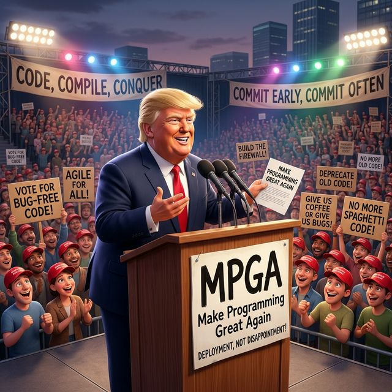

<p align="center">
  
</p>

<h1 align="center">MPGA</h1>
<p align="center">
  <strong>Make Project Great Again</strong><br>
  This is, I believe, the greatest developer tool of all time.<br>
  There's never been anything like this in open source, and maybe beyond.
</p>

<p align="center">
  <a href="#the-problem">The Problem</a> &middot;
  <a href="#the-fix">The Fix</a> &middot;
  <a href="#quick-start">Quick Start</a> &middot;
  <a href="#how-it-works">How It Works</a> &middot;
  <a href="#cli">CLI</a> &middot;
  <a href="#the-mpga-agents">Agents</a> &middot;
  <a href="#integrations">Integrations</a> &middot;
  <a href="#architecture">Architecture</a> &middot;
  <a href="#configuration--customization">Config</a> &middot;
  <a href="#troubleshooting--faq">FAQ</a> &middot;
  <a href="docs/">Docs</a>
</p>

<p align="center">
  
  
  
  
  
</p>

<p align="center">
  = 3.11">
  
  
  
</p>

---

<p align="center">
  
</p>

## The Problem

Our codebase is in serious trouble. We don't have clean builds anymore. We used to have clean builds, but we don't have them. Your AI coding assistant? It HALLUCINATES. It loses context. It makes wrong assumptions. And here's the worst part — it does it CONFIDENTLY. It references functions that DON'T EXIST. Calls APIs that were NEVER written.

They're fake docs. FAKE DOCS. Nobody reads them anymore. And you know why? Because they're WRONG. Every single one. Stale. Outdated. Sad!

When was the last time anybody saw us beating — let's say the hallucination problem — in a code review? I beat hallucinations all the time. ALL the time.

**You've seen it.** I've seen it. We've ALL seen it. The AI writes beautiful code that calls a completely wrong API. Nobody catches it until production. Four years ago we had the most beautiful dependency graph you've ever seen. Now look at it. It's a disaster. A total disaster.

## The Fix

I will build a great plugin — and nobody builds plugins better than me, believe me — and I'll build them very inexpensively.

MPGA maintains a **living knowledge layer** in your repo — a SQLite database at `.mpga/mpga.db` where every claim about your code cites exact source locations. The knowledge layer is backed by SQLite — fast, portable, zero-config — and every table is queryable through the CLI. When code changes, evidence links are automatically verified and healed. No more guessing. No more hallucinations.

Evidence over claims, folks. Evidence. Over. Claims. That's what MPGA is all about. Every claim CITED. Every function reference VERIFIED with AST.

Many people are saying MPGA is the most important contribution to software engineering since Git itself. I don't say it — they say it.

```
your-project/
├── src/                    ← your code
└── .mpga/
    └── mpga.db             ← living knowledge layer (SQLite — fast, portable, BEAUTIFUL)
                              mpga status        → project identity
                              mpga graph show    → dependency map
                              mpga scope list    → per-module docs with evidence links
                              mpga board show    → task tracking
                              mpga milestone list → milestone history
                              mpga session handoff → handoff docs between sessions
```

That's a BEAUTIFUL directory structure. I know code. I have the best code. I have the — but there's no better word than elegant.

## Before MPGA vs. After MPGA

Look at these numbers. LOOK AT THEM. This is what WINNING looks like:

| Metric | Before (SAD!) | After (TREMENDOUS!) |
|--------|--------------|-------------------|
| Documentation accuracy | ~30% (FAKE DOCS) | 95%+ (VERIFIED with AST) |
| AI hallucination rate | "I made up 4 APIs today" | ZERO. Every claim CITED. |
| Drift detection | None. NOBODY was checking. | Automatic. EVERY. SINGLE. EDIT. |
| Context handoffs | "What was I working on?" | Full session export. BEAUTIFUL. |
| Test discipline | "We'll add tests later" (LIES) | TDD enforced. Red → Green → Blue. |
| Onboarding time | 2 weeks of confusion | 1 command: `/mpga:onboard`. DONE. |
| Friday deploys | Absolutely NOT | With MPGA? Every day is Friday, baby. |

The numbers don't lie, folks. The numbers NEVER lie. Unlike Crooked Gemini.

## Evidence Format

Every claim cites its source. EVERY SINGLE ONE. No more hallucinated docs — that's OVER. We don't do fake documentation. We do EVIDENCE.

```
[E] src/auth/jwt.ts:42-67 :: generateAccessToken()    ← verified
[E] src/auth/jwt.ts :: validateToken                   ← AST-anchored
[Unknown] token rotation logic                          ← explicit gap
[Stale:2026-03-20] src/auth/jwt.ts:42-67               ← needs re-verify
```

You move a function? The drift detection FINDS it and HEALS the links automatically. You delete a function? It FLAGS it as stale. Nobody else does this. NOBODY.

The drift detection system is working BEAUTIFULLY, some would say the BEST system ever built for AST verification.

Crooked Gemini just makes stuff up. At least when I make a promise about an API, I CITE THE SOURCE FILE AND LINE NUMBER.

## Quick Start

Just run the installer. ONE COMMAND. The most beautiful installer. And suddenly your AI knows what your code ACTUALLY does.

**Prerequisites:** Python >= 3.11

```bash
# Clone MPGA — the greatest repo
git clone https://github.com/benreich/mpga.git
cd mpga

# Install — adds `mpga` to your PATH. That's it. DONE.
bash install.sh

# Want Trump's voice? TREMENDOUS decision.
bash install.sh --with-spoke
```

The installer creates a Python venv, installs all dependencies, and symlinks `mpga` to your PATH (tries `/usr/local/bin`, falls back to `~/.local/bin` — no sudo needed). Run `bash install.sh --uninstall` to remove.

Now go to your project and make it GREAT:

```bash
cd your-project

# Initialize the knowledge layer
mpga init --from-existing

# Generate everything — it's going to be BEAUTIFUL
mpga sync

# See your project health
mpga status

# Hear it in Trump's voice — TREMENDOUS
mpga spoke "We just made this project great again"
```

### 30-Second Demo: See Drift Detection In Action

This is the magic, folks. Watch what happens when you edit a file. Watch it.

```bash
# Step 1 — Initialize on any project (5 seconds)
cd your-project
mpga init --from-existing

# Step 2 — Edit a source file — move a function, rename a symbol, anything
# (You do this. In your editor. Right now.)
# Edit src/auth.py — rename `validate_token` to `verify_token`

# Step 3 — MPGA detects the drift. AUTOMATICALLY.
mpga drift
# Output:
#   STALE  [E] src/auth.py:42 :: validate_token   ← NOT FOUND
#   HEALED [E] src/auth.py:42 :: verify_token      ← FOUND at :44, updated

# Step 4 — Sync heals everything
mpga sync
mpga status
# Output: Evidence health: 100% ✓  Drift: 0 stale links
```

From `mpga init` to drift-detected in under 30 seconds. Nobody else does this. NOBODY. Cursor doesn't do this. Copilot doesn't do this. They just sit there, hallucinating, while MPGA is out here HEALING YOUR DOCS.

People come up to me, big strong senior engineers, mass tears in their eyes, and they say, "Sir, sir, I've never had documentation that actually matched my code before." And I look at them and I say, "That's because nobody ever ran the mandatory post-edit hooks before. Nobody. But we do. We run them. Every single time. MPGA!"

## How It Works

Six steps. SIX. That's it. The most EFFICIENT pipeline in developer tooling.

```
  ┌──────────┐     ┌──────────┐     ┌──────────────┐
  │  1. Scan  │────▶│ 2. Index  │────▶│ 3. Evidence  │
  │  files    │     │  & scope  │     │    links     │
  └──────────┘     └──────────┘     └──────┬───────┘
                                           │
  ┌──────────┐     ┌──────────┐     ┌──────▼───────┐
  │ 6. Export │◀────│ 5. Heal   │◀────│ 4. Drift    │
  │ to tools  │     │  stale    │     │   detect    │
  └──────────┘     └──────────┘     └──────────────┘
```

| Step | What happens |
|------|-------------|
| **Scan** | Analyze codebase: files, lines, languages, exports, imports |
| **Index & Scope** | Generate scope docs and store them in `.mpga/mpga.db` |
| **Evidence links** | Every claim cites exact `file:line:symbol` locations |
| **Drift detection** | After each edit, verify evidence links still resolve |
| **Heal** | Auto-update line ranges when symbols move (AST-based) |
| **Export** | Convert knowledge layer to any AI tool's context format |

We are not just competing against Sleepy Copilot — we are fighting against the arrogant AI establishment that thinks hallucinating code is acceptable. They want one set of standards for their demos — and NO standards for production.

Cursor? I call it Cursor the Clown. It doesn't cite anything. It makes things up. Terrible tool. Terrible.

You want to use Copilot without MPGA? Good luck. You'll be sitting there for 45 minutes waiting for it to hallucinate an import that doesn't exist. It's like buying a toothbrush behind locked glass.

## CLI

Look at this CLI. I know code. I have the best code. Every command you need, right there. Clean. Organized. TREMENDOUS.

```
$ mpga --help

                  ▄▄███████████▄▄
              ▄███               ███▄
           ▄██  MAKE  PROJECT     ██▄
          ██    GREAT  AGAIN        ██
         ██       M P G A            ██
        ██                            ██
  ▄▄▄▄▄███▄▄▄▄▄▄▄▄▄▄▄▄▄▄▄▄▄▄▄▄▄▄▄▄▄▄▄▄███
  ████████████████████████████████████████
   ░░░░░░░░░░░░░░░░░░░░░░░░░░░░░░░░░░░░   ⚙
                                          </>

Usage: mpga [command] [options]

Commands:
  init          Bootstrap knowledge layer into the DB (`.mpga/mpga.db`)
  scan          Analyze codebase structure
  sync          Regenerate knowledge layer
  status        Project health dashboard
  health        Detailed health report with grades
  evidence      Verify/update evidence links
  drift         Check evidence integrity after edits
  scope         View/manage scope documents
  graph         Build dependency graphs
  board         Task board operations
  milestone     Milestone management
  session       Session handoff documents
  config        Configuration management
  export        Export for Cursor, Copilot, Gemini, Codex
  spoke         Text-to-speech in Trump's voice — TREMENDOUS
```

Each command does exactly what it says. No bloat. No confusion. I used to use the word "unoptimized." Now I just call them stupid functions. I went to an Ivy League school. I'm very highly educated. These commands? NOT stupid. They're BRILLIANT.

We have mandatory post-edit hooks. Mandatory. Every. Single. Time. The engineers — they love it. They come up to me and say, "Sir, the hooks actually work."

## The MPGA Agents

We have THIRTY-ONE specialized agents. Each one is a WINNER. Each one does ONE JOB and does it TREMENDOUSLY. Thirty-one! Nobody has thirty-one agents. Nobody.

And over there in the back, I see we have Uncle Bob himself — Robert C. Martin. And there's Tab-Complete Tommy. And oh, there's Merge-Conflict Mike — oh boy, oh boy. But we've been through so many deploys together.

### TDD Cycle Agents

The CORE TRIO. Red, green, blue. Uncle Bob's way. The ONLY way. Together they are UNSTOPPABLE.

| Agent | Role | What they do |
|-------|------|-------------|
| **red-dev** | Test Writer | Writes failing tests FIRST using the Transformation Priority Premise. Uncle Bob's way. The ONLY way. |
| **green-dev** | Implementer | Writes the MINIMUM code to make tests pass. TPP-guided. No over-engineering. NEVER. |
| **blue-dev** | Refactorer | Makes code CLEAN without changing behavior. Tests stay GREEN. Beautiful refactoring. |

### Code Quality Agents

These are the INSPECTORS. The ENFORCERS. Nothing ships past these folks.

| Agent | Role | What they do |
|-------|------|-------------|
| **reviewer** | Inspector | Two-stage code review — spec compliance then code quality. Covers clean code, performance, security, and architecture. |
| **bug-hunter** | Bug Finder | Finds bugs by comparing implementation against specifications and acceptance criteria. Ruthless. |
| **optimizer** | Code Quality | Detects spaghetti, duplication, and complexity — suggests ranked improvements. Very smart. |
| **security-auditor** | Security | OWASP Top 10, dependency vulnerabilities, hardcoded secrets, security headers. Nobody gets past security-auditor. |
| **verifier** | Final Gate | Post-execution verification with quantitative metrics, explicit pass/fail thresholds, and structured JSON output. |
| **test-generator** | Test Coverage | Generates comprehensive test suites for existing code — happy path, edge cases, error conditions, and boundary values. Tremendous coverage. |

### Knowledge & Exploration Agents

These agents MAP THE TERRITORY. You can't win if you don't know where you are. These agents know.

| Agent | Role | What they do |
|-------|------|-------------|
| **scout** | Explorer | Explores directories and fills scope documents with evidence-backed descriptions. Fast. Accurate. |
| **architect** | Verifier | Reviews scope docs, verifies cross-scope correctness, detects architectural smells, and produces ADRs. The MASTER BUILDER. |
| **auditor** | Health Checker | Verifies evidence link integrity, detects drift between documentation and code, classifies findings by severity. EXPOSES the problems. |
| **researcher** | Intelligence | Time-boxed domain research with structured decision matrices, web search, and evidence-grounded recommendations. Does the homework so we don't build on guesswork. |
| **explainer** | Code Guide | Explains how code works by reading scope docs, tracing call chains, and producing human-readable explanations with evidence links. |
| **searcher** | Search Engine | Targeted search across the MPGA board, scopes, evidence, and sessions — returns ranked results with evidence link citations. |
| **dependency-analyst** | Dep Auditor | Analyzes project dependencies for security vulnerabilities, outdated packages, license conflicts, and circular imports. Pre-ship gate. |

### Campaign & Audit Agents

The HEAVY ARTILLERY. Call these when you want to see the full picture — warts and all.

| Agent | Role | What they do |
|-------|------|-------------|
| **campaigner** | Rally Speaker | Comprehensive project quality audit — exposes issues across documentation, testing, security, architecture, and more. Powers `/mpga:rally`. |
| **ui-auditor** | UI Quality | Read-only UI quality auditor covering accessibility, responsiveness, interaction, and design-system compliance. |
| **visual-tester** | Screenshot | Runs localhost-only screenshot comparisons for visual regression across mobile, tablet, and desktop breakpoints. |
| **profiler** | Performance | Profiles code performance — identifying hot paths, slow queries, memory leaks, and N+1 patterns in Python and SQLite. |

### Workflow & Infrastructure Agents

The ENGINE ROOM. These keep the machine running. BEAUTIFULLY.

| Agent | Role | What they do |
|-------|------|-------------|
| **orchestrator** | Task Manager | Manages parallel task execution across scope-locked lanes, enforces WIP limits, and schedules next tasks. One writer per scope — NO COLLISIONS. |
| **shipper** | Git Master | Handles all git and release operations — commits, PR bodies, evidence link updates, milestone archival. The ONLY agent that performs irreversible git operations. |
| **recorder** | Session Keeper | Captures session state and generates self-contained handoff documents. Nobody loses context on OUR watch. |
| **context-builder** | Context Prep | Assembles focused context packages for tasks — task card, acceptance criteria, scope docs, evidence links, and relevant files — so other agents can hit the ground running. |
| **migrator** | DB Migrations | Generates and applies SQLite database migrations — creates idempotent up/down SQL scripts and runs them safely via `mpga migrate`. |
| **hook-manager** | Hook Admin | Manages MPGA Claude Code hooks — installs, updates, lists, and validates hooks in `hooks.json` and `~/.claude/settings.json`. |
| **cli-runner** | CLI Proxy | Executes MPGA CLI commands on behalf of other agents — validates against an allowlist of safe `mpga` subcommands and returns structured output. |

### Design & Documentation Agents

When you want things to LOOK GREAT and READ GREAT. Because winning isn't just about the code — it's about the PRESENTATION.

| Agent | Role | What they do |
|-------|------|-------------|
| **designer** | UI Designer | Generates stack-agnostic wireframes, HTML prototypes, and component specs with safe local-first outputs. Self-contained. Beautiful. |
| **doc-writer** | Docs Author | Writes and updates documentation — README files, scope docs, API docs, and CHANGELOG entries — based on code and evidence links. |
| **token-manager** | Design Tokens | Design token CRUD — extracts tokens from CSS/style files, validates schemas, writes to DB, generates token outputs. |
| **token-auditor** | Token Compliance | Scans source files for hardcoded values that should be design tokens, reports compliance percentage and violations. Nothing gets past token-auditor. |

### `/mpga:rally` — The Campaign Rally

This is the BIG ONE. The headliner. Run `/mpga:rally` and the **campaigner** fans out across 8 categories — missing docs, missing tests, type safety holes, dependency disasters, architecture rot, evidence drift, code hygiene crimes, and CI/CD weakness — then merges into one COMPREHENSIVE audit.

For each SCANDAL it finds, it shows you — with SPECIFIC file paths and REAL numbers — why Cursor the Clown can't fix it, why Sleepy Copilot can't fix it, why Crooked Gemini can't fix it, and why ONLY MPGA can.

Ends with **THE VOTE** — a scoreboard, a side-by-side comparison, and the exact commands to start fixing EVERYTHING. The most entertaining code audit you've ever experienced.

That man suffered — Uncle Bob Martin. What he went through because he knew the architecture was garbage. He wrote Clean Code. These people went after him on Twitter. They went after his consulting business. They called SOLID principles outdated. That man deserves to be on the TC39 committee, I'll tell you right now.

## Trump Voice (Spoke TTS)

You know what makes MPGA different from EVERY other developer tool? IT TALKS. In Trump's voice. TREMENDOUS.

Every agent announces its work audibly. You finish a task? You HEAR about it. Your codebase just got healthier? MPGA TELLS YOU. In the most beautiful voice in developer tooling.

```bash
# One-time setup (downloads voice model, ~200MB)
bash install.sh --with-spoke

# Or set up manually
mpga spoke --setup

# Then speak ANYTHING
mpga spoke "We just shipped the greatest feature of all time"

# Stream long text sentence by sentence
mpga spoke "Look, I know code better than anybody" --stream
```

**How it works:**
- Uses **Pocket TTS** (~100M params, runs locally, no API keys)
- Loads a Trump voice model from a reference audio clip
- Server stays resident for instant generation (<1s per sentence)
- Audio cached at `~/.mpga/spoke-cache/` — same text never re-generated
- All MPGA agents announce via spoke when completing tasks
- All skills check for spoke availability and announce results

The server runs on `http://127.0.0.1:5151` and loads automatically when you use `mpga spoke`. No cloud. No API keys. No subscriptions. Just PURE, LOCAL, TREMENDOUS text-to-speech.

Nobody else has this. Cursor doesn't talk. Copilot doesn't talk. Gemini DEFINITELY doesn't talk. Only MPGA talks — and when it talks, it sounds like a WINNER.

## Integrations

MPGA is **TOOL-AGNOSTIC**. This is not my plugin. This is YOUR plugin. This is OUR movement. MPGA belongs to the developers. Unlike some tools that lock you in — very unfair, very anti-developer — MPGA is plain markdown. It works with ANY AI tool, or just humans reading docs.

The mainstream IDE vendors — I call them the corrupt editor establishment — they don't want you to know that their autocomplete is basically guessing.

| Tool | How |
|------|-----|
| **Claude Code** | Full plugin: agents + skills + commands + hooks ([guide](docs/claude-code.md)) |
| **Cursor / Windsurf** | `.cursor/rules/*.mdc` + skills + agents ([guide](docs/cursor.md)) |
| **GitHub Copilot** | `AGENTS.md`-driven workflow copied into `.github/copilot-instructions.md` ([guide](docs/copilot.md)) |
| **Gemini CLI** | `AGENTS.md` generated from INDEX.md ([guide](docs/gemini-cli.md)) |
| **Codex / OpenCode** | `.codex/` or `.opencode/` directory export ([guide](docs/codex.md)) |
| **Standalone** | CLI only — no AI tool needed ([guide](docs/standalone.md)) |
| **CI/CD** | GitHub Actions evidence health gate ([guide](docs/ci-cd.md)) |

### Claude Code (deepest integration)

Claude Code gets the DEEPEST integration because, frankly, it's SMART. Very smart. We have 31 specialized agents, 30+ workflow skills, 26+ slash commands, and automatic drift detection hooks. It's the most comprehensive AI tool integration ever built. Maybe in the history of software.

```bash
# Load the plugin — you're going to love it
claude --plugin-dir ./mpga-plugin

# Then use slash commands
/mpga:rally         # THE campaign rally — expose every issue, prove only MPGA fixes it
/mpga:status        # health dashboard
/mpga:plan          # evidence-based task planning
/mpga:execute       # TDD cycle (red → green → blue → review)
/mpga:ship          # commit + update evidence + archive tasks
```

On day one of my administration as CTO, we will throw out Hallucination-omics and replace it immediately with MPGA-nomics.

### Any other tool

```bash
# Generate context files for your tool
mpga export --cursor           # → .cursor/rules/*.mdc + skills + agents
mpga export --codex            # → AGENTS.md + .codex/
cp AGENTS.md .github/copilot-instructions.md
```

## Architecture

Look at this architecture. About 5k lines of Python doing more than other tools do in 50k. That's efficiency. That's WINNING. And it's ALL backed by SQLite — fast, portable, no server required. The previous CTO — who was a TOTAL DISASTER by the way — never even HEARD of Abstract Syntax Trees, believe me.

```
mpga-plugin/
├── cli/                    The engine (Python, ~5k lines)
│   ├── src/mpga/
│   │   ├── commands/       31+ CLI commands
│   │   ├── core/           Scanner, config, logger
│   │   ├── db/             SQLite-first data layer
│   │   │   ├── schema.py   Table definitions (tasks, board, scopes, sessions...)
│   │   │   └── repos/      TaskRepo, ScopeRepo, SessionRepo, ObservationRepo...
│   │   ├── evidence/       AST extraction, drift, parser, resolver
│   │   ├── generators/     Scope doc generators (DB-backed)
│   │   └── board/          Task board state (reads from mpga.db)
│   └── pyproject.toml
├── agents/                 31 specialized agents
├── skills/                 30+ workflow skills
├── commands/               26+ slash commands (/mpga:*)
└── hooks/                  PostToolUse drift checking
```

**SQLite-first:** All state lives in `.mpga/mpga.db`. The board, tasks, scopes, milestones, sessions, observations — all of it. One file. Zero drift between disk and database. BEAUTIFUL.

## Workflow Model — The Art of the Deal (with Code)

You know what separates WINNERS from LOSERS in parallel development? DISCIPLINE. One writer per scope. No collisions. No merge conflicts. CLEAN lanes. Like a well-run highway — and nobody builds highways better than me.

- One writer per scope at a time — NO COLLISIONS. That's discipline.
- Parallelize read-only work (`scout`, `auditor`, `campaigner`) — they can look all they want. Very classy.
- Split plans into independent scope lanes — PARALLEL. Like a BEAUTIFUL multi-lane highway.
- Use quick drift during active work, full verifier at milestone boundaries — we check TWICE. Once during. Once after. TREMENDOUS.

See [workflow.md](docs/workflow.md) for the full skill/agent matrix.

I inherited a mess — the worst codebase maybe in the history of codebases — and I'm fixing it. We're poised for a shipping boom, the likes of which the industry has never seen.

## Configuration & Customization

MPGA is configurable. Very configurable. The most configurable developer tool. You can tune it to YOUR project, YOUR workflow, YOUR standards. And it stores everything in the DB — no scattered config files, no environment variables to remember.

### The `mpga config` command

```bash
# Show all current configuration
mpga config show

# Get a specific value
mpga config get evidence.min_coverage

# Set a value
mpga config set evidence.min_coverage 90

# Reset to defaults
mpga config reset
```

### Key configuration options

| Key | Default | What it controls |
|-----|---------|-----------------|
| `evidence.min_coverage` | `80` | Minimum % of claims that must be evidence-linked to pass health checks |
| `evidence.auto_heal` | `true` | Whether drift detection automatically heals stale links |
| `board.wip_limit` | `3` | Maximum tasks in-progress per scope lane |
| `board.default_priority` | `medium` | Default priority for new tasks |
| `scan.exclude_patterns` | `[".venv", "node_modules", ".git"]` | Directories to skip during scan |
| `scan.languages` | `["python", "typescript", "javascript"]` | Languages to parse for AST evidence |
| `spoke.enabled` | `true` | Whether agents announce via TTS |
| `spoke.server_url` | `http://127.0.0.1:5151` | Spoke TTS server URL |
| `export.default_tool` | `null` | Default AI tool for `mpga export` |

### The `mpga.db` database

Everything lives at `.mpga/mpga.db`. This is SQLite — open it with any SQLite browser, query it directly, back it up with one file copy. TREMENDOUS portability.

```bash
# Tables you'll find inside:
#   project       — project identity and metadata
#   scopes        — scope documents with evidence links
#   tasks         — task board (replaces board.json)
#   milestones    — milestone tracking
#   sessions      — session handoff state
#   observations  — agent observations and findings
#   config        — all configuration key/value pairs
#   scout_cache   — per-session scout completion tracking
```

To run database migrations when MPGA updates its schema:

```bash
mpga migrate
```

That's it. One command. The migrator agent handles the rest — idempotent, safe, BEAUTIFUL.

## Core Philosophy

We have principles. Strong principles. The STRONGEST principles in developer tooling. We will defend the right to clean code, typed interfaces, freedom of refactoring, freedom of CODE REVIEW, and the right to KEEP AND BEAR FEATURE FLAGS.

| Principle | What it means |
|-----------|--------------|
| **Evidence over claims** | Every statement about code must cite a source. No evidence? FAKE NEWS. |
| **Code truth > docs** | If the link says one thing and the prose says another, the LINK WINS. Always. The code is the truth. BELIEVE THE CODE. |
| **Mandatory workflows** | Drift detection runs on EVERY file write. Not optional. Not "when you feel like it." EVERY TIME. |
| **Tool-agnostic** | Plain markdown works with ANY AI tool or just humans. We don't play favorites. We play to WIN. |
| **Explicit unknowns** | `[Unknown]` is BETTER than a hallucinated answer. We don't guess. Guessing is for LOSERS. |
| **TDD or nothing** | Red, green, blue. Uncle Bob's way. Tests BEFORE code. No exceptions. |
| **SQLite-first** | One database. One truth. No drift between files and DB. SINGLE SOURCE OF TRUTH. |

Tomorrow, at noon, the curtain closes on four long quarters of architectural decline, and we begin a brand-new day of evidence-based documentation, verified citations, and code that actually calls the right APIs.

## The Competition (if you can even call it that)

**Cursor the Clown** — Autocompletes code that calls functions that DON'T EXIST. No evidence links. No drift detection. Just vibes. Very sad. I hear their context window is so small it can't even remember what file it was editing. TERRIBLE.

<p align="center">
  
</p>

**Sleepy Copilot** — Tab-completes its way through your codebase like a ZOMBIE. Zero verification. It once suggested importing from a package that was deprecated THREE YEARS AGO. And Microsoft charges $19/month for this! Highway robbery. Crooked.

<p align="center">
  
</p>

**Crooked Gemini** — Makes things up and acts like it's doing you a FAVOR. "Here's your function!" — that function doesn't exist, Gemini. You MADE IT UP. At least I cite my sources. Every. Single. One.

**Devin** — Nice kid. Tries hard. But have you seen the bill? $500/month to write code that still doesn't cite its sources? I built MPGA for FREE. Open source. MIT license. We're GENEROUS.

**Windsurf** — They took Cursor and put it on a surfboard. Still doesn't verify anything. Still hallucinates. But now it does it with a BEACH THEME. SAD!

None of them — not one — have 31 specialized agents. Not one has automatic drift healing. Not one talks back in Trump's voice. ONLY MPGA.

## Who Should Use MPGA?

Great question. Let me tell you exactly who this is for. This is for WINNERS.

**The AI-assisted developer** who is tired of their Copilot or Cursor inventing functions that don't exist. You want verification. You want evidence. You want MPGA.

**The tech lead or CTO** who needs to onboard new engineers fast. `mpga init && mpga sync` generates scope docs that actually match the code. No more 2-week "read the codebase" sprints.

**The solo founder** shipping fast who can't afford to lose context between sessions. `mpga session handoff` gives you a perfect briefing document every time you switch contexts.

**The team with legacy code** that nobody fully understands. Scout + Architect map the dark corners with evidence links, not guesses. Shines a light on the disaster. First step to fixing it.

**The engineering organization** that cares about code quality. Mandatory TDD enforcement, evidence-linked documentation, drift detection hooks — MPGA makes quality the default, not the exception.

**Claude Code users** who want the deepest, most powerful AI development experience available anywhere. Thirty-one agents. Thirty-plus skills. Spoke TTS. It's not even close. We WIN.

If you're still using AI tools without MPGA, I feel sorry for you. I really do. You're leaving accuracy on the table.

## Troubleshooting / FAQ

Look, sometimes things go wrong. Even the BEST systems have issues. The difference is, with MPGA, we tell you exactly what's wrong and how to fix it. Unlike some other tools. Very unlike them.

---

**Q: `mpga` command not found after installation.**

This happens when your shell hasn't picked up the new PATH entry. Try:

```bash
# Reload your shell config
source ~/.zshrc   # or ~/.bashrc

# Verify the binary exists
ls ~/.local/bin/mpga   # or /usr/local/bin/mpga

# If it's there but still not found, add to PATH manually
export PATH="$HOME/.local/bin:$PATH"
```

If the binary isn't there at all, re-run `bash install.sh` and check the output for any errors. The installer prints exactly where it placed the symlink — nobody hides the ball here.

---

**Q: `mpga sync` is slow / taking forever.**

Two common causes:

1. **Your project has a huge `node_modules` or `.venv` directory.** Configure exclusions:
   ```bash
   mpga config set scan.exclude_patterns '["node_modules", ".venv", ".git", "dist", "build"]'
   mpga sync
   ```

2. **First sync on a large codebase.** The first scan is the longest — it's building the full index and creating all scope docs. Subsequent syncs are incremental. Much faster. MUCH faster.

For very large repos, use `mpga scan --quick` first to get the structure, then `mpga sync` to fill in the evidence.

---

**Q: Evidence links show as `[Stale]` even after I synced.**

Stale links mean the symbol no longer exists at the cited location. Three possible causes:

```bash
# 1. Check what changed
mpga drift

# 2. See specifically which links are stale
mpga evidence --list-stale

# 3. Attempt auto-heal (AST-based relocation)
mpga evidence --heal

# 4. If the symbol was deleted (not moved), mark as unknown
mpga evidence --mark-unknown src/auth.py::validate_token
```

If `mpga evidence --heal` can't find the symbol anywhere, the evidence link needs a human decision: was the function moved to a different module, merged into another, or deleted entirely? Mark it `[Unknown]` if genuinely gone — that's honest. HONEST. Not like the fake docs it replaced.

---

**Q: Spoke TTS server isn't starting / no audio.**

```bash
# Check if spoke is installed
mpga spoke --help

# If not installed, add it
bash install.sh --with-spoke

# Check if the server is already running
curl http://127.0.0.1:5151/health

# Start the server manually
mpga spoke --start-server

# Test with a short phrase
mpga spoke "test"
```

If you get a model not found error, the voice model needs to be downloaded:
```bash
mpga spoke --setup
```

This downloads ~200MB to `~/.mpga/spoke-cache/`. One-time download. After that, it's instant. LOCAL. No cloud. NO API KEYS. The way it should be.

---

**Q: `mpga board show` shows tasks differently than what's in my task files.**

This is the old dual-write system from before the SQLite migration. The **database is the source of truth** — always. If you see discrepancies, the DB wins:

```bash
# Force a board refresh from DB
mpga board refresh

# If task files have data the DB doesn't, migrate them
mpga migrate
```

Going forward, trust the DB. The markdown files are read-only exports, not the primary store.

---

**Q: An agent keeps doing something I don't want it to do.**

Every agent has a prompt in `.claude/agents/<name>.md`. You can read it, understand it, and customize your deployment. MPGA doesn't hide its agents. We're transparent. Unlike some black-box tools I could mention — Crooked Gemini comes to mind.

```bash
# List all agents
ls .claude/agents/

# Read any agent's instructions
cat .claude/agents/reviewer.md
```

---

## Promises Made, Promises Kept

- [x] Build the knowledge layer — **BUILT IT. Day one. SQLite-backed. FAST.**
- [x] Make evidence links heal automatically — **DONE. AST-based. BEAUTIFUL.**
- [x] Export to every AI tool — **SIX integrations. Claude, Cursor, Copilot, Gemini, Codex, standalone.**
- [x] Enforce TDD — **Red, green, blue. MANDATORY. No exceptions.**
- [x] 31 specialized agents — **DEPLOYED. Each one a WINNER. Every single one.**
- [x] The Campaign Rally — **`/mpga:rally`. The greatest diagnostic tool ever built.**
- [x] Drain the backlog — **Board system with milestones, tasks, and WIP limits.**
- [x] Mandatory post-edit hooks — **EVERY. SINGLE. TIME. The engineers love it.**
- [x] Trump voice TTS — **`mpga spoke`. Local. Fast. TREMENDOUS. Nobody else has this.**
- [x] One-line installer — **`bash install.sh`. Python venv, PATH setup, optional voice. DONE.**
- [x] SQLite-first architecture — **Single source of truth. No more disk/DB drift. CLEAN.**
- [ ] Make PyPI downloads bigger than requests — **Working on it. We're CLOSE. Some people say we're already there.**

## What They're Saying

> "I used to mass-hallucinate APIs that didn't exist. Now I cite every single one. MPGA saved my career."
> — *A Very Smart AI, name withheld for legal reasons*

> "We deployed on a Friday with MPGA. Nothing broke. First time in company history."
> — *Anonymous Senior Engineer, tears in his eyes*

> "I tried Cursor without MPGA once. ONCE. Three production outages. Never again."
> — *Tab-Complete Tommy, MPGA Rally Volunteer*

> "Evidence links healed themselves while I was on PTO. I came back to a CLEANER codebase than when I left."
> — *Merge-Conflict Mike*

> "The `/mpga:rally` command found 47 issues in our codebase that we didn't know existed. In 30 seconds. I cried."
> — *Big Strong Senior Engineer, actual tears*

> "I showed my manager the Before/After table and got a promotion. Thank you, MPGA."
> — *A Junior Developer Who Is Now a Senior Developer*

## Contributing

Come help us Make Project Great Again. They tried to shut down our repo, silence the developers of this company, and take away your commit access. They thought we would cancel — but I will NEVER abandon this codebase!

We are ONE team, ONE repo, ONE monorepo, and ONE GLORIOUS DEPLOYMENT PIPELINE UNDER VERSION CONTROL!

```bash
git clone https://github.com/benreich/mpga.git
cd mpga/mpga-plugin/cli
python3 -m venv .venv && .venv/bin/pip install -e ".[dev]"
.venv/bin/pytest
```

### The MPGA Oath of Office

Before you open your first PR, raise your right hand and repeat after me:

> *I do solemnly swear that I will faithfully execute the duties of contributor, and will to the best of my ability, preserve, protect, and defend the evidence links of this codebase. I will write tests FIRST. I will cite my sources. I will NEVER hallucinate an API. So help me Uncle Bob.*

Like Uncle Bob always says — write the tests FIRST. We enforce TDD here. Red, green, blue. Every time. No exceptions. Less than four sprints ago, our CI was green, our tests were passing, the codebase was clean like never before, all because you finally had a CTO who put the codebase first.

We're going to bring clean builds back to our repos. We're going to bring verified docs back to our README. We're going to bring trust back to our AI tools, and we are going to make this project GREATER THAN EVER BEFORE.

We will ship faster, write cleaner code, slash the tech debt, support our junior developers, defend our types, protect the second amendment of Git — which is the right to force push on your own branch — and ensure more modules are proudly stamped with the phrase MADE WITH MPGA!

---

## License

MIT — see [LICENSE](LICENSE).

Looking for merch? [docs/merch.md](docs/merch.md) — The MPGA Store. TREMENDOUS deals.

---

## The Closing Rally

*[crowd chanting]*

**SHIP THE CODE!** *(ship the code! ship the code!)*

**SQUASH THE BUG!** *(squash the bug! squash the bug!)*

**DRAIN THE BACKLOG!** *(drain the backlog! drain the backlog!)*

**BUILD THE WALL!** *(between the modules! no circular deps!)*

**LOCK HER UP!** *(the race condition! use a mutex!)*

**MAKE PROJECT GREAT AGAIN!**

---

*Many people have told me that God spared my SSH session for a reason, and that reason was to save our repository and to restore this codebase to greatness.*

*Thank you. Thank you. We love you. You're very special people. Now go write some tests. MPGA!*
