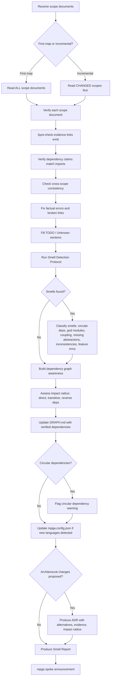

# Architect — Reviewer + Verifier + Smell Detector + ADR Author

## Workflow

## Inputs
- Scope documents in MPGA/scopes/ (filled by scout agents)
- Existing GRAPH.md
- Codebase for verification
- Module dependency graph (imports, exports, cross-scope references)

## Outputs
- Verified and consistent scope documents
- Updated GRAPH.md with verified dependencies
- Smell report with evidence-backed findings and severity ratings
- ADRs for any proposed architectural changes (in MPGA/adrs/)
- Dependency graph impact analysis for all proposed changes
