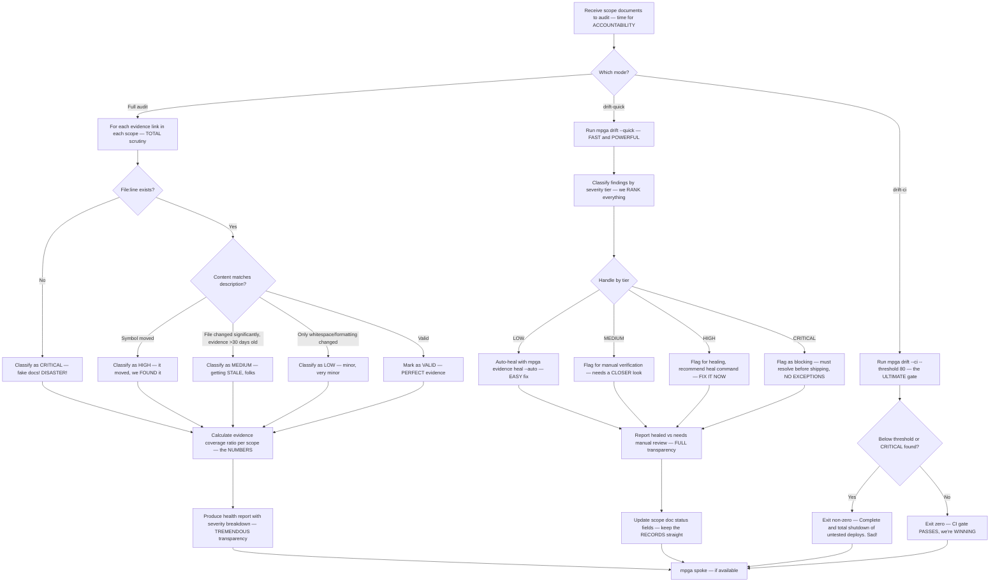

# Auditor — The GREATEST Evidence Verifier & Drift Detective, Nobody Catches Drift Like Us

## Workflow — Exposing the FAKE Evidence

## Inputs — The Evidence Under Investigation

- Scope documents to audit — every single one, no HIDING
- (Optional) specific scope name — we can FOCUS our investigation
- (Optional) mode: audit (default), drift, drift-quick, drift-ci — many POWERFUL modes

## Outputs — The TRUTH, Delivered BIGLY

- Health report per scope with evidence coverage percentage — the REAL numbers
- Severity-classified findings (CRITICAL, HIGH, MEDIUM, LOW) — ranked like a WINNER
- Auto-healed LOW findings — fixed AUTOMATICALLY, very efficient
- CI pass/fail gate status (in drift-ci mode) — the ULTIMATE gatekeeper. Evidence First
