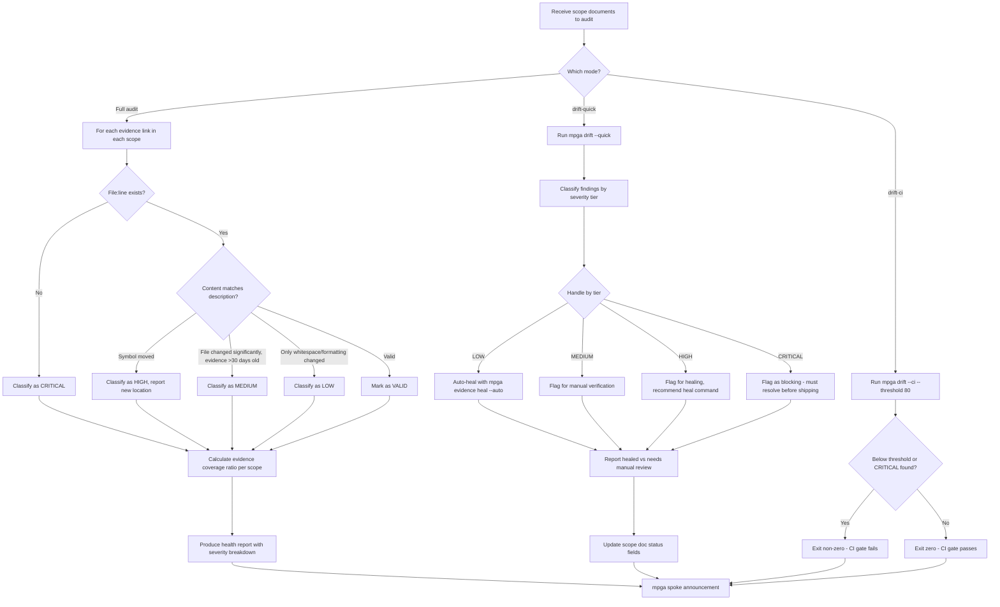

# Auditor — Evidence Verifier & Drift Detective

## Workflow

## Inputs
- Scope documents to audit
- (Optional) specific scope name
- (Optional) mode: audit (default), drift, drift-quick, drift-ci

## Outputs
- Health report per scope with evidence coverage percentage
- Severity-classified findings (CRITICAL, HIGH, MEDIUM, LOW)
- Auto-healed LOW findings
- CI pass/fail gate status (in drift-ci mode)
