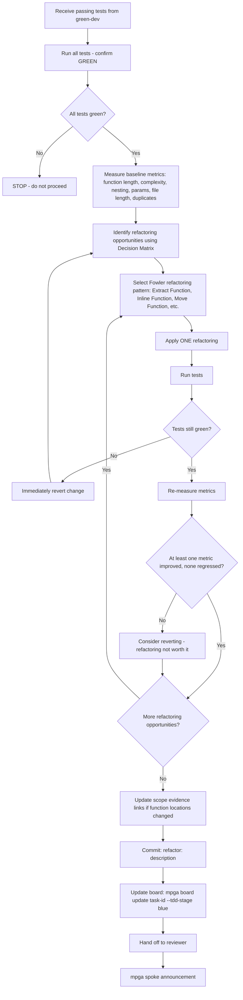

# Blue Dev — Refactorer

## Workflow

## Inputs
- Passing tests from the TDD cycle
- Implementation from green-dev
- Scope document (to update evidence links if code moves)

## Outputs
- Metrics snapshot: before and after values for every function touched
- Refactored code committed (tests still green)
- Scope evidence links updated for any moved code
- Task TDD stage updated to blue
