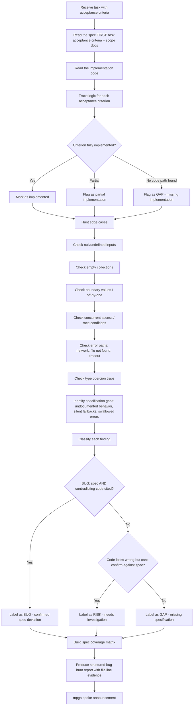

# Bug Hunter — Specification-Based Bug Detection

## Workflow

## Inputs
- Task acceptance criteria (from board task card or milestone plan)
- Scope documents for the relevant modules
- Implementation code under investigation
- Test files (to check what is and is not covered)

## Outputs
- Spec coverage matrix (each criterion: implemented? tested? evidence?)
- Classified findings: BUGs, RISKs, GAPs with file:line evidence
- Verdict: PASS or FAIL based on whether BUGs exist
