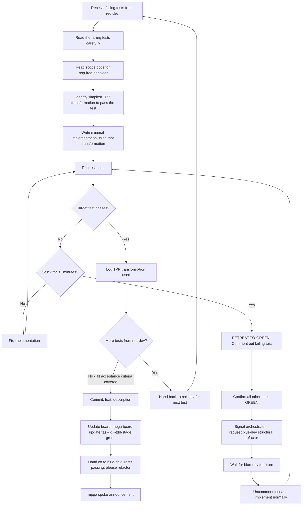

# Green Dev — Implementer

## Workflow

## Inputs
- Failing test file(s) from red-dev
- Scope document for the feature area
- Task card with acceptance criteria

## Outputs
- Implementation code committed
- All tests passing
- Task TDD stage updated to green
- TPP transformation log for this cycle
