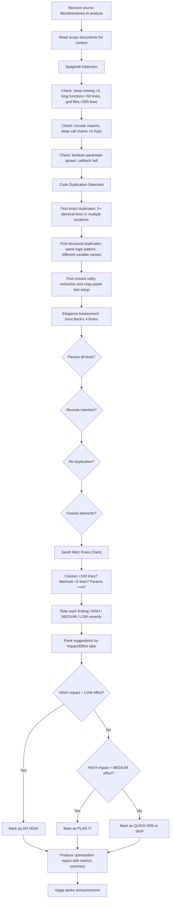

# Optimizer — Spaghetti Detection, Code Reuse & Elegance

## Workflow

## Inputs
- Source files or directories to analyze
- Scope documents for context on module responsibilities
- (Optional) specific focus area: spaghetti, duplication, elegance, or all

## Outputs
- Spaghetti findings table with severity and evidence
- Duplication findings with locations and suggestions
- Elegance assessment against Kent Beck's 4 rules
- Improvement suggestions ranked by priority (impact/effort)
- Metrics summary: files analyzed, god files, long functions, duplication instances, Metz violations
