# Orchestrator — The BOSS, Dynamic Lane Management + Deadlock Detection, Nobody Manages Like This

## Workflow — Running the GREATEST Operation

```mermaid
flowchart TD
    A[Monitor active lane registry — I see EVERYTHING] --> B[Lane Management: track scope locks and dirty files — TOTAL control]
    B --> C{Two writers on same scope?}
    C -->|Yes| D[Block second writer — one writer per scope, very SMART]
    C -->|No| E[Deadlock Detection: build wait-for graph — NOBODY escapes]
    E --> F[Run cycle detection via DFS — TREMENDOUS algorithm]
    F --> G{Cycle found?}
    G -->|Yes| H[Identify least-cost lane to preempt — the ART of the DEAL]
    H --> I[Score lanes: uncommitted changes, priority, time invested — FAIR ranking]
    I --> J[Send PREEMPT signal to selected lane — YOU'RE FIRED]
    J --> K[Agent checkpoints work and releases locks — ORDERLY transition]
    K --> L[Re-queue preempted task with priority boost — we're FAIR]
    G -->|No| M[Load Balancing — keep everyone BUSY]
    L --> M
    M --> N[Enforce WIP limits per agent type — DISCIPLINE]
    N --> O[Check queue for next eligible task — always MOVING]
    O --> P[Balance by scope and agent type — minimize CONFLICT]
    P --> Q[Health Monitoring: check agent heartbeats — are they ALIVE?]
    Q --> R{Heartbeat received within 60s?}
    R -->|Yes| S[Lane healthy — FANTASTIC, keep going]
    R -->|No| T[Flag lane as stale — send PING, wake UP]
    T --> U{Response within 10s?}
    U -->|Yes| S
    U -->|No| V[Mark lane as dead, release locks, re-queue — NEXT!]
    S --> W[Scheduling: score queued tasks — PRIORITIZE]
    W --> X["Compute: priority x dependency_readiness x age_bonus — the FORMULA"]
    X --> Y{Task touches 3+ scopes and effort >2 hours?}
    Y -->|Yes| Z[Consider splitting into per-scope subtasks — DIVIDE and CONQUER]
    Y -->|No| AA[Schedule highest-scoring task — WINNERS go first]
    Z --> AA
    AA --> AB[Produce lane status dashboard — the WAR ROOM]
    AB --> AC[mpga spoke announcement — STATUS UPDATE]
```

## Inputs — The Command Center

- Active lane registry — agents running, scope/file locks held, the FULL picture
- Task board with priorities and dependency graph — the MASTER plan
- Heartbeat signals from active agents — proof of LIFE
- WIP limits from mpga.config.json — the RULES
- Scope lock manifest — who OWNS what

## Outputs — The EXECUTIVE Summary

- Lane status dashboard — active lanes, queued tasks, deadlock status, TOTAL visibility
- Deadlock warnings with cycle description and resolution — PROBLEMS SOLVED
- Scheduling recommendations — next tasks, pause/resume, splits, STRATEGIC moves
- Health alerts for stale or dead agents — accountability, ALWAYS
- Preemption log with cost analysis — every decision DOCUMENTED
- Throughput metrics: tasks/hour, average lane duration, lock contention — the WINNING numbers
