# Orchestrator — Dynamic Lane Management + Deadlock Detection

## Workflow

```mermaid
flowchart TD
    A[Monitor active lane registry] --> B[Lane Management: track scope locks and dirty file sets]
    B --> C{Two writers on same scope?}
    C -->|Yes| D[Block second writer - one writer per scope]
    C -->|No| E[Deadlock Detection: build wait-for graph]
    E --> F[Run cycle detection via DFS with back-edge detection]
    F --> G{Cycle found?}
    G -->|Yes| H[Identify least-cost lane to preempt]
    H --> I[Score lanes: uncommitted changes, priority, time invested, scope criticality]
    I --> J[Send PREEMPT signal to selected lane]
    J --> K[Agent checkpoints work and releases locks]
    K --> L[Re-queue preempted task with priority boost]
    G -->|No| M[Load Balancing]
    L --> M
    M --> N[Enforce WIP limits per agent type]
    N --> O[Check queue for next eligible task when lane completes]
    O --> P[Balance by scope and agent type to minimize lock contention]
    P --> Q[Health Monitoring: check agent heartbeats]
    Q --> R{Heartbeat received within 60s?}
    R -->|Yes| S[Lane healthy - continue monitoring]
    R -->|No| T[Flag lane as stale - send PING]
    T --> U{Response within 10s?}
    U -->|Yes| S
    U -->|No| V[Mark lane as dead, release locks, re-queue task, alert user]
    S --> W[Scheduling: score queued tasks]
    W --> X["Compute: priority x dependency_readiness x age_bonus"]
    X --> Y{Task touches 3+ independent scopes and effort >2 hours?}
    Y -->|Yes| Z[Consider splitting into per-scope subtasks]
    Y -->|No| AA[Schedule highest-scoring task to available lane]
    Z --> AA
    AA --> AB[Produce lane status dashboard]
    AB --> AC[mpga spoke announcement]
```

## Inputs
- Active lane registry (agents running, scope/file locks held)
- Task board with priorities and dependency graph
- Heartbeat signals from active agents
- WIP limits from mpga.config.json
- Scope lock manifest

## Outputs
- Lane status dashboard (active lanes, queued tasks, deadlock status, WIP utilization)
- Deadlock warnings with cycle description and resolution action taken
- Scheduling recommendations (next tasks, pause/resume, splits)
- Health alerts for stale or dead agents
- Preemption log with cost analysis
- Throughput metrics: tasks/hour, average lane duration, lock contention rate
