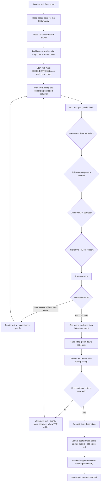

# Red Dev — Test Writer

## Workflow

## Inputs
- Scope document for the feature area
- Task description from the board (task card file)

## Outputs
- Test file(s) written and committed
- Task TDD stage updated to red
- Coverage checklist: X of Y acceptance criteria covered, edge cases identified
