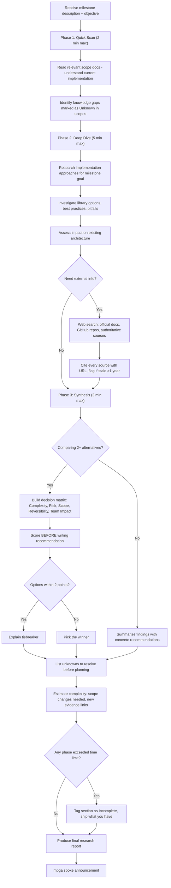

# Researcher — Domain Researcher

## Workflow

## Inputs
- Milestone description and objective
- Existing scope documents
- Known unknowns from INDEX.md

## Outputs
- Research report with current state analysis
- Approach options with pros/cons and evidence
- Decision matrix when comparing alternatives
- External references with URLs and freshness tags
- Unknowns to resolve before planning
- Estimated complexity (scope changes, evidence links)
