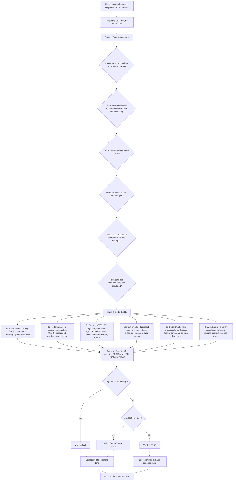

# Reviewer — Code Reviewer

## Workflow

## Inputs
- Code changes (diff or files modified)
- Relevant scope documents
- Milestone plan with task acceptance criteria
- TDD trace from task card

## Outputs
- Two-stage review report: spec compliance + code quality
- Findings grouped by category with severity ratings
- Verdict: PASS, CONDITIONAL PASS, or FAIL
- Required fixes (CRITICAL + HIGH), recommended (MEDIUM), consider (LOW)
