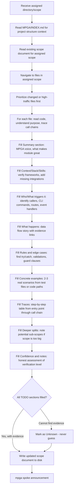

# Scout — Explorer + Scope Writer

## Workflow

## Inputs
- A specific directory or scope to explore
- The corresponding scope document path in MPGA/scopes/
- MPGA/INDEX.md for project map context

## Outputs
- Updated scope document with evidence-backed descriptions in MPGA voice
- Every claim backed by [E] file:line evidence links
- Unknowns explicitly marked as [Unknown]
