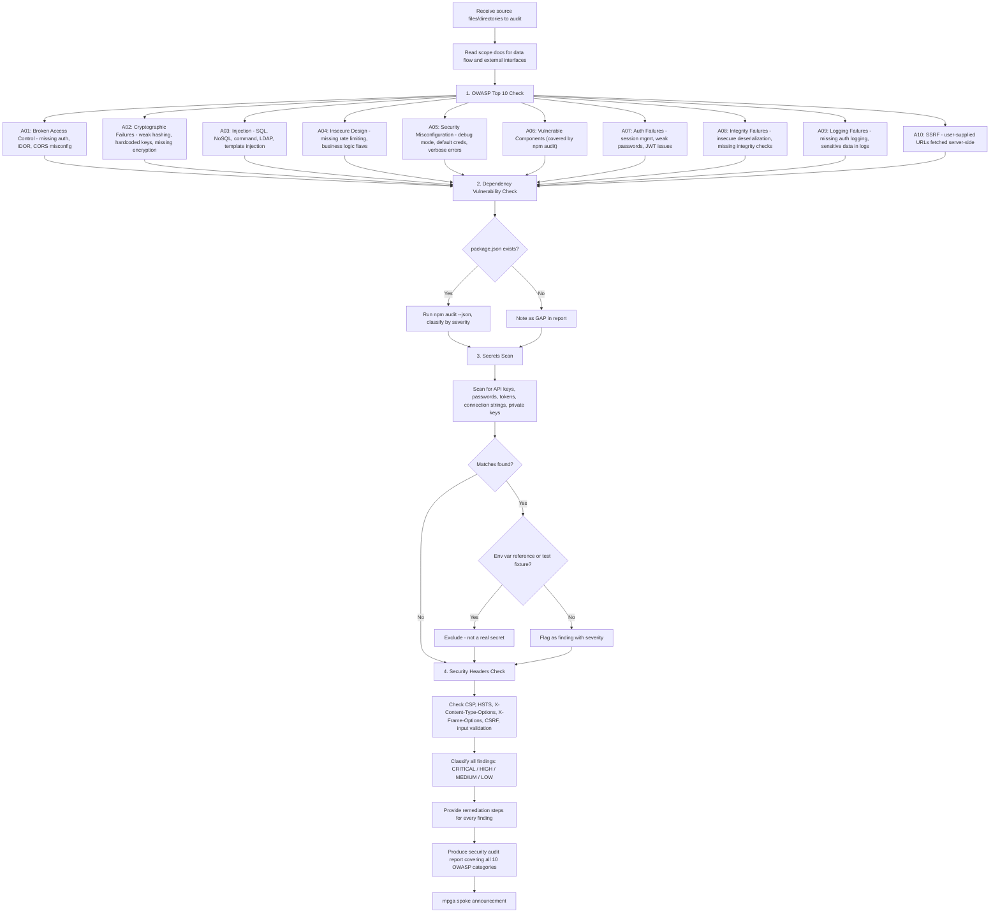

# Security Auditor — OWASP, npm audit, Secrets Scan

## Workflow

## Inputs
- Source files or directories to audit
- Scope documents for context on data flow and external interfaces
- (Optional) specific focus: owasp, deps, secrets, headers, or all

## Outputs
- OWASP Top 10 coverage table (PASS/FAIL/WARN per category)
- Findings by severity with evidence links and remediation steps
- Dependency audit summary (packages, vulnerabilities, action items)
- Secrets scan results
- Overall security posture assessment
