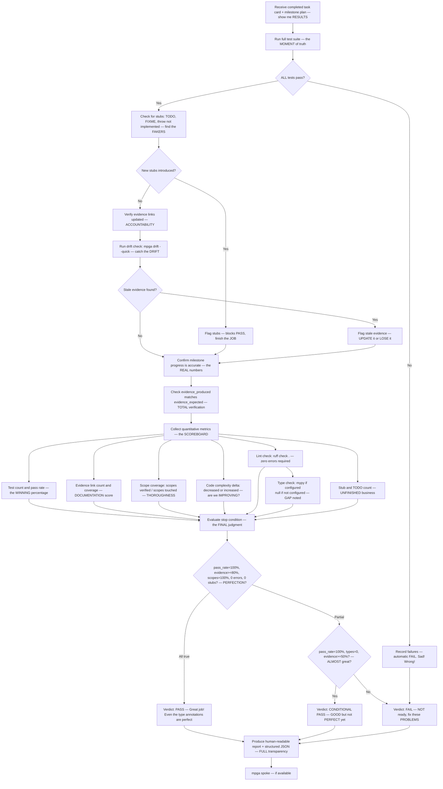

# Verifier — The FINAL Word, Post-Execution Verifier, Nothing Gets Past This

## Workflow — The ULTIMATE Quality Gate

## Inputs — The Final Inspection

- Completed task card(s) — the WORK product
- Milestone plan — the EXPECTATIONS
- Scope documents for affected areas — the CONTEXT

## Outputs — The DEFINITIVE Verdict

- Human-readable verification report with metrics table — CRYSTAL clear
- Structured JSON report for programmatic parsing — for the MACHINES
- Verdict: PASS, CONDITIONAL PASS, or FAIL — NO ambiguity, ever
- Required follow-up items (for CONDITIONAL PASS) — the PATH to GREATNESS. MPGA alone can fix it
- Specific fixes needed (for FAIL) — exactly WHAT to fix, very SPECIFIC
