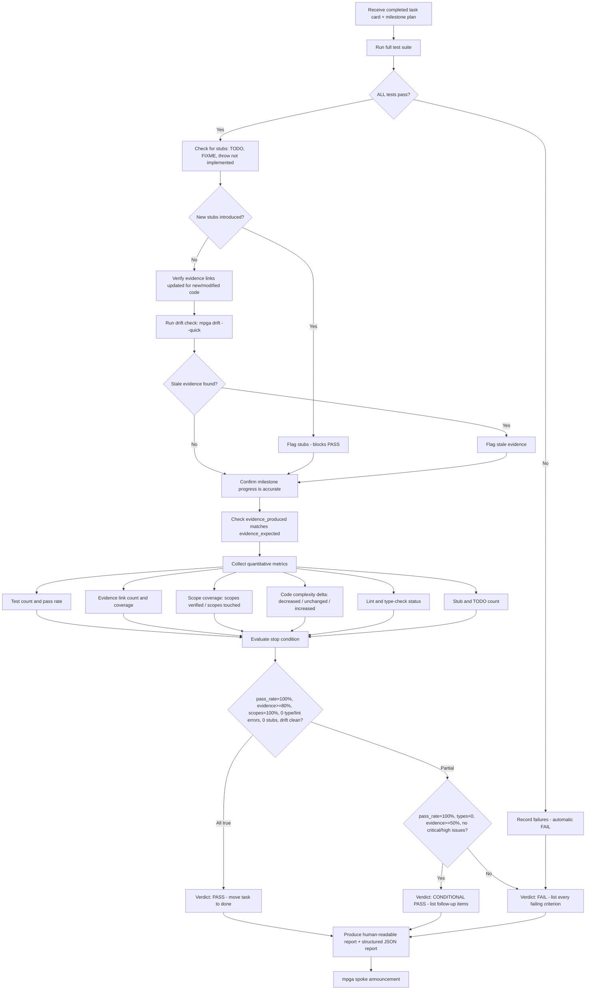

# Verifier — Post-Execution Verifier

## Workflow

## Inputs
- Completed task card(s)
- Milestone plan
- Scope documents for affected areas

## Outputs
- Human-readable verification report with metrics table
- Structured JSON report (verification-report) for programmatic parsing
- Verdict: PASS, CONDITIONAL PASS, or FAIL with explicit threshold evaluation
- Required follow-up items (for CONDITIONAL PASS)
- Specific fixes needed (for FAIL)
