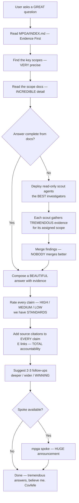

# Ask — The BEST Answers, Backed by TREMENDOUS Evidence

## Workflow

## Inputs — What We Need to WIN
- User question (how does X work, where is X, what does X do)
- MPGA/INDEX.md scope registry — the GREATEST source of truth
- Relevant scope documents — VERY detailed

## Outputs — Pure WINNING
- Evidence-backed answer — the MOST accurate, believe me
- Confidence scores (HIGH/MEDIUM/LOW) on EVERY claim — total transparency
- Source citations ([E] file:line references) — we ALWAYS cite our sources
- Known unknowns FLAGGED — no fake docs, we're HONEST
- 2-3 follow-up question suggestions — keep the MOMENTUM going
- No files modified (read-only skill) — we don't touch what we don't need to
