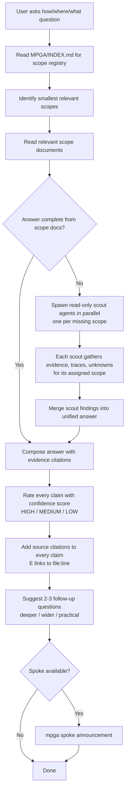

# Ask — Evidence-Based Question Answering

## Workflow

## Inputs
- User question (how does X work, where is X, what does X do)
- MPGA/INDEX.md scope registry
- Relevant scope documents

## Outputs
- Evidence-backed answer with confidence scores (HIGH/MEDIUM/LOW) on every claim
- Source citations ([E] file:line references) for all claims
- Known unknowns flagged
- 2-3 follow-up question suggestions
- No files modified (read-only skill)
