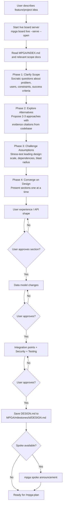

# Brainstorm — Socratic Design Refinement

## Workflow

## Inputs
- Feature or project idea description
- MPGA/INDEX.md and relevant scope documents
- Existing code patterns as evidence

## Outputs
- Approved DESIGN.md in the milestone directory (structured template with Problem, Constraints, Alternatives, Decision, Consequences, Implementation Outline)
- Clear scope ready for /mpga:plan
- No code written (design phase only)
