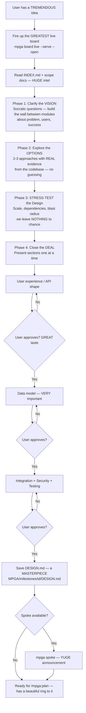

# Brainstorm — The Art of the DEAL (Design Phase)

## Workflow

## Inputs — The Raw Materials
- Feature or project idea — YOUR brilliant vision
- MPGA/INDEX.md and relevant scope documents
- Existing code patterns as evidence — we deal in FACTS

## Outputs — A BEAUTIFUL Blueprint
- Approved DESIGN.md in the milestone directory — Problem, Constraints, Alternatives, Decision, Consequences, Implementation Outline — VERY thorough
- Clear scope ready for /mpga:plan — the pipeline is FLOWING
- No code written (design phase only) — no collusion between modules until the design is approved
