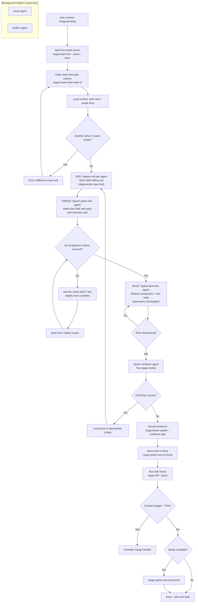

# Develop — TDD Cycle Orchestration (Red-Green-Blue)

## Workflow

## Inputs
- Task ID (or picks next todo task)
- Task card with acceptance criteria
- Relevant scope documents
- Phase number (optional, to run all tasks in a phase)

## Outputs
- Failing tests written (red phase)
- Minimal implementation passing all tests (green phase)
- Refactored clean code (blue phase)
- Reviewer approval
- Evidence links recorded on task card
- Task moved to done column
- Drift check run after completion
