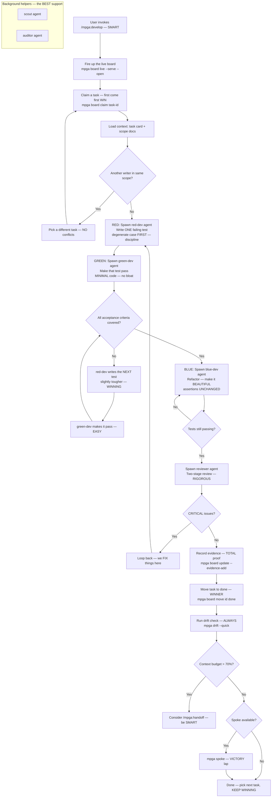

# Develop — The GREATEST TDD Cycle (Red-Green-Blue)

## Workflow

## Inputs — What the CHAMPION Needs
- Task ID (or picks next todo task — we're always MOVING)
- Task card with acceptance criteria
- Relevant scope documents
- Phase number (optional, to run all tasks in a phase)

## Outputs — TREMENDOUS Results
- Failing tests written (red phase) — we PROVE it first
- Minimal implementation passing all tests (green phase) — EFFICIENT
- Refactored clean code (blue phase) — BEAUTIFUL
- Reviewer approval — QUALITY control
- Evidence links recorded on task card — TOTAL accountability
- Task moved to done column — another WIN
- Drift check run after completion — we NEVER let things slide
