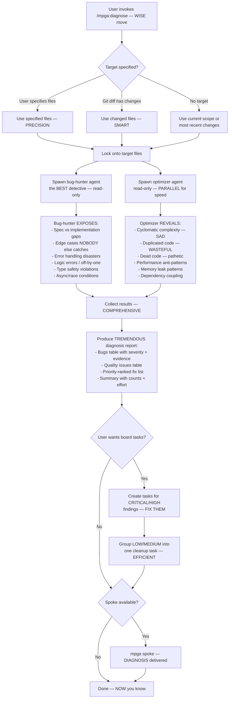

# Diagnose — Finding Bugs Like NOBODY Else Can

## Workflow

## Inputs — Point Us at the Problem
- Target files/directories (optional)
- Git diff changes (fallback)
- Current scope (fallback)

## Outputs — The FULL Picture
- Unified diagnosis report — bugs AND quality issues, NOTHING hidden
- Each finding has severity, file:line, evidence citation — REAL proof
- Priority-ranked fix list with effort estimates — we're PRACTICAL
- Optional board tasks for CRITICAL/HIGH findings — take ACTION
- No files modified (read-only skill) — we diagnose, we don't break things
