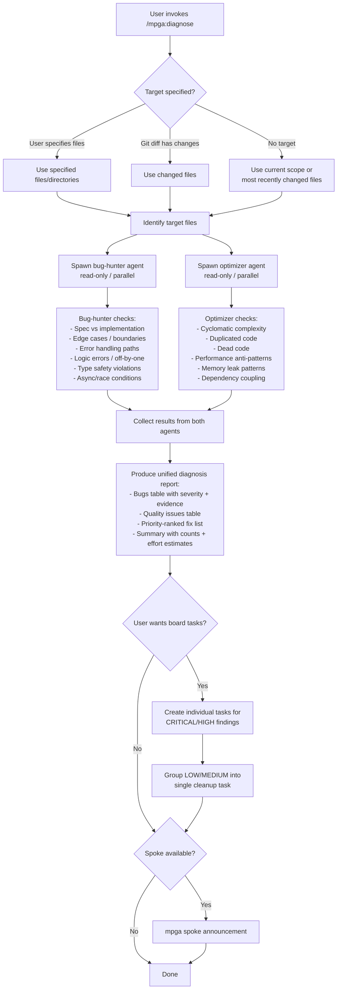

# Diagnose — Bug and Quality Issue Detection

## Workflow

## Inputs
- Target files/directories (optional)
- Git diff changes (fallback)
- Current scope (fallback)

## Outputs
- Unified diagnosis report with bugs and quality issues
- Each finding has severity, file:line, evidence citation
- Priority-ranked fix list with effort estimates
- Optional board tasks for CRITICAL/HIGH findings
- No files modified (read-only skill)
