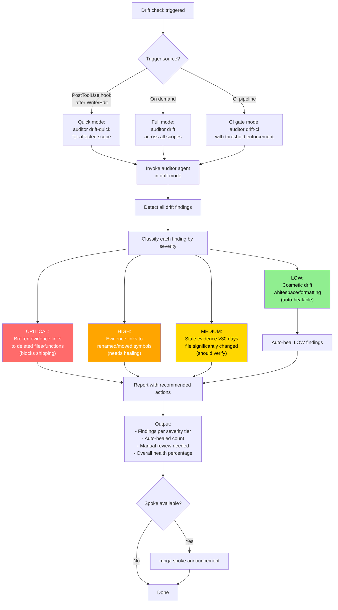

# Drift-Check — Evidence Drift Detection and Healing

## Workflow

## Inputs
- Trigger source: PostToolUse hook, manual invocation, or CI pipeline
- Affected scope (for quick mode)
- Threshold value (for CI gate mode)

## Outputs
- Number of findings per severity tier (CRITICAL/HIGH/MEDIUM/LOW)
- Auto-healed LOW (cosmetic) findings
- Links needing manual review (HIGH/CRITICAL)
- Overall evidence health percentage
- Minimal output in hook mode (only warns if drift detected)
