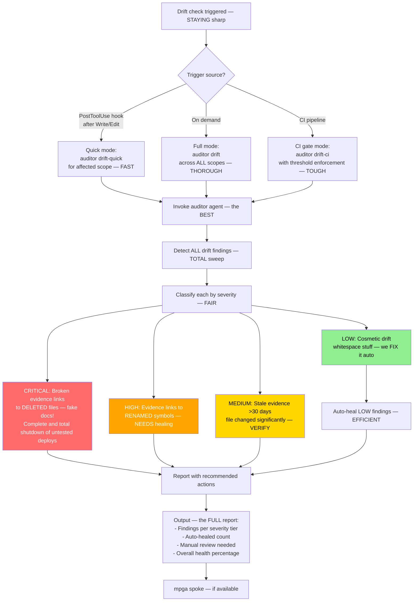

# Drift-Check — Keeping Evidence HONEST (No Fake News)

## Workflow

## Inputs — Where the Drift Comes From
- Trigger source: PostToolUse hook, manual invocation, or CI pipeline
- Affected scope (for quick mode)
- Threshold value (for CI gate mode)

## Outputs — The TRUTH About Your Evidence
- Number of findings per severity tier (CRITICAL/HIGH/MEDIUM/LOW)
- Auto-healed LOW (cosmetic) findings — taken care of, AUTOMATICALLY
- Links needing manual review (HIGH/CRITICAL) — Wrong! You gotta HANDLE these
- Overall evidence health percentage — your REAL score
- Minimal output in hook mode (only warns if drift detected) — no NOISE
