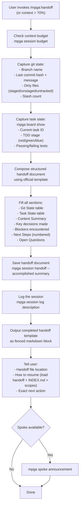

# Handoff — Session State Export for Context Continuity

## Workflow

## Inputs
- Current session state (git, board, context)
- Context budget usage percentage
- Active task and TDD stage information

## Outputs
- Structured handoff document saved to MPGA/sessions/
- Session log entry
- Copy-pasteable handoff template for new session
- Resume instructions with exact next action
- Self-contained document (new session can resume without prior context)
