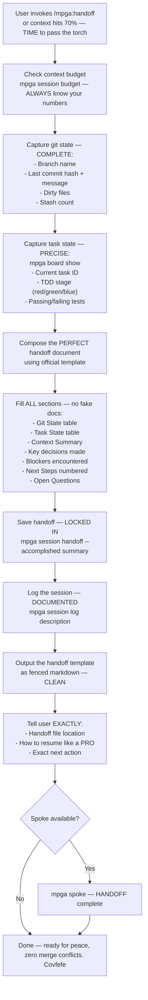

# Handoff — The SMOOTHEST Transition, Believe Me

## Workflow

## Inputs — What We Capture
- Current session state (git, board, context) — the WHOLE picture
- Context budget usage percentage
- Active task and TDD stage information

## Outputs — A PERFECT Handoff Package
- Structured handoff document saved to MPGA/sessions/ — ORGANIZED
- Session log entry — we keep RECORDS
- Copy-pasteable handoff template for new session — READY to go
- Resume instructions with exact next action — NO confusion
- Self-contained document (new session resumes without prior context) — has a beautiful ring to it, believe me
