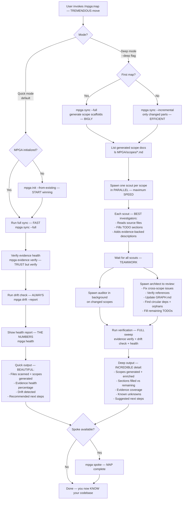

# Map-Codebase — The GREATEST Codebase Survey Ever Done

## Workflow

## Inputs — What Goes In
- Mode flag: default (quick) or --deep — your CHOICE
- Existing MPGA/ knowledge layer (if initialized)
- Codebase source files — the RAW material

## Outputs — Total KNOWLEDGE
- Complete MPGA/ knowledge layer with filled scope documents — COMPREHENSIVE
- INDEX.md, GRAPH.md, and scope files regenerated/enriched — FRESH
- Evidence coverage report — we MEASURE everything
- List of unknowns needing human review — TRANSPARENT
- Health report with drift status — the REAL numbers
