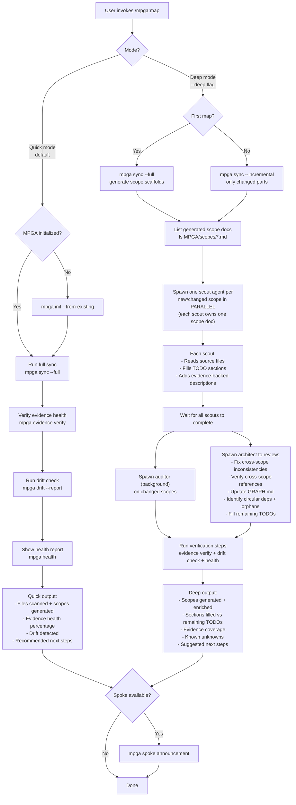

# Map-Codebase — Unified Codebase Mapping and Sync

## Workflow

## Inputs
- Mode flag: default (quick) or --deep
- Existing MPGA/ knowledge layer (if initialized)
- Codebase source files

## Outputs
- Complete MPGA/ knowledge layer with filled scope documents
- INDEX.md, GRAPH.md, and scope files regenerated/enriched
- Evidence coverage report
- List of unknowns needing human review
- Health report with drift status
