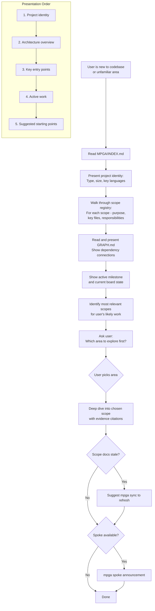

# Onboard — Guided Codebase Tour

## Workflow

## Inputs
- MPGA/INDEX.md (scope registry and project identity)
- MPGA/GRAPH.md (dependency graph)
- Scope documents in MPGA/scopes/
- Active milestone and board state

## Outputs
- Sectioned codebase tour (presented incrementally, not all at once)
- Evidence-cited claims about the codebase
- Suggested starting points for the user's work
- Stale doc warnings with sync suggestions
- No files modified (read-only skill)
