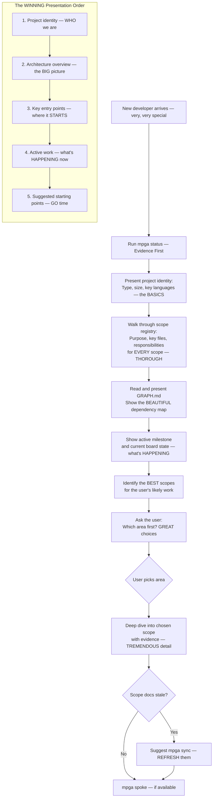

# Onboard — The GREATEST Codebase Tour You'll Ever Get

## Workflow

## Inputs — The Foundation
- Project status via `mpga status` (scope registry and project identity) — the MASTER list
- Dependency graph via `mpga graph show` — the CONNECTION map
- Scope documents via `mpga scope list` — the DETAILED intel
- Active milestone and board state — what's IN PLAY

## Outputs — You'll Know EVERYTHING
- Sectioned codebase tour (presented incrementally, not all at once) — PACED perfectly
- Evidence-cited claims about the codebase — REAL facts, no guessing
- Suggested starting points for the user's work — get PRODUCTIVE fast
- Stale doc warnings with sync suggestions — we keep things CURRENT
- No files modified (read-only skill) — a SAFE tour, has a beautiful ring to it
