# Plan — Evidence-Based Task Planning

## Workflow

```mermaid
flowchart TD
    A[User provides goal to plan] --> B[Start live board server\nmpga board live --serve --open]
    B --> C{Active milestone exists?}
    C -->|Yes| D[Ask: use existing or create new?]
    C -->|No| E[Create new milestone\nmpga milestone new goal]

    D -->|Existing| F[Load milestone PLAN.md + DESIGN.md]
    D -->|New| E
    E --> F

    F --> G["Read MPGA/INDEX.md\n+ relevant scope docs"]
    G --> H{Research needed?\nconfig.agents.researchBeforePlan}
    H -->|Yes| I["Spawn researcher + scout agents\nin parallel for evidence"]
    H -->|No| J[Break work into tasks]
    I --> J

    J --> K["Each task must have:\n- 2-10 min focused work\n- Exact files to modify\n- Acceptance criteria\n- Explicit dependencies\n- Scope assignment\n- Serial vs parallel flag"]

    K --> L["Risk assessment per task:\nComplexity x Uncertainty x Impact\n= Score (1-125)"]
    L --> M{Score > 50?}
    M -->|Yes| N["HIGH RISK: flag prominently\nadd Mitigation field\nconsider spike first"]
    M -->|No| O[LOW/MODERATE risk noted]

    N --> P[Critical path analysis]
    O --> P
    P --> Q["Map dependency graph\nIdentify longest chain\nMark critical path tasks\nCalculate parallel lanes + slack"]

    Q --> R{More than 8 tasks?}
    R -->|Yes| S["Decompose into phases:\nFoundation / Core / Polish\nwith gate criteria"]
    R -->|No| T[Create task cards on board\nmpga board add per task]
    S --> T

    T --> U[Update PLAN.md with full breakdown:\ntasks, risks, critical path, phases]
    U --> V[Show the board\nmpga board show]
    V --> W{Spoke available?}
    W -->|Yes| X[mpga spoke announcement]
    W -->|No| Y[Ready for /mpga:develop]
    X --> Y
```

## Inputs
- Goal description or existing milestone
- MPGA/INDEX.md and relevant scope documents
- Optional researcher/scout evidence gathering

## Outputs
- Milestone created or loaded
- Tasks added to board with risk assessments
- PLAN.md with full breakdown (tasks, dependencies, risk table, critical path, phases)
- Critical path identified with parallel lanes
- Phase decomposition for large milestones (8+ tasks)
- Board visible with all planned tasks
